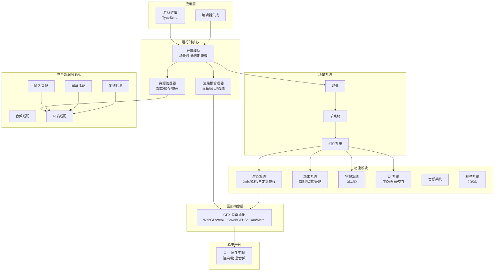

Cocos Engine 是 Cocos Creator 编辑器的**运行时框架**，为游戏开发提供完整的 2D 和 3D 能力支持。本引擎采用 **C++ 与 TypeScript 混合架构**设计，底层性能关键部分使用 C++ 实现，上层游戏逻辑接口使用 TypeScript 提供，兼顾运行效率与开发体验。

## 引擎定位与特性

Cocos Engine 作为 Cocos Creator 的核心运行时组件，并非设计为独立使用，而是深度集成于编辑器工作流中。引擎提供以下核心特性：

**现代化图形架构**：GFX 图形设备抽象层适配现代图形 API，在 Windows 和 Android 平台使用 Vulkan，在 macOS 和 iOS 平台使用 Metal，在 Web 平台使用 WebGL，确保跨平台渲染一致性与高性能。

**混合语言架构**：运行时引擎由 C++ 和 TypeScript 共同构建，底层基础设施、原生平台适配、渲染器和场景管理均采用 C++ 编写以保证运行时性能，同时持续将计算密集型任务迁移至原生层。

**可编程渲染管线**：渲染管线采用完全可定制的设计，内置支持前向渲染和延迟渲染管线，开发者可遵循相同的架构模式自定义专属渲染流程。

**可扩展 Surface Shader**：材质系统基于 Cocos 效果格式构建，使用 GLSL 300 编写，着色器程序会自动转换为适合目标平台的运行时格式。Surface Shader 支持完全自定义表面材质，同时保证通用光照模型的统一性。

**基于物理的渲染 (PBR)**：标准效果采用基于物理的渲染技术，配合基于物理的相机和基于物理指标的光照系统，开发者可轻松实现跨环境的真实感渲染效果。

**TypeScript API**：用户级 API 集采用 TypeScript 提供，配合 VSCode 编辑器的智能提示和类型检查，游戏逻辑开发效率显著提升。

Sources: [README.md](README.md#L1-L121), [README.zh-CN.md](README.zh-CN.md#L1-L86)

## 引擎架构总览



上图展示了 Cocos Engine 的分层架构：**应用层**通过导演模块与运行时核心交互，**场景系统**组织游戏实体，**功能模块**提供具体能力，**GFX 抽象层**统一图形 API，**平台适配层 (PAL)** 处理跨平台差异，**原生平台**提供底层性能支持。

Sources: [cocos/game/game.ts](cocos/game/game.ts#L1-L100), [cocos/root.ts](cocos/root.ts#L1-L100), [cocos/core/index.ts](cocos/core/index.ts#L1-L55)

## 核心模块结构

引擎代码库按功能划分为以下核心模块：

| 模块目录 | 职责描述 | 关键文件 |
|---------|---------|---------|
| `cocos/core` | 核心基础架构 | 数学库、事件系统、序列化、调度器、设置管理 |
| `cocos/scene-graph` | 场景图系统 | 节点树、组件基类、场景管理、Prefab 系统 |
| `cocos/game` | 游戏运行时 | 导演模式、游戏生命周期、场景切换 |
| `cocos/gfx` | 图形设备抽象 | 设备管理、资源描述、渲染命令封装 |
| `cocos/rendering` | 渲染管线 | 前向/延迟管线、渲染阶段、渲染队列、后处理 |
| `cocos/render-scene` | 渲染场景数据 | 相机、灯光、模型、渲染窗口 |
| `cocos/2d` | 2D 系统 | 精灵渲染、UI 组件、2D 物理 |
| `cocos/3d` | 3D 系统 | 模型、材质、骨骼动画、LOD |
| `cocos/animation` | 动画系统 | 动画剪辑、状态机、曲线插值、骨骼动画 |
| `cocos/physics` | 3D 物理 | Bullet/Cannon/PhysX 后端适配 |
| `cocos/physics-2d` | 2D 物理 | Box2D 封装、碰撞检测 |
| `cocos/ui` | UI 系统 | 按钮、布局、滚动视图、交互组件 |
| `cocos/particle` | 粒子系统 | GPU/CPU 粒子、发射器、渲染器 |
| `cocos/audio` | 音频系统 | 音频剪辑、音频源、管理器 |
| `cocos/asset` | 资源管理 | 资源加载、依赖管理、内置资源 |
| `pal` | 平台适配层 | 输入、屏幕、系统信息、音频跨平台适配 |
| `native` | 原生实现 | C++ 底层实现、平台绑定、构建工具 |

Sources: [get_dir_structure](cocos#L1-L1)

## 项目目录结构

```
cocos-engine/
├── cocos/                    # 引擎核心 TypeScript 实现
│   ├── core/                # 基础架构（数学、事件、序列化）
│   ├── scene-graph/         # 场景图（Node、Component、Scene）
│   ├── game/                # 游戏运行时（Director、Game）
│   ├── gfx/                 # 图形设备抽象层
│   ├── rendering/           # 渲染管线架构
│   ├── render-scene/        # 渲染场景数据
│   ├── 2d/                  # 2D 系统与 UI
│   ├── 3d/                  # 3D 系统与模型
│   ├── animation/           # 动画系统
│   ├── physics/             # 3D 物理
│   ├── physics-2d/          # 2D 物理
│   ├── particle/            # 粒子系统
│   └── ...                  # 其他功能模块
├── native/                   # C++ 原生实现
│   ├── cocos/               # 原生引擎核心
│   ├── extensions/          # 原生扩展
│   ├── tools/               # 原生开发工具
│   └── tests/               # 原生测试
├── pal/                      # 平台适配层 (Platform Adaptation Layer)
│   ├── input/               # 输入适配
│   ├── screen-adapter/      # 屏幕适配
│   ├── system-info/         # 系统信息
│   └── audio/               # 音频适配
├── exports/                  # 公共模块导出
├── editor/                   # 编辑器集成代码
├── templates/                # 项目模板
├── tests/                    # 单元测试
└── docs/                     # 开发文档
```

**关键目录说明**：

- **`cocos/`**：引擎主要 TypeScript 实现，包含所有运行时功能模块
- **`native/`**：C++ 原生实现，处理性能关键路径和平台特定功能
- **`pal/`**：平台适配层，抽象不同平台（Web、原生、小游戏）的 API 差异
- **`exports/`**：公共模块导出点，用户通过 `cc` 命名空间访问的 API 由此定义
- **`editor/`**：编辑器扩展和检查器定义，用于 Cocos Creator 集成

Sources: [package.json](package.json#L1-L87), [docs/contribution/modules.md](docs/contribution/modules.md#L1-L59)

## 技术栈与依赖

| 技术组件 | 版本/描述 | 用途 |
|---------|----------|------|
| TypeScript | ^4.9.5 | 主要开发语言，提供类型安全 |
| Node.js | >=18.0.0 | 构建环境和工具链 |
| Babel | ^7.13.10 | JavaScript 转译 |
| Jest | ^28.0.2 | 单元测试框架 |
| ESLint | ^8.44.0 | 代码质量检查 |
| Box2D | @cocos/box2d 1.0.2 | 2D 物理引擎 |
| Cannon | @cocos/cannon 1.2.8 | 3D 物理引擎后端 |
| DragonBones | @cocos/dragonbones-js 1.0.1 | 骨骼动画支持 |

Sources: [package.json](package.json#L1-L87)

## 开发工作流

### 环境要求

- Node.js v18.0.0 或更高版本
- Gulp CLI v2.3.0 或更高版本（用于构建任务）

### 安装与构建

```bash
# 克隆仓库后安装依赖
npm install

# 构建引擎（在编辑器外单独使用时）
npm run build

# 开发模式构建
npm run build:dev

# 运行测试
npm run test
```

在 Cocos Creator 编辑器内部，引擎会在编辑器窗口打开后自动编译和构建，无需手动执行构建命令。

Sources: [README.md](README.md#L80-L100), [package.json](package.json#L14-L30)

## 学习路径建议

作为初学者，建议按照以下顺序深入学习 Cocos Engine：

1. **[快速开始](2-kuai-su-kai-shi)**：了解引擎的基本使用方法和第一个示例项目创建
2. **[项目结构解析](3-xiang-mu-jie-gou-jie-xi)**：深入理解引擎目录组织和模块划分
3. **[引擎架构设计](4-yin-qing-jia-gou-she-ji)**：掌握整体架构理念和设计模式
4. **[场景图与节点系统](5-chang-jing-tu-yu-jie-dian-xi-tong)**：学习场景组织和实体管理
5. **[组件系统](6-zu-jian-xi-tong)**：理解组件模式和功能扩展机制

完成基础学习后，可根据开发需求选择专项深入：

- **2D 开发**：[2D 渲染与精灵](7-2d-xuan-ran-yu-jing-ling) → [UI 系统](8-ui-xi-tong) → [2D 物理](9-2d-wu-li)
- **3D 开发**：[3D 渲染管线](10-3d-xuan-ran-guan-xian) → [3D 模型与材质](11-3d-mo-xing-yu-cai-zhi) → [3D 物理系统](12-3d-wu-li-xi-tong)
- **动画开发**：[动画剪辑与状态](13-dong-hua-jian-ji-yu-zhuang-tai) → [骨骼动画](14-gu-ge-dong-hua) → [动画曲线与插值](15-dong-hua-qu-xian-yu-cha-zhi)
- **图形编程**：[图形设备抽象层 (GFX)](16-tu-xing-she-bei-chou-xiang-ceng-gfx) → [渲染管线架构](17-xuan-ran-guan-xian-jia-gou) → [着色器与效果系统](18-zhao-se-qi-yu-xiao-guo-xi-tong)

## 示例项目资源

引擎官方提供以下示例项目供学习参考：

| 项目名称 | 用途 | 仓库地址 |
|---------|------|---------|
| Mind Your Step 3D | 初学者逐步教程项目 | [cocos-tutorial-mind-your-step](https://github.com/cocos/cocos-tutorial-mind-your-step) |
| Test Cases | 各模块单元测试场景 | [cocos-test-projects](https://github.com/cocos/cocos-test-projects) |
| Example Cases | 功能演示和基线测试 | [cocos-example-projects](https://github.com/cocos/cocos-example-projects) |
| UI Demo | UI 组件使用案例 | [cocos-example-ui](https://github.com/cocos/cocos-example-ui) |

Sources: [README.md](README.md#L105-L115)

## 贡献与社区

Cocos Engine 是开源项目，欢迎社区参与贡献：

- **报告问题**：通过 [GitHub Issues](https://github.com/cocos/cocos-engine/issues) 提交 bug 或功能请求
- **参与讨论**：在 Issues 中参与技术讨论
- **提交代码**：创建 Pull Request 修复问题或实现新功能
- **改进文档**：向 [cocos-docs](https://github.com/cocos/cocos-docs) 仓库提交文档改进
- **社区互助**：在 [官方论坛](https://discuss.cocos2d-x.org/c/creator) 帮助其他开发者

贡献代码需遵循 [C++ 代码风格指南](docs/CPP_CODING_STYLE.md) 和 [TypeScript 代码风格参考](docs/TS_CODING_STYLE.md)，并通过所有自动化 CI 测试。

Sources: [README.md](README.md#L60-L80)

## 相关链接

- [官方网站](https://www.cocos.com/)
- [下载页面](https://www.cocos.com/creator/download)
- [用户手册](https://docs.cocos.com/creator/manual/zh/)
- [API 参考](https://docs.cocos.com/creator/api/zh/)
- [项目路线图](https://github.com/orgs/cocos/projects?query=is%3Aopen&type=new)
- [Discord 社区](https://discord.com/)（搜索 Cocos）