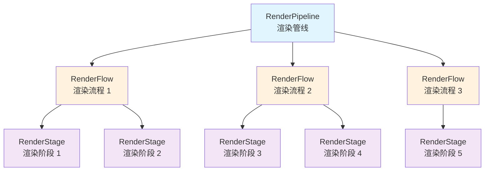
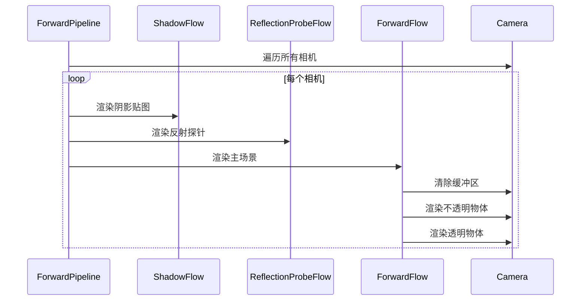
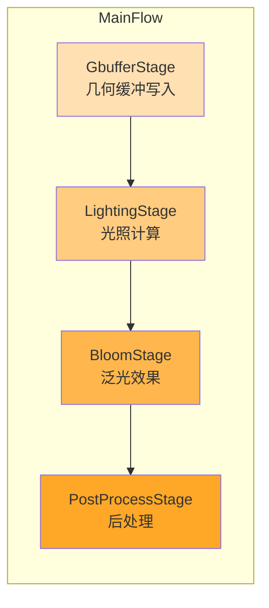
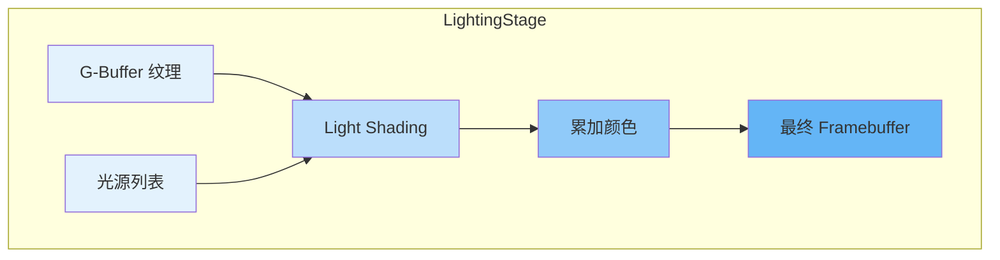

3D 渲染管线是 Cocos Engine 渲染系统的核心架构，负责将 3D 场景数据转换为最终显示在屏幕上的 2D 图像。引擎采用了**分层递进式渲染架构**，通过渲染管线（RenderPipeline）、渲染流程（RenderFlow）和渲染阶段（RenderStage）三级抽象，实现了灵活且高效的渲染调度机制。本文档深入解析 3D 渲染管线的架构设计、核心组件、数据流和两种主要渲染路径（前向渲染与延迟渲染）的实现原理。

Sources: [render-pipeline.ts](cocos/rendering/render-pipeline.ts#L100-L150), [render-flow.ts](cocos/rendering/render-flow.ts#L40-L90), [render-stage.ts](cocos/rendering/render-stage.ts#L40-L90)

## 渲染管线架构层次

Cocos 3D 渲染系统采用**三层架构模型**：渲染管线 → 渲染流程 → 渲染阶段。这种设计遵循单一职责原则，每一层都有明确的职责边界。



**渲染管线（RenderPipeline）** 作为最高层级，负责管理整个渲染过程的全局状态，包括 GFX 设备资源、全局描述符集、管线场景数据（PipelineSceneData）等。它定义了渲染的整体框架，包含多个渲染流程的集合。管线的 `render` 方法会遍历所有相机，对每个相机执行所有渲染流程。

**渲染流程（RenderFlow）** 是管线的子过程，负责将渲染任务按逻辑分组。例如，阴影计算、主场景渲染、UI 渲染等都可以是独立的流程。每个流程包含多个渲染阶段，按优先级顺序执行。流程的主要职责是协调其包含的阶段，确保渲染任务正确派发。

**渲染阶段（RenderStage）** 是渲染的最小执行单元，负责实际的渲染操作。阶段会收集需要渲染的对象，设置渲染状态，记录 GFX 命令缓冲区，并最终执行渲染。典型的渲染阶段包括 G-Buffer 写入、光照计算、后处理等。

Sources: [render-pipeline.ts](cocos/rendering/render-pipeline.ts#L100-L180), [render-flow.ts](cocos/rendering/render-flow.ts#L40-L120), [render-stage.ts](cocos/rendering/render-stage.ts#L40-L120)

## 前向渲染管线

前向渲染（Forward Rendering）是 Cocos Engine 的默认渲染路径，适用于大多数应用场景。前向渲染的核心特点是**每个渲染对象在一次遍历中完成所有光照计算**，渲染流程直接且易于理解。

### 前向管线组成

前向渲染管线由三个主要流程构成：

| 流程名称 | 优先级 | 功能描述 | 包含阶段 |
|---------|--------|---------|---------|
| ShadowFlow | 0 | 阴影贴图生成 | ShadowStage |
| ReflectionProbeFlow | 0 | 反射探针渲染 | ReflectionProbeStage |
| ForwardFlow | 1 | 主场景渲染 | ForwardStage |



前向渲染流程（ForwardFlow）包含单个 ForwardStage 阶段，该阶段负责收集场景中的渲染对象并按渲染队列组织。渲染队列分为不透明队列和透明队列，分别采用不同的排序策略：不透明物体按**从前到后**排序以减少过度绘制，透明物体按**从后到前**排序以保证正确的混合效果。

Sources: [forward-pipeline.ts](cocos/rendering/forward/forward-pipeline.ts#L45-L80), [forward-flow.ts](cocos/rendering/forward/forward-flow.ts#L35-L60), [forward-stage.ts](cocos/rendering/forward/forward-stage.ts#L45-L80)

### 前向渲染执行流程

ForwardStage 的渲染过程遵循严格的执行顺序。首先，阶段会根据相机的清除标志（ClearFlag）清除颜色缓冲区和深度缓冲区。然后，阶段遍历所有渲染队列，对每个队列执行以下操作：

1. **渲染对象收集**：通过场景剔除（Scene Culling）获取可见的渲染对象列表
2. **渲染过程生成**：对每个渲染对象的每个 SubModel 和 Pass，生成 IRenderPass 实例
3. **队列排序**：根据预设的比较函数对渲染过程进行排序
4. **命令记录**：遍历排序后的队列，记录 GFX 渲染命令到命令缓冲区
5. **命令执行**：提交命令缓冲区到 GPU 执行

在渲染过程中，ForwardStage 会处理多种渲染特性，包括实例化渲染（Instanced Rendering）、平面阴影（Planar Shadow）、逐像素光照（Additive Light）等。这些特性通过独立的队列管理器实现，如 RenderInstancedQueue、PlanarShadowQueue、RenderAdditiveLightQueue 等。

Sources: [forward-stage.ts](cocos/rendering/forward/forward-stage.ts#L85-L180), [scene-culling.ts](cocos/rendering/scene-culling.ts#L150-L214)

## 延迟渲染管线

延迟渲染（Deferred Rendering）是针对复杂光照场景优化的高级渲染路径。延迟渲染的核心思想是**将几何信息传递与光照计算分离**，通过多遍渲染实现高效的多光源处理。

### 延迟管线组成

延迟渲染管线包含两个主要流程：

| 流程名称 | 优先级 | 功能描述 | 包含阶段 |
|---------|--------|---------|---------|
| ShadowFlow | 0 | 阴影贴图生成 | ShadowStage |
| MainFlow | 1 | 主场景渲染 | GbufferStage → LightingStage → BloomStage → PostProcessStage |



延迟渲染的关键创新在于**G-Buffer（几何缓冲区）** 的使用。G-Buffer 是一组离屏纹理，用于存储场景的几何和材质信息，通常包括：

- **Albedo 纹理**：存储表面基础颜色和金属度
- **法线纹理**：存储世界空间法线向量
- **深度纹理**：存储深度信息
- **其他辅助数据**：如粗糙度、自发光等

Sources: [deferred-pipeline.ts](cocos/rendering/deferred/deferred-pipeline.ts#L50-L100), [deferred-pipeline.ts](cocos/rendering/deferred/deferred-pipeline.ts#L100-L150)

### G-Buffer 阶段

GbufferStage 是延迟渲染的第一阶段，负责将场景几何信息写入 G-Buffer。该阶段会遍历所有不透明物体，使用特殊的 G-Buffer 着色器渲染。与常规渲染不同，G-Buffer 阶段不进行任何光照计算，仅输出几何和材质属性到对应的纹理目标。

G-Buffer 阶段的渲染队列配置与前向阶段类似，但仅处理不透明物体。透明物体在 G-Buffer 阶段会被跳过，留待后续的光照阶段与前向渲染结合处理。这种设计保证了延迟渲染的效率优势，同时保留了处理透明物体的能力。

Sources: [gbuffer-stage.ts](cocos/rendering/deferred/gbuffer-stage.ts#L45-L90)

### 光照计算阶段

LightingStage 是延迟渲染的核心，负责从 G-Buffer 读取几何信息并执行光照计算。该阶段使用**屏幕空间四边形（Screen-Space Quad）** 技术，对每个像素执行光照方程。

光照阶段的工作流程如下：

1. **光源剔除**：遍历场景中的所有光源，使用视锥体剔除和边界盒测试筛选出对当前像素有影响的光源
2. **光照体积渲染**：对每个有效光源，渲染一个包围光照影响范围的几何体（如球体、圆锥体）
3. **像素着色**：在光照体积内，从 G-Buffer 读取法线、深度、材质信息，计算光照贡献
4. **结果累加**：将所有光源的光照贡献累加到最终颜色缓冲区

延迟渲染的优势在于**光照计算复杂度与光源数量线性相关，而与场景几何复杂度无关**。这使得延迟渲染在处理大量动态光源的场景时具有显著性能优势。



延迟渲染管线的 PipelineSceneData 使用 DeferredPipelineSceneData 子类，提供了延迟渲染特定的场景数据管理，包括 G-Buffer 纹理配置、光照参数更新等功能。

Sources: [lighting-stage.ts](cocos/rendering/deferred/lighting-stage.ts#L80-L150), [deferred-pipeline-scene-data.ts](cocos/rendering/deferred/deferred-pipeline-scene-data.ts#L1-L50)

## 场景剔除系统

场景剔除（Scene Culling）是渲染管线性能优化的关键环节，负责确定哪些物体需要渲染。Cocos Engine 实现了多层次剔除策略，包括**视锥体剔除**、**遮挡剔除**和**光源剔除**。

### 视锥体剔除

视锥体剔除（Frustum Culling）是最基础的剔除技术，通过测试物体的包围盒（AABB）是否在相机视锥体内来判断可见性。剔除过程在 `sceneCulling` 函数中执行：

```typescript
// 简化的剔除逻辑
if (model.worldBounds && !geometry.intersect.aabbFrustum(model.worldBounds, camera.frustum)) {
    return; // 物体在视锥体外，跳过渲染
}
```

剔除后的可见物体被组织成 IRenderObject 数组，包含模型引用和深度值。深度值用于后续的透明物体排序。

### 阴影剔除

阴影剔除（Shadow Culling）专门用于确定哪些物体会投射阴影到阴影贴图中。与视锥体剔除不同，阴影剔除使用**光源的视锥体**（对于聚光灯）或**正交投影范围**（对于平行光）进行测试。

对于 CSM（级联阴影贴图），剔除过程会更加复杂。CSMLayers 管理类负责维护多个阴影层级，每个层级对应不同的距离范围和阴影分辨率。剔除系统会为每个层级独立执行剔除，确保阴影质量与性能的最佳平衡。

Sources: [scene-culling.ts](cocos/rendering/scene-culling.ts#L100-L180), [scene-culling.ts](cocos/rendering/scene-culling.ts#L50-L90)

### 光源剔除

光源剔除（Light Culling）用于确定哪些光源对当前相机可见。`validPunctualLightsCulling` 函数实现了点光源、聚光灯和范围方向光的剔除逻辑：

| 光源类型 | 剔除方法 | 测试几何体 |
|---------|---------|-----------|
| 聚光灯 | 球体 - 视锥体相交测试 | 光源范围球体 |
| 点光源 | 球体 - 视锥体相交测试 | 光源范围球体 |
| 范围方向光 | AABB-视锥体相交测试 | 光源影响范围盒 |

剔除后的有效光源列表存储在 PipelineSceneData.validPunctualLights 中，供光照阶段使用。这种剔除机制显著减少了不必要的光照计算，特别是在大型场景中。

Sources: [scene-culling.ts](cocos/rendering/scene-culling.ts#L50-L95)

## 渲染队列管理

渲染队列（RenderQueue）是连接场景剔除与最终渲染的桥梁，负责组织和调度渲染命令。Cocos Engine 的渲染队列系统采用了**基于描述符的配置化设计**，支持灵活的队列定制。

### 队列配置

渲染队列通过 RenderQueueDesc 描述符定义，包含以下关键属性：

- **isTransparent**：是否为透明队列，决定排序方向
- **sortMode**：排序模式（从前到后或从后到前）
- **stages**：关联的渲染阶段标签

队列描述符在渲染阶段初始化时被转换为实际的 RenderQueue 实例。每个阶段可以包含多个队列，分别处理不同类型的渲染对象。

Sources: [render-queue.ts](cocos/rendering/render-queue.ts#L50-L90), [pipeline-serialization.ts](cocos/rendering/pipeline-serialization.ts#L1-L50)

### 排序策略

渲染队列的排序策略对渲染质量和性能都有重要影响。Cocos Engine 实现了两种核心排序函数：

**不透明物体排序**（opaqueCompareFn）：
- 优先级 → 深度（从前到后） → Shader ID
- 从前到后排序可以减少深度测试失败，降低过度绘制

**透明物体排序**（transparentCompareFn）：
- 优先级 → 深度（从后到前） → Shader ID
- 从后到前排序保证透明混合的正确性

排序过程在每帧渲染前执行，确保渲染顺序与场景状态同步。对于动态物体，深度值会在剔除阶段实时计算。

Sources: [render-queue.ts](cocos/rendering/render-queue.ts#L30-L50), [render-queue.ts](cocos/rendering/render-queue.ts#L90-L120)

### 渲染过程插入

渲染过程（RenderPass）的插入是渲染队列管理的核心操作。`insertRenderPass` 方法负责将渲染对象的每个 SubModel 和 Pass 转换为 IRenderPass 实例并插入队列：

```typescript
insertRenderPass(renderObj, subModelIdx, passIdx): boolean {
    const subModel = renderObj.model.subModels[subModelIdx];
    const pass = subModel.passes[passIdx];
    const shader = subModel.shaders[passIdx];
    const isTransparent = pass.blendState.targets[0].blend;
    
    // 检查 Pass 是否符合队列要求
    if (isTransparent !== this._passDesc.isTransparent) {
        return false;
    }
    
    // 创建渲染过程实例
    const rp = this._passPool.add();
    rp.hash = (0 << 30) | (pass.priority) << 16 | (subModel.priority) << 8 | passIdx;
    rp.depth = renderObj.depth;
    rp.subModel = subModel;
    
    this.queue.push(rp);
    return true;
}
```

这个过程实现了**渲染状态批处理**，将相同材质和 Pass 的渲染对象合并，减少状态切换开销。

Sources: [render-queue.ts](cocos/rendering/render-queue.ts#L90-L130)

## 管线场景数据

PipelineSceneData 是渲染管线的全局数据中心，存储了所有与场景渲染相关的配置和状态信息。这个类充当了场景图与渲染系统之间的桥梁，提供了统一的数据访问接口。

### 核心数据成员

| 成员名称 | 类型 | 功能描述 |
|---------|------|---------|
| fog | Fog | 雾效配置参数 |
| ambient | Ambient | 环境光配置 |
| skybox | Skybox | 天空盒配置与状态 |
| shadows | Shadows | 阴影系统配置 |
| csmLayers | CSMLayers | CSM 阴影层级管理 |
| renderObjects | IRenderObject[] | 当前帧可见渲染对象列表 |
| validPunctualLights | Light[] | 当前帧有效光源列表 |
| isHDR | boolean | HDR 渲染开关状态 |
| shadingScale | number | 渲染缩放比例 |

PipelineSceneData 在每帧渲染开始时通过 `sceneCulling` 函数更新，确保渲染系统使用最新的场景数据。数据生命周期与帧同步，在下一帧开始时会被重置和重新填充。

Sources: [pipeline-scene-data.ts](cocos/rendering/pipeline-scene-data.ts#L50-L130)

### 延迟渲染扩展

对于延迟渲染管线，PipelineSceneData 被扩展为 DeferredPipelineSceneData 子类，添加了延迟渲染特定的数据成员：

- **G-Buffer 纹理引用**：存储 G-Buffer 各通道的纹理对象
- **光照计算缓冲区**：存储用于光照计算的 Uniform 数据
- **延迟材质引用**：存储 G-Buffer 写入和光照计算使用的材质

这种继承设计保持了代码复用性，同时为延迟渲染提供了必要的数据支持。

Sources: [deferred-pipeline-scene-data.ts](cocos/rendering/deferred/deferred-pipeline-scene-data.ts#L1-L80)

## 渲染管线对比

前向渲染和延迟渲染各有优劣，选择适合的渲染路径需要根据具体应用场景权衡。

| 对比维度 | 前向渲染 | 延迟渲染 |
|---------|---------|---------|
| **光照计算方式** | 每物体每光源 | 每像素一次 |
| **多光源性能** | 随光源数量线性下降 | 基本不受影响 |
| **内存占用** | 低（仅需深度 + 颜色缓冲） | 高（需要多个 G-Buffer 纹理） |
| **透明物体支持** | 原生支持 | 需要额外处理 |
| **MSAA 支持** | 完全支持 | 支持受限 |
| **材质复杂度** | 不受限制 | 受 G-Buffer 带宽限制 |
| **适用场景** | 移动平台、光源较少场景 | 主机/PC、复杂光照场景 |

**前向渲染优势**：
- 实现简单，调试方便
- 内存占用低，适合移动设备
- 对透明物体和抗锯齿支持完善
- 材质系统灵活，不受 G-Buffer 限制

**延迟渲染优势**：
- 多光源场景性能优异
- 光照计算与几何复杂度解耦
- 便于实现复杂的光照效果（如 SSAO、屏幕空间反射）

Sources: [forward-pipeline.ts](cocos/rendering/forward/forward-pipeline.ts#L1-L50), [deferred-pipeline.ts](cocos/rendering/deferred/deferred-pipeline.ts#L50-L100)

## 自定义渲染管线

Cocos Engine 提供了灵活的管线扩展机制，开发者可以通过继承 RenderPipeline 基类实现自定义渲染管线。自定义管线可以实现特殊的渲染效果、性能优化或平台适配。

### 扩展步骤

1. **继承 RenderPipeline**：创建自定义管线类，继承自 RenderPipeline 或现有管线类
2. **实现 initialize 方法**：初始化管线的渲染流程和阶段
3. **实现 activate 方法**：激活管线，创建必要的 GFX 资源
4. **实现 render 方法**（可选）：自定义渲染逻辑
5. **注册管线类**：使用 `@ccclass` 装饰器注册，使其可在编辑器中配置

### 自定义流程示例

```typescript
@ccclass('CustomPipeline')
export class CustomPipeline extends RenderPipeline {
    public initialize(info: IRenderPipelineInfo): boolean {
        super.initialize(info);
        
        // 添加自定义流程
        const customFlow = new CustomFlow();
        customFlow.initialize(CustomFlow.initInfo);
        this._flows.push(customFlow);
        
        return true;
    }
    
    public activate(swapchain: Swapchain): boolean {
        this._macros = { CC_PIPELINE_TYPE: CUSTOM_PIPELINE_TYPE };
        this._pipelineSceneData = new CustomPipelineSceneData();
        
        return super.activate(swapchain);
    }
}
```

自定义管线可以完全控制渲染过程，实现如体积渲染、光线追踪混合、非真实感渲染（NPR）等高级效果。

Sources: [render-pipeline.ts](cocos/rendering/render-pipeline.ts#L100-L200), [custom/pipeline.ts](cocos/rendering/custom/pipeline.ts#L1-L50)

## 下一步阅读

- 了解渲染管线的底层图形抽象，阅读 [图形设备抽象层 (GFX)](16-tu-xing-she-bei-chou-xiang-ceng-gfx)
- 深入渲染管线的整体架构设计，阅读 [渲染管线架构](17-xuan-ran-guan-xian-jia-gou)
- 学习着色器编写和效果配置，阅读 [着色器与效果系统](18-zhao-se-qi-yu-xiao-guo-xi-tong)
- 了解后期处理效果的实现，阅读 [后处理系统](19-hou-chu-li-xi-tong)