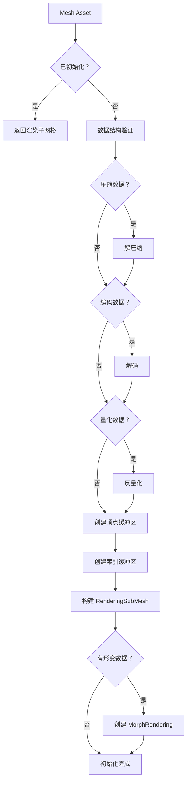
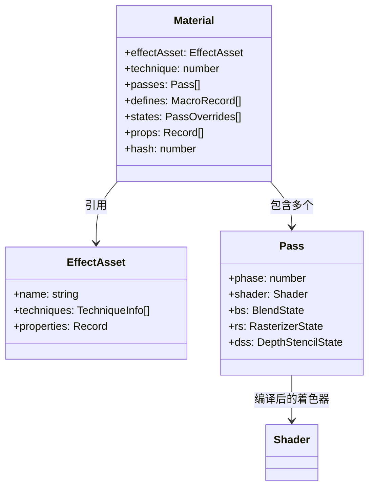
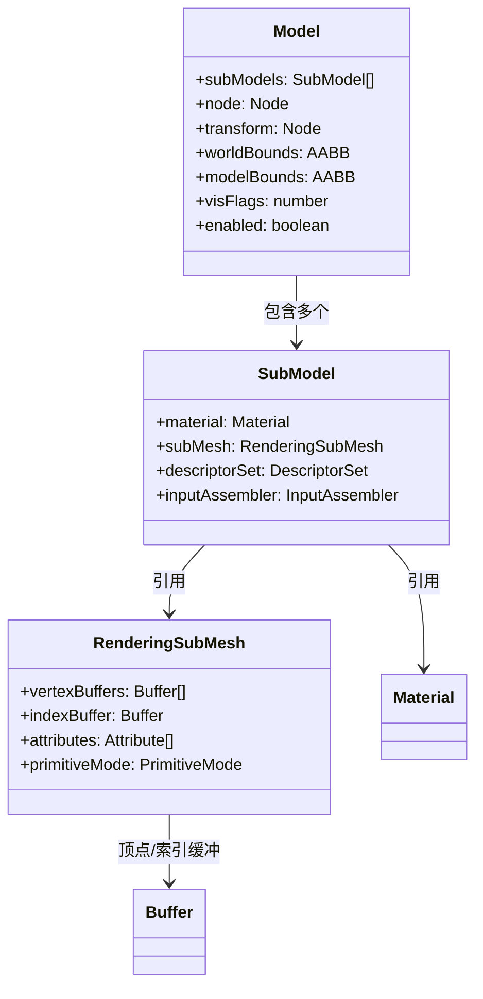
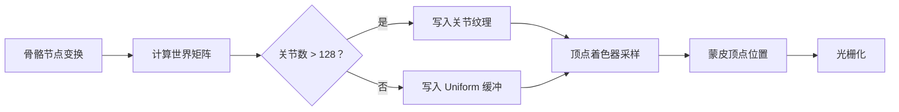
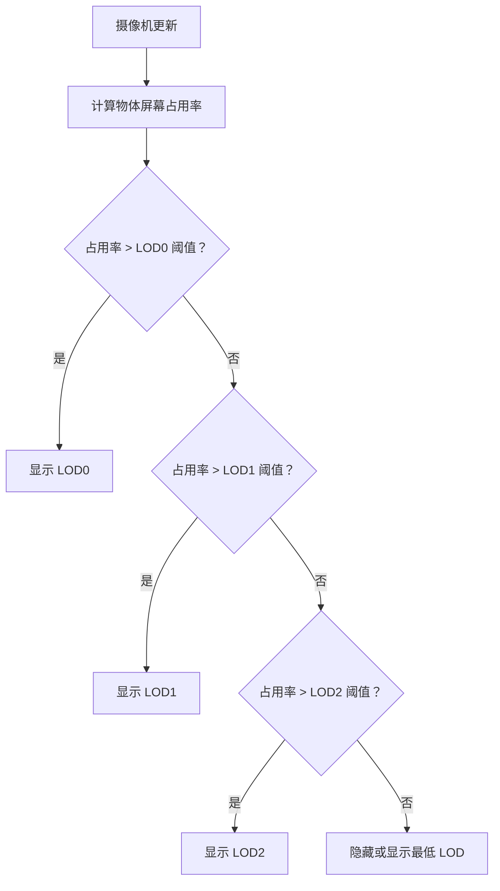

本文档深入解析 Cocos Creator 3D 引擎中模型与材质系统的架构设计与实现机制。面向高级开发者，涵盖网格数据结构、材质渲染管线、蒙皮动画系统、形变网格以及 LOD 管理等核心技术主题。通过本文档，你将理解 3D 模型从资产加载到渲染提交的完整数据流，掌握材质系统的工作原理，并能够针对复杂 3D 场景进行性能优化和定制开发。

## 网格资产架构

**网格（Mesh）** 是 3D 模型几何数据的核心载体，负责存储顶点属性、索引数据和形变信息。引擎采用分层设计将网格资产与渲染实例分离，实现数据复用和高效渲染。

### 网格数据结构

网格的核心数据结构定义在 [`Mesh`](cocos/3d/assets/mesh.ts#L280-L320) 类中，包含以下关键组成部分：

| 组件 | 说明 | 数据结构 |
|------|------|----------|
| **顶点块（Vertex Bundle）** | 交错排列的顶点属性集合 | `IVertexBundle` |
| **子网格（Primitive）** | 具有相同图元类型的渲染单元 | `ISubMesh` |
| **索引视图（Index View）** | 索引数据的缓冲区视图 | `IBufferView` |
| **形变数据（Morph）** | 顶点形变目标及权重 | `Morph` |
| **骨骼映射（Joint Map）** | 蒙皮关节索引映射表 | `number[][]` |

顶点块采用**交错排列**（interleaved）存储策略，即每个顶点的所有属性（位置、法线、UV 等）在内存中连续存放。这种布局提高了 GPU 缓存命中率，优化了顶点着色器的读取效率 [`IVertexBundle`](cocos/3d/assets/mesh.ts#L60-L85)。

子网格是渲染的基本单元，每个子网格引用一个或多个顶点块，并定义图元类型（点、线、三角形）。子网格结构包含：

```typescript
interface ISubMesh {
    vertexBundelIndices: number[];  // 引用的顶点块索引
    primitiveMode: PrimitiveMode;   // 图元类型
    indexView?: IBufferView;        // 索引数据视图
    jointMapIndex?: number;         // 关节映射表索引
    cluster?: IMeshCluster;         // 聚类数据（用于 GPU 剔除）
}
```

Sources: [mesh.ts](cocos/3d/assets/mesh.ts#L90-L130)

### 网格初始化与 GPU 资源创建

网格资产的初始化过程涉及从序列化数据到 GPU 资源的转换。`Mesh.initialize()` 方法负责：

1. **数据解码**：处理压缩、编码和量化数据的解包
2. **顶点缓冲区创建**：为每个顶点块创建 `gfx.Buffer`
3. **索引缓冲区创建**：为子网格创建索引缓冲
4. **渲染子网格构建**：生成 `RenderingSubMesh` 实例



顶点缓冲区的创建根据设备特性进行优化。对于不支持 32 位索引的设备，引擎会自动将索引数据降级为 16 位，并在顶点数超过 65536 时发出警告 [`initialize`](cocos/3d/assets/mesh.ts#L410-L520)。

### 动态网格支持

引擎支持动态网格更新，允许在运行时修改顶点数据。动态网格通过 `IDynamicInfo` 结构预分配缓冲区容量，支持以下属性的实时更新：

- 顶点位置、法线、UV、切线
- 自定义顶点属性
- 索引数据
- 包围盒边界

`Mesh.updateSubMesh()` 方法负责将新的几何数据上传到 GPU，并更新绘制信息（顶点数、索引数）。动态网格适用于程序化生成地形、流体模拟等需要频繁几何更新的场景 [`updateSubMesh`](cocos/3d/assets/mesh.ts#L560-L670)。

Sources: [mesh.ts](cocos/3d/assets/mesh.ts#L280-L350) [mesh.ts](cocos/3d/assets/mesh.ts#L410-L520) [mesh.ts](cocos/3d/assets/mesh.ts#L560-L670)

## 材质系统与渲染管线

**材质（Material）** 是连接模型资产与渲染管线的桥梁，定义了模型如何被绘制。材质系统基于 Effect-Technique-Pass 三层架构，提供灵活的着色器管理和状态控制。

### 材质数据模型

`Material` 类封装了渲染所需的全部状态信息：

| 属性 | 类型 | 说明 |
|------|------|------|
| `effectAsset` | `EffectAsset` | 引用的效果资产 |
| `technique` | `number` | 当前使用的 Technique 索引 |
| `passes` | `Pass[]` | 渲染通道数组 |
| `defines` | `MacroRecord[]` | 着色器宏定义 |
| `states` | `PassOverrides[]` | 管线状态覆盖 |
| `props` | `Record<string, MaterialPropertyFull>[]` | 材质属性 |

材质通过 `effectAsset` 引用 [`EffectAsset`](cocos/asset/assets/effect-asset.ts) 资源，后者定义了着色器程序、渲染技术和属性绑定。Technique 是渲染技术的抽象，包含多个 Pass，每个 Pass 对应一次完整的绘制调用。



材质的哈希值用于材质实例的共享和合批。相同配置的材质会共享底层 GFX 资源，减少内存占用和状态切换开销 [`Material`](cocos/asset/assets/material.ts#L80-L180)。

### 材质属性管理

材质属性分为 Uniform 和 Texture 两类，通过 `setUniform()` 和 `setProperty()` 方法进行设置。属性值会自动同步到对应的 `Pass` 和 `DescriptorSet`。

```typescript
// 设置 Uniform 属性
material.setProperty('albedoScale', new Vec4(1, 1, 1, 1));

// 设置纹理属性
material.setProperty('mainTexture', texture2D);
```

材质支持属性覆盖（Property Override），允许在材质实例层面修改 Effect 中定义的默认值。这种机制支持材质变体的创建，无需修改原始 Effect 资源。

### 管线状态控制

材质的管线状态（Pipeline State）包括混合状态、光栅化状态和深度模板状态。这些状态在 Effect 中定义，但可以通过 `states` 属性进行覆盖：

```typescript
material.overridePipelineStates({
    blendState: {
        targets: [{
            blend: true,
            blendSrc: GFXBlendFactor.SRC_ALPHA,
            blendDst: GFXBlendFactor.ONE_MINUS_SRC_ALPHA,
        }],
    },
    depthStencilState: {
        depthTest: true,
        depthWrite: true,
    },
});
```

**注意**：过度自定义管线状态会增加 PSO（Pipeline State Object）的数量，影响渲染性能。建议优先使用 Effect 中的默认配置。

Sources: [material.ts](cocos/asset/assets/material.ts#L80-L180) [material.ts](cocos/asset/assets/material.ts#L200-L280)

## 模型实例与渲染场景

**模型（Model）** 是渲染场景中的实例对象，负责将网格资产和材质组合成可渲染的实体。`Model` 类管理子模型（SubModel）、包围盒、变换矩阵和渲染状态。

### 模型层级结构



每个 `Model` 包含一个或多个 `SubModel`，每个 `SubModel` 对应一个材质和子网格的组合。`SubModel` 负责创建和管理 GFX 资源：

- **InputAssembler**：组装顶点和索引数据
- **DescriptorSet**：绑定 Uniform 和纹理
- **PipelineState**：配置渲染管线

Sources: [model.ts](cocos/render-scene/scene/model.ts#L117-L250) [rendering-sub-mesh.ts](cocos/asset/assets/rendering-sub-mesh.ts#L80-L150)

### 包围盒与剔除

模型维护两个层级的包围盒：

| 包围盒类型 | 空间 | 用途 |
|-----------|------|------|
| `modelBounds` | 模型空间 | 静态几何边界 |
| `worldBounds` | 世界空间 | 动态变换后的边界 |

`worldBounds` 在每帧更新时根据节点变换重新计算，用于视锥体剔除和阴影剔除。对于蒙皮模型，包围盒需要考虑骨骼动画的影响，引擎使用 `updateTransform()` 方法在动画更新后重新计算边界。

### 可见性与层级

模型的可见性通过 `visFlags` 和 `node.layer` 共同控制。`visFlags` 是模型的可见性标志，与摄像机的 `visibility` 进行位运算比较，决定是否渲染。这种机制支持分层渲染、VR 多视角等高级功能。

```typescript
// 设置模型只在对摄像机可见的层上渲染
model.visFlags = Layers.BitMask.DEFAULT;
camera.visibility = Layers.BitMask.DEFAULT | Layers.BitMask.UI_3D;
```

Sources: [model.ts](cocos/render-scene/scene/model.ts#L280-L350)

## 蒙皮动画系统

蒙皮动画是将网格顶点绑定到骨骼层级系统的技术，用于实现角色动画。Cocos Creator 支持两种蒙皮模式：**实时蒙皮**和**GPU 烘焙蒙皮**。

### 骨骼资产结构

`Skeleton` 资产存储骨骼层级信息：

```typescript
class Skeleton extends Asset {
    joints: string[];      // 关节路径数组
    bindposes: Mat4[];     // 绑定姿势矩阵
    inverseBindposes: Mat4[]; // 反向绑定姿势（运行时计算）
}
```

`joints` 数组存储从 `skinningRoot` 节点到每个关节的路径。`bindposes` 是关节在绑定姿势下的世界矩阵，用于将顶点从模型空间转换到骨骼空间 [`Skeleton`](cocos/3d/assets/skeleton.ts#L30-L80)。

### 实时蒙皮模型

`SkinningModel` 实现实时蒙皮，每帧根据骨骼变换计算顶点位置。蒙皮计算在顶点着色器中执行，使用 Uniform 缓冲区或纹理传递骨骼矩阵。

**关键特性**：

- **Uniform 缓冲区模式**：适用于关节数较少（≤128）的情况
- **纹理模式**：当关节数超过 Uniform 容量时，使用纹理存储骨骼矩阵
- **实时计算**：每帧更新骨骼矩阵，支持动态动画



实时蒙皮的优点是可以响应骨骼的实时变化，但计算开销较大，适合关节数较少的角色 [`SkinningModel`](cocos/3d/models/skinning-model.ts#L80-L150)。

### GPU 烘焙蒙皮模型

`BakedSkinningModel` 将动画数据预烘焙到纹理中，在运行时通过索引查找骨骼矩阵。这种方式将蒙皮计算从 CPU 转移到 GPU，显著提升性能。

**烘焙流程**：

1. 遍历动画剪辑的所有关键帧
2. 计算每个关节在每个关键帧的矩阵
3. 将矩阵打包到纹理（`RGBA32F` 格式）
4. 运行时根据动画时间采样纹理

```typescript
class BakedSkinningModel extends MorphModel {
    uploadedAnim: AnimationClip | null;  // 已烘焙的动画
    _jointsMedium: IJointsInfo;          // 关节纹理和缓冲
    
    uploadAnimation(clip: AnimationClip): void {
        // 烘焙动画到纹理
        this._dataPoolManager.jointTexturePool.bakeAnimation(clip);
    }
}
```

**优势**：

- 减少 CPU-GPU 数据传输
- 支持大量关节（受纹理大小限制）
- 适合复杂角色动画

**限制**：

- 仅支持预定义的动画剪辑
- 不支持运行时骨骼修改

Sources: [skeleton.ts](cocos/3d/assets/skeleton.ts#L30-L80) [skinning-model.ts](cocos/3d/models/skinning-model.ts#L80-L150) [baked-skinning-model.ts](cocos/3d/models/baked-skinning-model.ts#L60-L120)

### 蒙皮渲染器组件

`SkinnedMeshRenderer` 继承自 `MeshRenderer`，添加骨骼和蒙皮根节点引用：

```typescript
@ccclass('cc.SkinnedMeshRenderer')
class SkinnedMeshRenderer extends MeshRenderer {
    skeleton: Skeleton | null;      // 骨骼资产
    skinningRoot: Node | null;      // 蒙皮根节点
    model: SkinningModel | BakedSkinningModel;
}
```

`skinningRoot` 是控制骨骼动画的节点（通常是 `SkeletalAnimation` 组件所在节点）。渲染器在初始化时绑定骨骼，创建对应类型的模型实例 [`SkinnedMeshRenderer`](cocos/3d/skinned-mesh-renderer/skinned-mesh-renderer.ts#L50-L120)。

Sources: [skinned-mesh-renderer.ts](cocos/3d/skinned-mesh-renderer/skinned-mesh-renderer.ts#L50-L120)

## 形变网格渲染

**形变网格（Morph Target）** 技术允许在多个顶点变体之间插值，用于实现面部表情、口型同步等效果。

### 形变数据结构

形变数据存储在 `Morph` 结构中，包含每个子网格的形变目标：

```typescript
interface Morph {
    subMeshMorphs: (SubMeshMorph | null)[];  // 子网格形变数据
    weights?: number[];                       // 全局权重
    targetNames?: string[];                   // 目标名称
}

interface SubMeshMorph {
    attributes: AttributeName[];  // 形变属性（position、normal 等）
    targets: MorphTarget[];       // 形变目标数组
    weights?: number[];           // 目标权重
}
```

每个 `MorphTarget` 包含顶点属性的**位移数据**（displacement），即目标位置与基础位置的差值。这种增量存储方式节省内存，并支持多目标混合 [`Morph`](cocos/3d/assets/morph.ts#L30-L80)。

### 形变渲染实现

形变渲染在顶点着色器中执行，根据权重对多个目标的位移进行加权求和：

```glsl
vec3 morphedPosition = basePosition;
for (int i = 0; i < morphTargetCount; i++) {
    morphedPosition += morphTargets[i].displacement * weights[i];
}
```

引擎提供 `MorphRendering` 接口管理形变实例，支持运行时权重调整：

```typescript
// 设置形变权重
meshRenderer.setWeight(0.8, 0, 2);  // 子网格 0，目标 2，权重 0.8

// 批量设置权重
meshRenderer.setWeights([0.5, 0.3, 0.2], 0);
```

**性能考虑**：

- 形变目标数量影响顶点着色器复杂度
- 建议使用纹理存储大量形变数据
- 支持 GPU 实例化的形变合批

Sources: [morph.ts](cocos/3d/assets/morph.ts#L30-L80) [mesh-renderer.ts](cocos/3d/framework/mesh-renderer.ts#L680-L750)

## LOD 层级细节系统

**LOD（Level of Detail）** 技术根据物体与摄像机的距离动态切换不同精度的模型，优化渲染性能。

### LOD 组组件

`LODGroup` 组件管理多个 LOD 层级，每个层级包含一个或多个 `MeshRenderer`：

```typescript
@ccclass('cc.LOD')
class LOD {
    screenUsagePercentage: number;  // 屏幕占用阈值 [0, 1]
    renderers: MeshRenderer[];      // 该层级的渲染器
    triangleCount: number[];        // 三角形数量统计
}
```

`screenUsagePercentage` 定义该层级生效的最小屏幕占用比例。例如，0.25 表示当物体占据屏幕面积超过 25% 时，该层级可见。

### LOD 切换策略

LOD 系统根据以下因素决定当前激活的层级：

1. **屏幕占用率**：物体包围盒在屏幕空间的投影面积
2. **距离阈值**：物体与摄像机的距离
3. **性能预算**：目标三角形数量限制



### LOD 数据管理

每个 LOD 层级维护 `LODData` 对象，存储模型引用和渲染状态。LOD 切换时，系统会动态添加/移除模型到渲染场景：

```typescript
class LODGroup extends Component {
    lods: LOD[];  // LOD 层级数组
    
    updateLOD(camera: Camera): void {
        const screenRatio = this.calculateScreenRatio(camera);
        for (let i = 0; i < this.lods.length; i++) {
            const lod = this.lods[i];
            if (screenRatio >= lod.screenUsagePercentage) {
                this.activateLOD(i);
                break;
            }
        }
    }
}
```

**最佳实践**：

- LOD0 三角形数建议控制在 5000-10000
- 相邻 LOD 级别的三角形数差异建议为 50%
- 为最低 LOD 级别使用简化的材质和着色器

Sources: [lodgroup-component.ts](cocos/3d/lod/lodgroup-component.ts#L40-L120)

## 光照与阴影集成

3D 模型与引擎的光照系统深度集成，支持实时光照、光照贴图、光照探针和反射探针。

### 光照烘焙设置

`ModelBakeSettings` 组件定义模型的光照烘焙行为：

| 属性 | 类型 | 说明 |
|------|------|------|
| `bakeable` | `boolean` | 是否可烘焙光照贴图 |
| `castShadow` | `boolean` | 烘焙时是否投射阴影 |
| `receiveShadow` | `boolean` | 烘焙时是否接收阴影 |
| `lightmapSize` | `number` | 光照贴图分辨率 |
| `useLightProbe` | `boolean` | 是否使用光照探针 |
| `bakeToLightProbe` | `boolean` | 是否贡献到光照探针 |
| `reflectionProbe` | `ReflectionProbeType` | 反射探针类型 |
| `bakeToReflectionProbe` | `boolean` | 是否贡献到反射探针 |

Sources: [mesh-renderer.ts](cocos/3d/framework/mesh-renderer.ts#L100-L280)

### 实时阴影

模型通过 `shadowCastingMode` 和 `receiveShadow` 属性控制实时阴影行为：

```typescript
meshRenderer.shadowCastingMode = MeshRenderer.ShadowCastingMode.ON;
meshRenderer.receiveShadow = MeshRenderer.ShadowReceivingMode.ON;
```

阴影偏移（`shadowBias` 和 `shadowNormalBias`）用于解决阴影痤疮（shadow acne）问题：

- `shadowBias`：深度偏移，解决自阴影伪影
- `shadowNormalBias`：法线偏移，沿法线方向推移阴影采样点

### 光照探针集成

光照探针为动态物体提供间接光照。模型通过 `useLightProbe` 启用探针采样，引擎在着色器中使用球谐函数（Spherical Harmonics）编码环境光。

```glsl
// 着色器中采样光照探针
vec3 probeLighting = sampleLightProbe(probeIndex, normal);
```

### 反射探针

反射探针提供环境反射效果，支持三种模式：

| 模式 | 说明 | 适用场景 |
|------|------|----------|
| `NONE` | 不使用反射探针 | 无反射需求 |
| `PLANAR` | 平面反射 | 地面、水面 |
| `CUBEMAP` | 立方体贴图反射 | 室内场景、金属表面 |

模型可以混合两个反射探针，实现平滑过渡：

```typescript
meshRenderer.reflectionProbe = ReflectionProbeType.CUBEMAP;
meshRenderer.reflectionProbeId = 0;
meshRenderer.reflectionProbeBlendId = 1;
meshRenderer.reflectionProbeBlendWeight = 0.5;
```

Sources: [mesh-renderer.ts](cocos/3d/framework/mesh-renderer.ts#L350-L450) [model.ts](cocos/render-scene/scene/model.ts#L300-L400)

## 性能优化策略

### 网格优化

1. **合并子网格**：减少 Draw Call，将使用相同材质的子网格合并
2. **顶点去重**：移除重复顶点，减少顶点缓冲区大小
3. **索引优化**：使用顶点缓存友好的索引顺序（如 Stripes 或 TipLong 算法）
4. **量化顶点**：使用 16 位浮点或定点数存储顶点属性，减少内存占用

### 材质优化

1. **材质实例共享**：相同配置的材质共享 Pass 和 DescriptorSet
2. **减少宏定义组合**：避免过多的材质变体
3. **合批友好设计**：使用相同的 Effect 和 Technique 以支持静态/动态合批

### 蒙皮优化

1. **优先使用烘焙蒙皮**：对于预定义动画，使用 `BakedSkinningModel`
2. **限制关节数量**：单个模型的关节数建议不超过 256
3. **LOD 蒙皮简化**：低 LOD 级别使用简化的骨骼层级

### 渲染优化

1. **视锥体剔除**：确保 `worldBounds` 准确，避免过度绘制
2. **遮挡剔除**：对于复杂场景，启用遮挡剔除
3. **LOD 策略**：根据目标平台性能设置合理的 LOD 阈值

## 总结

3D 模型与材质系统是 Cocos Creator 渲染管线的核心组成部分。理解网格数据结构、材质渲染流程、蒙皮动画机制和 LOD 管理，对于开发高性能 3D 应用至关重要。

**关键要点**：

- 网格资产采用顶点块和子网格的分层设计，支持动态更新和形变
- 材质系统基于 Effect-Technique-Pass 架构，提供灵活的着色器管理
- 蒙皮动画支持实时和 GPU 烘焙两种模式，平衡性能与灵活性
- LOD 系统根据屏幕占用率动态切换模型精度，优化渲染负载
- 光照与阴影集成支持实时和烘焙混合方案，提供高质量的视觉效果

**下一步学习**：

- 深入了解 [3D 渲染管线](10-3d-xuan-ran-guan-xian) 的渲染流程和剔除机制
- 探索 [着色器与效果系统](18-zhao-se-qi-yu-xiao-guo-xi-tong) 的自定义着色器开发
- 研究 [3D 物理系统](12-3d-wu-li-xi-tong) 的碰撞检测与物理模拟