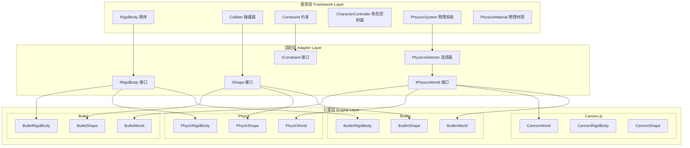

Cocos Creator 3D 物理系统为游戏提供完整的刚体动力学模拟能力，支持多种物理引擎后端，包括内置的轻量级实现、Cannon.js、Bullet（Ammo.js）以及 NVIDIA PhysX。系统采用**策略模式**设计，通过统一的抽象接口层屏蔽不同物理引擎的实现差异，使开发者能够在不修改业务代码的前提下灵活切换物理后端。

## 系统架构设计

3D 物理系统采用分层架构设计，从上至下分别为**框架层**、**适配层**和**引擎层**。框架层提供与引擎深度集成的组件系统，包括刚体、碰撞器、约束和角色控制器；适配层定义统一的物理世界接口规范；引擎层则封装具体的物理引擎实现。



框架层组件通过 `selector` 机制动态绑定到具体引擎的实现类。`PhysicsSelector` 作为系统的注册中心，在初始化时根据配置加载对应的物理后端，并在运行时维护当前激活的物理世界实例 Sources: [physics-selector.ts](cocos/physics/framework/physics-selector.ts#L1-L200)。

## 物理引擎后端

Cocos Creator 支持四种物理引擎后端，每种后端针对不同的使用场景和平台需求：

| 引擎 | 标识符 | 特性 | 适用场景 | 导出模块 |
|------|--------|------|----------|----------|
| **Builtin** | `builtin` | 轻量级、纯 TypeScript 实现、仅支持触发器 | 简单交互、Web 小游戏 | [physics-builtin.ts](exports/physics-builtin.ts#L1-L29) |
| **Cannon.js** | `cannon.js` | 中等精度、JavaScript 实现、支持完整动力学 | 移动端 Web、中等复杂度物理 | [physics-cannon.ts](exports/physics-cannon.ts#L1-L49) |
| **Bullet** | `bullet` | 高精度、WASM 实现、工业级物理模拟 | 主机游戏、复杂物理交互 | [physics-ammo.ts](exports/physics-ammo.ts#L1-L29) |
| **PhysX** | `physx` | 高性能、NVIDIA 官方 SDK、多线程支持 | 原生平台、高性能需求 | [physics-physx.ts](exports/physics-physx.ts#L1-L29) |

### Builtin 引擎

内置物理引擎是纯 TypeScript 实现的轻量级方案，位于 `cocos/physics/cocos` 目录。它仅支持触发器功能，不进行真实的物理模拟，适用于只需要碰撞检测而不需要动力学计算的场景 Sources: [builtin-world.ts](cocos/physics/cocos/builtin-world.ts#L1-L100)。

### Cannon.js 引擎

Cannon.js 是一个用 JavaScript 编写的轻量级 3D 物理引擎，通过 `@cocos/cannon` 包引入。它在 `cocos/physics/cannon` 目录中进行了封装，支持完整的刚体动力学、碰撞检测和约束系统。Cannon.js 在性能和精度之间取得平衡，适合移动端 Web 项目 Sources: [cannon-world.ts](cocos/physics/cannon/cannon-world.ts#L1-L100)。

### Bullet 引擎

Bullet 是工业级开源物理引擎，通过 WebAssembly (WASM) 形式集成。`cocos/physics/bullet` 目录提供了完整的 Bullet 封装，包括 `BulletWorld`、`BulletRigidBody` 和各种形状实现。Bullet 提供最高精度的物理模拟，支持连续碰撞检测 (CCD)、软体物理和车辆模拟等高级特性 Sources: [bullet-world.ts](cocos/physics/bullet/bullet-world.ts#L1-L150)。

### PhysX 引擎

NVIDIA PhysX 是商业级物理引擎，在原生平台上提供最佳性能。`cocos/physics/physx` 目录封装了 PhysX SDK，通过 `PhysXWorld` 管理物理场景。PhysX 支持多线程模拟、GPU 加速和高级角色控制器，是原生游戏项目的首选 Sources: [physx-world.ts](cocos/physics/physx/physx-world.ts#L1-L150)。

## 核心组件系统

### 刚体组件 (RigidBody)

`RigidBody` 是物理系统的核心组件，赋予节点物理属性。刚体分为三种类型：**动态刚体** (DYNAMIC) 受力和重力影响、**静态刚体** (STATIC) 固定不动、**运动学刚体** (KINEMATIC) 通过速度控制运动。

```typescript
@ccclass('cc.RigidBody')
export class RigidBody extends Component {
    @type(ERigidBodyType)
    public type: ERigidBodyType = ERigidBodyType.DYNAMIC;
    
    @displayOrder(0)
    public mass: number = 1.0;
    
    @tooltip('i18n:physics3d.rigidbody.allowSleep')
    public allowSleep: boolean = true;
    
    // 线性速度、角速度、力/扭矩施加方法
    public setLinearVelocity (velocity: Vec3): void;
    public applyForce (force: Vec3, worldPos?: Vec3): void;
}
```

刚体组件通过 `_body` 属性持有底层物理引擎的刚体实例，所有物理操作都委托给该实例执行 Sources: [rigid-body.ts](cocos/physics/framework/components/rigid-body.ts#L1-L150)。

### 碰撞器组件 (Collider)

碰撞器定义物体的物理形状，必须依附于刚体或作为独立的触发器使用。系统提供多种碰撞器类型：

| 碰撞器类型 | 类名 | 几何描述 | 性能开销 |
|-----------|------|----------|----------|
| 盒子碰撞器 | `BoxCollider` | 长方体 | 低 |
| 球体碰撞器 | `SphereCollider` | 球体 | 最低 |
| 胶囊碰撞器 | `CapsuleCollider` | 胶囊体 | 低 |
| 圆柱碰撞器 | `CylinderCollider` | 圆柱体 | 中 |
| 圆锥碰撞器 | `ConeCollider` | 圆锥体 | 中 |
| 网格碰撞器 | `MeshCollider` | 三角网格 | 高 |
| 地形碰撞器 | `TerrainCollider` | 高度场地形 | 中 |
| 平面碰撞器 | `PlaneCollider` | 无限平面 | 最低 |
| 单形碰撞器 | `SimplexCollider` | 点/线/三角形/四面体 | 最低 |

碰撞器通过 `sharedMaterial` 属性引用 `PhysicsMaterial` 资源，定义摩擦系数和回弹系数。`isTrigger` 属性决定碰撞器是否产生物理响应还是仅触发事件 Sources: [collider.ts](cocos/physics/framework/components/colliders/collider.ts#L1-L150)。

### 约束组件 (Constraint)

约束用于连接两个刚体，限制它们的相对运动。系统支持五种约束类型：

- **Point-to-Point Constraint**: 球铰约束，允许绕连接点自由旋转
- **Hinge Constraint**: 铰链约束，限制绕单轴旋转
- **Fixed Constraint**: 固定约束，完全锁定相对运动
- **Configurable Constraint**: 可配置约束，支持 6 自由度精细控制

约束组件通过 `connectedBody` 属性指定连接的刚体，为空时连接到世界坐标系的原点 Sources: [constraint.ts](cocos/physics/framework/components/constraints/constraint.ts#L1-L100)。

### 角色控制器 (CharacterController)

角色控制器是专为游戏角色设计的移动组件，提供碰撞检测和自动爬坡功能。系统提供两种实现：

- **BoxCharacterController**: 盒子形状角色控制器
- **CapsuleCharacterController**: 胶囊形状角色控制器（推荐）

角色控制器独立于刚体系统，使用专门的运动学算法，避免传统刚体方案中的"抖动"和"卡住"问题 Sources: [character-controller.ts](cocos/physics/framework/components/character-controllers/character-controller.ts#L1-L100)。

## 物理系统与配置

`PhysicsSystem` 是物理模块的全局单例，管理物理世界的生命周期和模拟参数。系统通过 `physics-config.json` 或运行时 API 进行配置：

```typescript
PhysicsSystem.instance.gravity = new Vec3(0, -10, 0);
PhysicsSystem.instance.fixedTimeStep = 1 / 60;
PhysicsSystem.instance.maxSubSteps = 4;
PhysicsSystem.instance.allowSleep = true;
PhysicsSystem.instance.autoSimulation = true;
```

关键配置参数说明：

| 参数 | 类型 | 默认值 | 说明 |
|------|------|--------|------|
| `gravity` | `Vec3` | `(0, -10, 0)` | 世界重力向量 |
| `fixedTimeStep` | `number` | `1/60` | 每步模拟的固定时间 |
| `maxSubSteps` | `number` | `4` | 每帧最大子步数 |
| `allowSleep` | `boolean` | `true` | 允许刚体自动休眠 |
| `autoSimulation` | `boolean` | `true` | 是否自动模拟 |
| `sleepThreshold` | `number` | `0.1` | 进入休眠的速度阈值 |

当 `autoSimulation` 设为 `false` 时，开发者需要手动调用 `PhysicsSystem.instance.step(deltaTime)` 来推进物理模拟 Sources: [physics-system.ts](cocos/physics/framework/physics-system.ts#L1-L200)。

## 物理材质系统

`PhysicsMaterial` 资源定义物体表面的物理特性，包括四种系数：

- **friction** (摩擦系数): 影响滑动摩擦力，默认 0.6
- **rollingFriction** (滚动摩擦): 影响滚动物体的阻力，默认 0.0
- **spinningFriction** (自旋摩擦): 影响旋转物体的阻力，默认 0.0
- **restitution** (回弹系数): 影响碰撞反弹，范围 [0, 1]，默认 0.0

材质修改通过 `EVENT_UPDATE` 事件通知底层物理引擎，确保运行时变更即时生效 Sources: [physics-material.ts](cocos/physics/framework/assets/physics-material.ts#L1-L200)。

## 碰撞检测与射线投射

物理系统提供多种场景查询方法，用于实现拾取、视野检测等功能：

### 射线投射 (Raycast)

```typescript
const ray = new Ray(origin, direction);
const results: PhysicsRayResult[] = [];
const hit = PhysicsSystem.instance.raycast(ray, {
    mask: 0xffffffff,
    group: 0,
    queryTrigger: true,
    maxDistance: 100
}, results);
```

### 形状扫描 (Sweep)

支持盒子、球体、胶囊体的扫描测试，用于预测运动路径上的碰撞：

```typescript
const halfExtent = new Vec3(1, 1, 1);
const orientation = new Quat();
const hit = PhysicsSystem.instance.sweepBoxClosest(
    ray, halfExtent, orientation, options, result
);
```

射线投射结果通过 `PhysicsRayResult` 返回，包含碰撞点、法线、距离和碰撞器引用 Sources: [i-physics-world.ts](cocos/physics/spec/i-physics-world.ts#L1-L63)。

## 事件系统

物理系统支持三种事件类型，通过组件上的回调方法响应：

### 碰撞事件 (Collision Events)

仅在非触发器碰撞器之间产生，提供详细的碰撞接触信息：

```typescript
onCollisionEnter (event: ICollisionEvent): void;
onCollisionStay (event: ICollisionEvent): void;
onCollisionExit (event: ICollisionEvent): void;
```

`ICollisionEvent` 包含 `contacts` 数组，每个接触点提供：
- 本地/世界坐标系下的碰撞点和法线
- 碰撞冲量大小
- 接触物体引用

### 触发事件 (Trigger Events)

当任意一个碰撞器标记为 `isTrigger` 时产生：

```typescript
onTriggerEnter (event: ITriggerEvent): void;
onTriggerStay (event: ITriggerEvent): void;
onTriggerExit (event: ITriggerEvent): void;
```

### 角色控制器事件

角色控制器提供专用的碰撞和触发事件，包含额外的滑动和台阶信息 Sources: [physics-interface.ts](cocos/physics/framework/physics-interface.ts#L1-L200)。

## 碰撞分组与过滤

物理系统使用**位掩码**机制实现碰撞过滤。`PhysicsGroup` 枚举预定义 32 个分组，开发者可通过 `collisionMatrix` 配置分组间的碰撞关系：

```json
{
  "collisionMatrix": {
    "DEFAULT": 0xffffffff,
    "PLAYER": 0xfffffffd,
    "ENEMY": 0xfffffffb
  }
}
```

每个刚体和碰撞器通过 `group` 属性设置所属分组，射线投射也可指定 `mask` 参数过滤检测结果 Sources: [collision-matrix.ts](cocos/physics/framework/collision-matrix.ts#L1-L50)。

## 调试可视化

物理系统提供调试绘制功能，通过 `EPhysicsDrawFlags` 控制显示内容：

```typescript
enum EPhysicsDrawFlags {
    NONE = 0,
    COLLIDERS = 1 << 0,
    JOINTS = 1 << 1,
    AABB = 1 << 2,
    PAIR_BROADPHASE = 1 << 3,
    CONTACTS = 1 << 4,
    ALL = 0xffffffff
}
```

设置 `PhysicsSystem.instance.debugDrawFlags = EPhysicsDrawFlags.ALL` 可在 Scene 视图中显示所有物理对象 Sources: [physics-enum.ts](cocos/physics/framework/physics-enum.ts#L1-L200)。

## 性能优化建议

1. **选择合适的物理引擎**: Web 平台优先 Cannon.js，原生平台使用 PhysX
2. **简化碰撞形状**: 使用复合碰撞器代替 MeshCollider
3. **合理设置休眠阈值**: 减少静止物体的计算开销
4. **分层碰撞过滤**: 通过 `collisionMatrix` 减少不必要的碰撞检测
5. **控制子步数量**: 根据帧率调整 `maxSubSteps`
6. **批量操作**: 避免每帧多次调用力/速度设置方法

## 相关文档

- 了解 2D 物理系统的实现差异，参考 [2D 物理](9-2d-wu-li)
- 深入学习物理引擎与渲染管线的集成，参考 [3D 渲染管线](10-3d-xuan-ran-guan-xian)
- 研究角色动画与物理的结合，参考 [骨骼动画](14-gu-ge-dong-hua)