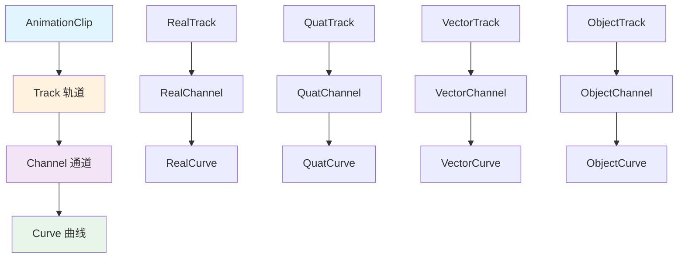
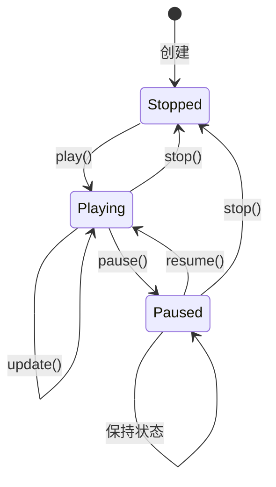
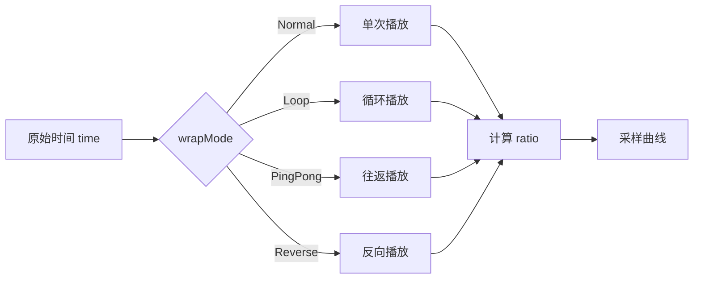
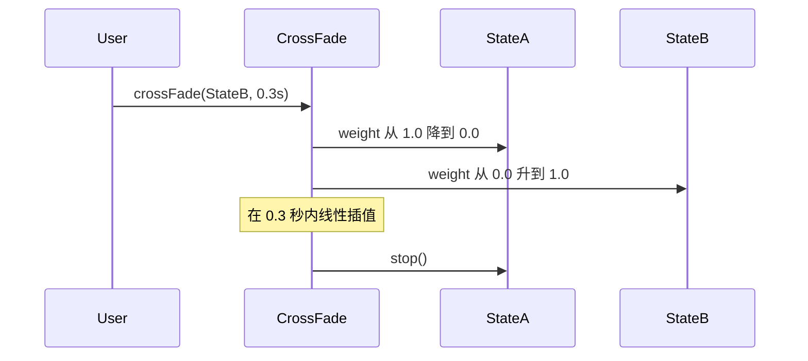

动画剪辑与状态是 Cocos Creator 动画系统的核心概念，它们共同构成了动画播放的基础架构。**动画剪辑**（AnimationClip）是动画数据的载体，存储了关键帧、轨道和曲线等原始数据；**动画状态**（AnimationState）则是动画剪辑的运行时实例，负责控制动画的播放过程。理解这两者的关系与工作机制，是掌握 Cocos Creator 动画系统的关键。

## 动画剪辑：数据的容器

动画剪辑是动画资源的静态表示，它继承了资源基类 `Asset`，在编辑器中作为资源文件存在。动画剪辑的核心职责是**组织和存储动画数据**，包括轨道、关键帧、事件和嵌入播放器等信息。

### 核心属性

动画剪辑具有以下关键属性：

| 属性 | 类型 | 说明 |
|------|------|------|
| `sample` | number | 动画帧率，单位为帧/秒，默认为 60 |
| `speed` | number | 播放速度，1 为正常速度 |
| `wrapMode` | WrapMode | 循环模式，定义动画的播放方式 |
| `duration` | number | 动画周期（秒），只读属性 |
| `tracks` | Iterable<Track> | 轨道集合，只读 |
| `events` | IEvent[] | 事件数据数组 |
| `enableTrsBlending` | boolean | 是否启用节点 TRS 曲线混合 |

Sources: [animation-clip.ts](cocos/animation/animation-clip.ts#L129-L175)

### 循环模式详解

`WrapMode` 枚举定义了动画的循环行为，这些模式决定了动画播放到结尾后的行为：

```typescript
enum WrapMode {
    Default = 0,      // 向 Animation 组件或 AnimationClip 查找 wrapMode
    Normal = 1,       // 动画只播放一遍
    Reverse = 2,      // 从最后一帧反向播放到第一帧
    Loop = 3,         // 循环播放
    LoopReverse = 4,  // 反向循环播放
    PingPong = 5,     // 往返播放（正序→倒序→正序循环）
    PingPongReverse = 6 // 从反向开始的往返播放
}
```

Sources: [types.ts](cocos/animation/types.ts#L30-L62)

### 轨道系统架构

动画剪辑的数据组织采用**轨道 - 通道 - 曲线**三层结构：



**轨道**（Track）定义了动画的目标路径，通过 `TrackPath` 描述如何找到动画目标属性。**通道**（Channel）是轨道的子单元，单个通道包含一条曲线。**曲线**（Curve）存储了关键帧数据和插值逻辑。

Sources: [track.ts](cocos/animation/tracks/track.ts#L451-L510)

### 轨道类型体系

Cocos Creator 提供了多种轨道类型，每种类型对应不同的数据插值方式：

| 轨道类型 | 曲线类型 | 用途 |
|----------|----------|------|
| `RealTrack` | `RealCurve` | 标量属性动画（如透明度、数值） |
| `QuatTrack` | `QuatCurve` | 四元数旋转动画 |
| `VectorTrack` | `VectorCurve` | 向量属性动画（如位置、缩放） |
| `ColorTrack` | `ColorCurve` | 颜色属性动画 |
| `ObjectTrack` | `ObjectCurve<T>` | 对象属性动画（如 SpriteFrame 切换） |
| `SizeTrack` | `SizeCurve` | 尺寸属性动画 |
| `ArrayTrack` | `ArrayCurve` | 数组属性动画 |

Sources: [real-track.ts](cocos/animation/tracks/real-track.ts#L36-L44) [quat-track.ts](cocos/animation/tracks/quat-track.ts#L36-L53) [vector-track.ts](cocos/animation/tracks/vector-track.ts#L39-L75)

### 目标路径解析

`TrackPath` 类描述了如何从根节点寻址到动画目标属性。它支持四种路径段：

1. **层级路径**（HierarchyPath）：通过节点名称访问子节点
2. **组件路径**（ComponentPath）：访问节点上的组件
3. **属性路径**：访问对象的属性（字符串）
4. **元素路径**：访问数组元素（数字索引）

```typescript
// 示例：构建一个访问 Node 位置属性的路径
const trackPath = new TrackPath()
    .toHierarchy('ChildNode')           // 访问子节点
    .toComponent('cc.Sprite')           // 访问组件
    .toProperty('color');               // 访问属性
```

Sources: [track.ts](cocos/animation/tracks/track.ts#L59-L150)

### 事件系统

动画剪辑支持在特定时间点触发事件。事件数据以 `IEvent` 数组形式存储，每个事件包含：

- `frame`：事件触发的帧号
- `func`：事件函数名
- `params`：事件参数数组

Sources: [animation-clip.ts](cocos/animation/animation-clip.ts#L53-L60)

## 动画状态：运行的实例

动画状态是动画剪辑的运行时实例，继承自 `Playable` 基类。它负责**控制动画的播放过程**，包括时间管理、曲线采样、事件触发等。

### 生命周期管理

动画状态的生命周期由 `Playable` 基类定义，包含以下状态转换：



Sources: [playable.ts](cocos/animation/playable.ts#L28-L100)

### 核心属性

动画状态提供了丰富的属性来控制播放行为：

| 属性 | 类型 | 说明 |
|------|------|------|
| `clip` | AnimationClip | 正在播放的动画剪辑（只读） |
| `name` | string | 动画状态名称（只读） |
| `duration` | number | 单次动画持续时间（秒） |
| `time` | number | 当前累计播放时间（秒） |
| `speed` | number | 播放速率，1 为正常速度 |
| `wrapMode` | WrapMode | 循环模式 |
| `repeatCount` | number | 迭代次数，Infinity 表示无限循环 |
| `weight` | number | 权重，用于混合多个动画 |
| `playbackRange` | {min, max} | 播放范围（秒） |
| `current` | number | 当前时间进度（秒，只读） |
| `ratio` | number | 播放比例 0-1（只读） |

Sources: [animation-state.ts](cocos/animation/animation-state.ts#L82-L280)

### 播放控制方法

动画状态提供以下核心方法控制播放：

| 方法 | 说明 |
|------|------|
| `play()` | 开始播放动画 |
| `stop()` | 停止动画播放 |
| `pause()` | 暂停动画 |
| `resume()` | 恢复播放 |
| `setTime(time)` | 设置当前播放时间 |
| `sample()` | 采样当前帧的曲线值 |

Sources: [playable.ts](cocos/animation/playable.ts#L58-L100) [animation-state.ts](cocos/animation/animation-state.ts#L475-L485)

### 时间系统

动画状态的时间系统支持多种播放模式。`getWrappedInfo` 方法根据 `wrapMode` 和 `repeatCount` 计算实际播放时间和方向：



对于 PingPong 模式，系统会根据当前迭代次数的奇偶性决定播放方向：

```typescript
private _needReverse(currentIterations: number): boolean {
    const wrapMode = this.wrapMode;
    let needReverse = false;
    
    if ((wrapMode & WrapModeMask.PingPong) === WrapModeMask.PingPong) {
        const isOddIteration = currentIterations & 1;
        if (isOddIteration) {
            needReverse = !needReverse;
        }
    }
    if ((wrapMode & WrapModeMask.Reverse) === WrapModeMask.Reverse) {
        needReverse = !needReverse;
    }
    return needReverse;
}
```

Sources: [animation-state.ts](cocos/animation/animation-state.ts#L620-L640)

### 曲线采样机制

动画状态通过 `_sampleCurves` 方法采样曲线值：

```typescript
protected _sampleCurves(time: number): void {
    const { _poseOutput: poseOutput, _clipEval: clipEval } = this;
    if (poseOutput) {
        poseOutput.weight = this.weight;
    }
    if (clipEval) {
        clipEval.evaluate(time);
    }
}
```

`clipEval` 是动画剪辑创建的评估器，负责遍历所有轨道并计算目标属性的值。`poseOutput` 用于姿态输出，支持动画混合。

Sources: [animation-state.ts](cocos/animation/animation-state.ts#L545-L555)

### 事件采样

动画事件在 `_sampleEvents` 方法中处理。系统根据当前时间比率查找需要触发的事件组：

```typescript
private _sampleEvents(wrapInfo: WrappedInfo): void {
    if (!this._clipEventEval) return;
    
    const ratio = wrapInfo.ratio;
    const direction = wrapInfo.direction;
    this._clipEventEval.sample(ratio, direction);
}
```

事件评估器会检查事件是否应该触发，并通过 `Animation` 组件派发事件。

Sources: [animation-state.ts](cocos/animation/animation-state.ts#L510-L517)

## 动画组件：高级控制器

`Animation` 组件是动画系统的高级接口，它管理多个动画剪辑和状态，提供便捷的播放控制。

### 组件架构

```mermaid
graph TD
    A[Animation 组件] --> B[clips: AnimationClip[]]
    A --> C[_nameToState: Map<string, AnimationState>]
    A --> D[_crossFade: CrossFade]
    
    B --> E[创建 AnimationState]
    C --> E
    D --> F[管理状态切换]
    
    E --> G[初始化到节点]
    F --> H[淡入淡出控制]
```

### 核心属性

| 属性 | 类型 | 说明 |
|------|------|------|
| `clips` | AnimationClip[] | 管理的动画剪辑数组 |
| `defaultClip` | AnimationClip | 默认剪辑 |
| `playOnLoad` | boolean | 是否在 onLoad 时自动播放默认剪辑 |

Sources: [animation-component.ts](cocos/animation/animation-component.ts#L54-L135)

### 播放控制方法

Animation 组件提供两层播放控制：

**立即切换**：
- `play(name?)`：立即播放指定动画，无过渡

**平滑切换**：
- `crossFade(name, duration)`：在指定时间内淡入淡出切换到目标动画

**状态管理**：
- `getState(name)`：获取指定动画状态
- `createState(clip, name?)`：创建动画状态
- `removeState(name)`：移除动画状态

Sources: [animation-component.ts](cocos/animation/animation-component.ts#L195-L280)

### 使用示例

```typescript
import { _decorator, Component, Animation } from 'cc';
const { ccclass, property } = _decorator;

@ccclass('AnimationExample')
export class AnimationExample extends Component {
    @property(Animation)
    animation: Animation = null!;

    start() {
        // 立即播放
        this.animation.play('run');
        
        // 平滑切换，0.3 秒过渡
        this.animation.crossFade('jump', 0.3);
        
        // 获取状态并控制
        const state = this.animation.getState('run');
        if (state) {
            state.speed = 1.5;  // 加速播放
            state.weight = 0.5; // 设置权重
        }
        
        // 暂停/恢复所有动画
        this.animation.pause();
        this.animation.resume();
        
        // 停止所有动画
        this.animation.stop();
    }
}
```

## 交叉淡入淡出

`CrossFade` 类实现了多个动画状态之间的平滑过渡。它通过管理状态的权重来实现淡入淡出效果。

### 工作原理



### 核心方法

| 方法 | 说明 |
|------|------|
| `crossFade(state, duration)` | 在指定时间内切换到目标状态 |
| `clear()` | 停止所有淡入淡出并清除状态 |
| `update(deltaTime)` | 更新淡入淡出进度 |

Sources: [cross-fade.ts](cocos/animation/cross-fade.ts#L60-L120)

### 权重计算

当只有一个状态时，权重直接设为 1.0。多个状态同时播放时，`CrossFade` 会根据淡入淡出时间计算每个状态的权重：

```typescript
if (managedStates.length === 1 && fadings.length === 1) {
    const state = managedStates[0].state;
    if (state) {
        state.weight = 1.0;
    }
} else {
    this._calculateWeights(deltaTime);
}
```

Sources: [cross-fade.ts](cocos/animation/cross-fade.ts#L54-L68)

## 高级特性

### 辅助曲线

动画剪辑支持添加**辅助曲线**（Auxiliary Curve），这些曲线不直接驱动任何属性，但可以在动画逻辑中作为参考值使用。辅助曲线在 3.x 版本中是实验性特性。

```typescript
// 添加辅助曲线
const curve = clip.addAuxiliaryCurve_experimental('speedFactor');
curve.addKey(0, 1.0);
curve.addKey(1, 2.0);

// 获取辅助曲线
const factorCurve = clip.getAuxiliaryCurve_experimental('speedFactor');
```

Sources: [animation-clip.ts](cocos/animation/animation-clip.ts#L715-L760)

### 嵌入式播放器

动画剪辑可以包含**嵌入式播放器**（Embedded Player），用于在动画播放过程中触发特殊效果，如粒子系统播放、音效触发等。

Sources: [animation-clip.ts](cocos/animation/animation-clip.ts#L84-L90)

### 根运动

根运动（Root Motion）允许动画驱动角色的位移和旋转。通过设置 `enableTrsBlending` 和配置根骨骼路径，可以实现动画驱动的移动效果。

Sources: [animation-clip.ts](cocos/animation/animation-clip.ts#L150-L156)

## 性能优化建议

1. **复用动画状态**：避免频繁创建和销毁 AnimationState，使用 `getState` 获取已有状态
2. **合理设置 sample**：根据动画复杂度选择合适的帧率，过高会增加计算开销
3. **使用 CrossFade**：相比直接切换，CrossFade 能提供更平滑的视觉效果
4. **控制激活状态数量**：同时播放的动画状态越多，性能开销越大

## 与其他模块的关系

- **[动画曲线与插值](15-dong-hua-qu-xian-yu-cha-zhi)**：深入了解曲线类型和插值算法
- **[骨骼动画](14-gu-ge-dong-hua)**：学习骨骼动画的特殊处理机制
- **[组件系统](6-zu-jian-xi-tong)**：理解 Animation 组件在组件系统中的位置

## 总结

动画剪辑与状态构成了 Cocos Creator 动画系统的双层架构：**剪辑层**负责数据存储和组织，**状态层**负责运行时控制。通过理解这两者的职责划分和协作机制，开发者可以更高效地使用动画系统，实现复杂的动画效果。