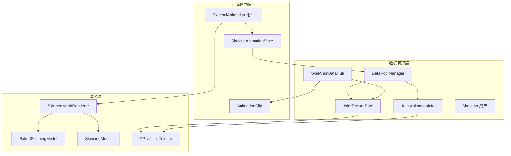
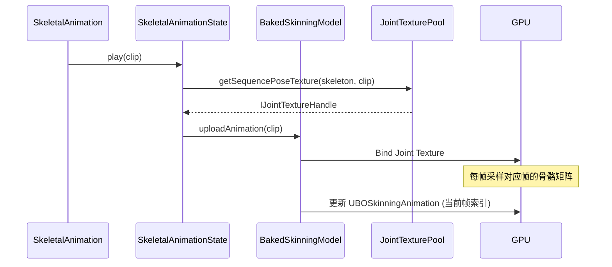
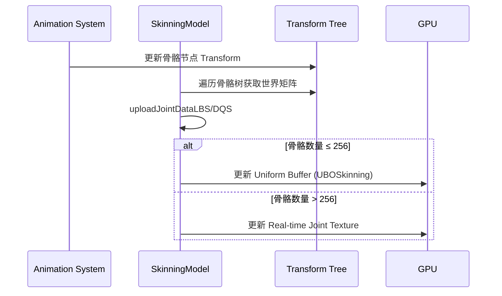
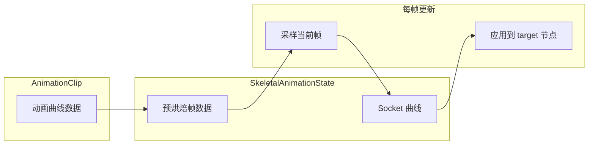

骨骼动画是 3D 角色动画的核心技术，Cocos Engine 提供了一套完整的骨骼动画解决方案，支持**预烘焙**和**实时计算**两种模式，并集成了 Spine 和 DragonBones 等外部动画系统。本文深入解析骨骼动画的架构设计、数据流和性能权衡。

## 核心架构

Cocos 的骨骼动画系统由三个层次组成：**动画控制层**、**数据管理层**和**渲染层**。



**控制层**负责动画播放状态管理，**数据层**负责骨骼变换数据的缓存和分发，**渲染层**负责将骨骼数据传递给 GPU 进行蒙皮计算。

Sources: [cocos/3d/skeletal-animation/skeletal-animation.ts](cocos/3d/skeletal-animation/skeletal-animation.ts#L1-L386)

## 动画模式：预烘焙 vs 实时计算

骨骼动画提供两种运行模式，通过 `useBakedAnimation` 属性切换：

| 特性 | 预烘焙模式 | 实时计算模式 |
|------|-----------|-------------|
| 性能 | 高（GPU 计算） | 中（CPU 计算） |
| 动态混合 | ❌ 不支持 | ✅ 支持 |
| Socket 支持 | ✅ 有限支持 | ✅ 完整支持 |
| 内存占用 | 高（存储帧数据） | 低 |
| 适用场景 | 固定动画循环 | 需要动态 blending |

### 预烘焙模式架构

预烘焙模式将动画的所有帧预先计算并存储到 **Joint Texture** 中，GPU 在渲染时直接采样：



关键实现中，`SkeletalAnimationState` 的 `_sampleCurvesBaked` 方法每帧更新当前帧索引，`BakedSkinningModel` 通过 Uniform Buffer 将帧索引传递给着色器：

Sources: [cocos/3d/skeletal-animation/skeletal-animation-state.ts](cocos/3d/skeletal-animation/skeletal-animation-state.ts#L180-L203)
Sources: [cocos/3d/models/baked-skinning-model.ts](cocos/3d/models/baked-skinning-model.ts#L164-L200)

### 实时计算模式架构

实时模式每帧在 CPU 端计算骨骼的世界变换，通过 Uniform Buffer 或 Joint Texture 传递给 GPU：



当骨骼数量超过 `UBOSkinning.JOINT_UNIFORM_CAPACITY`（默认 256）时，系统自动切换到 Real-time Joint Texture 模式：

Sources: [cocos/3d/models/skinning-model.ts](cocos/3d/models/skinning-model.ts#L95-L110)
Sources: [cocos/3d/skeletal-animation/skeletal-animation-utils.ts](cocos/3d/skeletal-animation/skeletal-animation-utils.ts#L26-L95)

## 骨骼资产与蒙皮

### Skeleton 资产

[`Skeleton`](cocos/3d/assets/skeleton.ts#L32-L128) 资产存储骨骼的元数据：

- **joints**: 所有骨骼相对于 `skinningRoot` 的路径数组
- **bindposes**: 每个骨骼的绑定姿势矩阵（世界矩阵的逆）
- **hash**: 用于纹理缓存的唯一标识

```typescript
@ccclass('cc.Skeleton')
export class Skeleton extends Asset {
    get joints(): string[] { return this._joints; }
    get bindposes(): Mat4[] { return this._bindposes; }
    get inverseBindposes(): Mat4[] { /* 计算逆矩阵 */ }
}
```

### SkinnedMeshRenderer 组件

[`SkinnedMeshRenderer`](cocos/3d/skinned-mesh-renderer/skinned-mesh-renderer.ts#L41-L191) 是蒙皮网格的渲染组件，关键属性：

- **skeleton**: 绑定的 Skeleton 资产
- **skinningRoot**: 骨骼根节点（通常与 SkeletalAnimation 同节点）
- **associatedAnimation**: 内部引用，指向控制的 SkeletalAnimation

组件在初始化时根据 `useBakedAnimation` 设置自动选择 `BakedSkinningModel` 或 `SkinningModel`：

Sources: [cocos/3d/skinned-mesh-renderer/skinned-mesh-renderer.ts](cocos/3d/skinned-mesh-renderer/skinned-mesh-renderer.ts#L55-L95)

## Socket 挂点系统

Socket 系统允许开发者将任意节点挂载到运动的骨骼上，实现武器挂载、特效跟随等功能。

### Socket 数据结构

```typescript
@ccclass('cc.SkeletalAnimation.Socket')
export class Socket {
    @editable public path = '';      // 骨骼路径
    @type(Node) public target = null; // 同步目标节点
}
```

### 工作原理



`SkeletalAnimationState.rebuildSocketCurves` 方法为每个 Socket 预计算所有帧的变换矩阵（位置、旋转、缩放），在 `_sampleCurvesBaked` 中每帧直接应用：

```typescript
public rebuildSocketCurves(sockets: Socket[]): void {
    // 为每个 socket 预计算 frames 个变换矩阵
    for (let f = 0; f < frames; f++) {
        Mat4.toSRT(mat, tfm.rot, tfm.pos, tfm.scale);
        transforms.push(tfm);
    }
}
```

Sources: [cocos/3d/skeletal-animation/skeletal-animation-state.ts](cocos/3d/skeletal-animation/skeletal-animation-state.ts#L122-L175)

### 使用示例

```typescript
// 创建 Socket
const socket = skeletalAnimation.createSocket('Root/Hips/Spine/WeaponBone');
if (socket) {
    weaponNode.parent = socket; // 武器节点成为 socket 的子节点
}

// 或手动配置
skeletalAnimation.sockets = [
    new SkeletalAnimation.Socket('Root/Hips/Spine/WeaponBone', weaponNode)
];
```

查询可用骨骼路径：

```typescript
const paths = skeletalAnimation.querySockets();
```

Sources: [cocos/3d/skeletal-animation/skeletal-animation.ts](cocos/3d/skeletal-animation/skeletal-animation.ts#L218-L270)

## 数据池管理

### DataPoolManager

[`DataPoolManager`](cocos/3d/skeletal-animation/data-pool-manager.ts#L28-L55) 管理全局的骨骼动画资源：

- **jointTexturePool**: 管理 Joint Texture 的分配和回收
- **jointAnimationInfo**: 管理每节点的动画 Uniform 数据

### JointTexturePool

负责骨骼纹理的生命周期管理：

```typescript
class JointTexturePool {
    getSequencePoseTexture(skeleton, clip, mesh, skinningRoot): IJointTextureHandle
    getDefaultPoseTexture(skeleton, mesh, skinningRoot): IJointTextureHandle
    releaseSkeleton(skeleton): void
    releaseAnimationClip(clip): void
}
```

纹理格式根据设备能力自动选择：
- 支持 `RGBA32F`：使用浮点纹理（精度高）
- 否则使用 `RGBA8`：使用 8 位纹理（兼容性好）

每个 Joint 占用 12 个浮点数（48 字节）或 12 个像素（RGBA8 格式）：

Sources: [cocos/3d/skeletal-animation/skeletal-animation-utils.ts](cocos/3d/skeletal-animation/skeletal-animation-utils.ts#L144-L280)

### JointAnimationInfo

管理每节点的动画 Uniform Buffer，存储：
- **data**: Float32Array，包含当前帧索引
- **buffer**: GPU Uniform Buffer
- **currentClip**: 当前播放的 AnimationClip
- **dirty**: 标记是否需要更新

```typescript
class JointAnimationInfo {
    getData(nodeID): IAnimInfo
    switchClip(info, clip): void  // 切换动画时重置帧索引
    destroy(nodeID): void
}
```

Sources: [cocos/3d/skeletal-animation/skeletal-animation-utils.ts](cocos/3d/skeletal-animation/skeletal-animation-utils.ts#L459-L510)

## 动画混合与状态管理

### SkeletalAnimationState

[`SkeletalAnimationState`](cocos/3d/skeletal-animation/skeletal-animation-state.ts#L52-L203) 继承自 `AnimationState`，扩展了骨骼动画特有的功能：

- **setUseBaked**: 切换烘焙模式
- **rebuildSocketCurves**: 重建 Socket 曲线
- **_sampleCurvesBaked**: 烘焙模式下的采样逻辑

模式切换逻辑：

```typescript
public setUseBaked(useBaked: boolean): void {
    if (useBaked) {
        this._sampleCurves = this._sampleCurvesBaked;
        this.duration = this._bakedDuration;
    } else {
        this._sampleCurves = super._sampleCurves;
        this.duration = this.clip.duration;
        // 重新初始化曲线评估器
    }
}
```

Sources: [cocos/3d/skeletal-animation/skeletal-animation-state.ts](cocos/3d/skeletal-animation/skeletal-animation-state.ts#L101-L118)

### 混合状态缓冲区

[`BlendStateBuffer`](cocos/3d/skeletal-animation/skeletal-animation-blending.ts#L26-L100) 支持多动画层的权重混合，通过 `createWriter` 为每个节点的属性创建混合写入器：

```typescript
const writer = blendState.createWriter(node, 'position', host, constants);
// 每帧调用 writer.write(weight, value)
blendState.apply(); // 应用所有混合结果
```

## 外部动画系统集成

### Spine 动画

Spine 通过独立的 [`Skeleton`](cocos/spine/skeleton.ts#L1-L1957) 组件实现，支持三种缓存模式：

```typescript
enum SpineAnimationCacheMode {
    REALTIME = 0,      // 实时计算
    SHARED_CACHE = 1,  // 共享缓存（多实例共享帧数据）
    PRIVATE_CACHE = 2  // 私有缓存
}
```

关键特性：
- 使用 `SkeletonCache` 预计算动画帧
- 通过 `SkeletonSystem` 统一更新
- 支持事件回调（complete, interrupt, dispose 等）

Sources: [cocos/spine/skeleton.ts](cocos/spine/skeleton.ts#L50-L100)

### DragonBones

DragonBones 通过 [`ArmatureDisplay`](cocos/dragon-bones/ArmatureDisplay.ts#L1-L1551) 组件实现，架构与 Spine 类似：

- 支持 `AnimationCacheMode`（REALTIME/SHARED_CACHE/PRIVATE_CACHE）
- 提供 `DragonBoneSocket` 挂点系统
- 通过 `ArmatureSystem` 统一更新

```typescript
@ccclass('dragonBones.ArmatureDisplay.DragonBoneSocket')
export class DragonBoneSocket {
    @editable public path = '';
    @type(Node) public target: Node | null = null;
    public boneIndex: number | null = null;
}
```

Sources: [cocos/dragon-bones/ArmatureDisplay.ts](cocos/dragon-bones/ArmatureDisplay.ts#L115-L150)

## 性能优化策略

### 1. 模式选择

- **预烘焙模式**：适合 NPC、背景角色等固定动画
- **实时模式**：适合主角、需要程序化动画混合的场景

### 2. 骨骼数量控制

- 单模型骨骼数建议 ≤ 256（避免切换到 Real-time Texture）
- 使用 LOD 系统减少远处角色的骨骼数量

### 3. 纹理复用

- 相同 Skeleton + Clip 组合共享 Joint Texture
- 使用 `registerCustomTextureLayouts` 手动管理纹理布局

### 4. Socket 优化

- 减少 Socket 数量（每 Socket 增加内存和计算开销）
- 在编辑器模式下 Socket 系统自动禁用（`FORCE_BAN_BAKED_ANIMATION`）

## 调试与问题排查

### 常见问题

| 问题 | 可能原因 | 解决方案 |
|------|---------|---------|
| 模型不随动画变形 | skinningRoot 未正确设置 | 确保 skinningRoot 指向 SkeletalAnimation 所在节点 |
| Socket 不同步 | 使用了预烘焙模式 | 切换到实时模式或确保 Socket 在播放前配置 |
| 性能下降 | 骨骼数量过多 | 减少骨骼或使用预烘焙模式 |
| 内存泄漏 | 未释放资源 | 组件销毁时调用 `DataPoolManager.releaseAnimationClip` |

### 调试技巧

```typescript
// 查询当前 Joint Texture 使用情况
const pool = cc.director.root.dataPoolManager.jointTexturePool;

// 检查骨骼路径是否正确
const paths = skeletalAnimation.querySockets();
console.log('Available bones:', paths);

// 强制切换到实时模式（编辑器调试）
skeletalAnimation.useBakedAnimation = false;
```

## 相关文档

- [动画剪辑与状态](13-dong-hua-jian-ji-yu-zhuang-tai) - 了解 AnimationClip 和 AnimationState 的基础
- [3D 渲染管线](10-3d-xuan-ran-guan-xian) - 理解蒙皮着色的渲染流程
- [3D 模型与材质](11-3d-mo-xing-yu-cai-zhi) - Mesh 和 Skeleton 资产详解