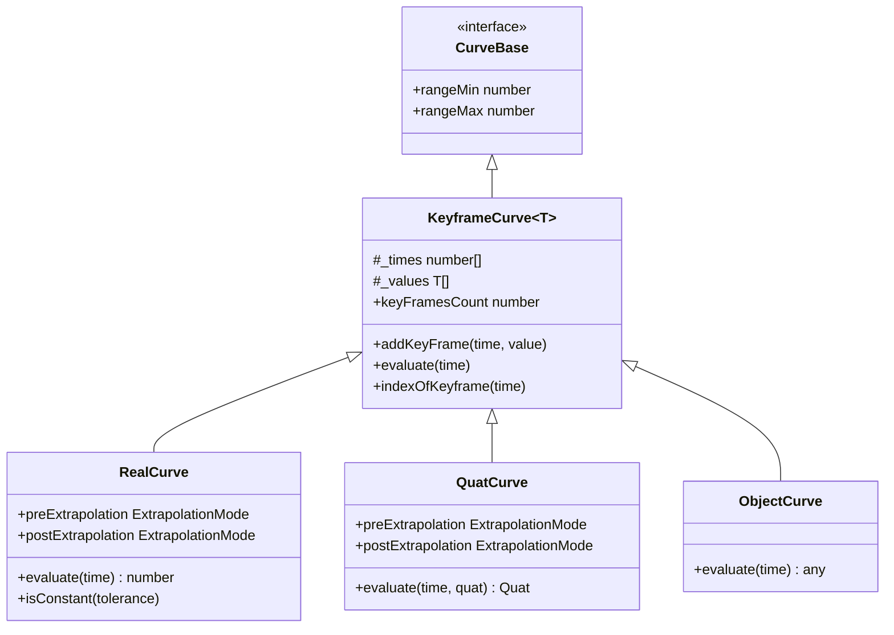
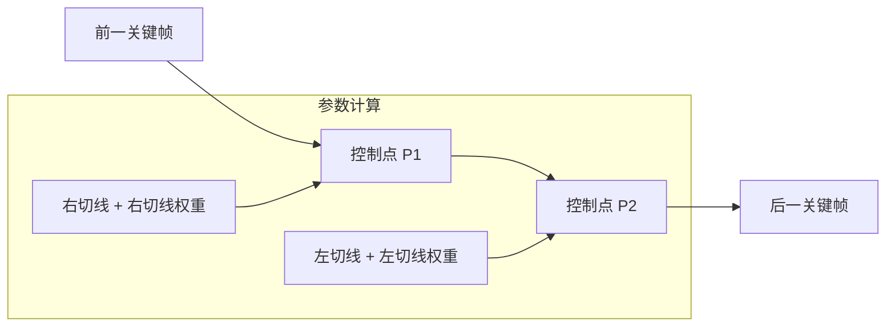
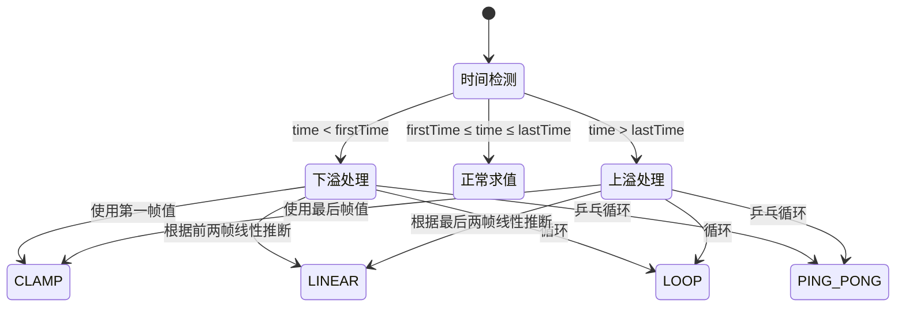
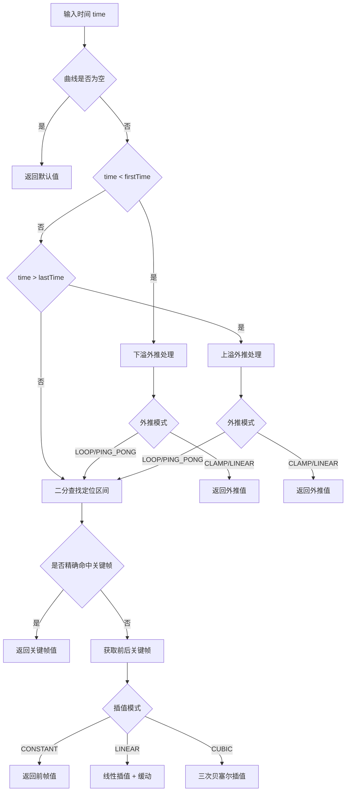

动画曲线与插值是 Cocos 引擎动画系统的数学核心，它定义了动画属性如何随时间变化。本文档深入剖析动画曲线的数据结构、插值算法、外推模式以及性能优化策略，为高级开发者提供完整的理论框架和实现细节。

## 曲线系统架构

Cocos 引擎的动画曲线系统采用分层设计，从抽象的曲线基类到具体的类型化曲线实现，形成了完整的类型体系。



**核心设计原则**：所有曲线都基于关键帧系统，通过时间 - 值对（KeyFrame）定义动画轨迹。曲线求值时，系统首先定位输入时间所在的关键帧区间，然后根据配置的插值模式计算中间值。

Sources: [curve-base.ts](cocos/core/curves/curve-base.ts#L1-L29), [keyframe-curve.ts](cocos/core/curves/keyframe-curve.ts#L1-L200)

## 关键帧数据结构

关键帧是动画曲线的最小数据单元，不同类型的关键帧承载不同的插值参数。

### 实数关键帧（RealKeyframeValue）

实数关键帧支持三种插值模式，并包含完整的切线控制参数：

| 属性 | 类型 | 默认值 | 说明 |
|------|------|--------|------|
| `value` | number | 0.0 | 关键帧的数值 |
| `interpolationMode` | RealInterpolationMode | LINEAR | 插值模式（常量/线性/三次） |
| `tangentWeightMode` | TangentWeightMode | NONE | 切线权重模式 |
| `rightTangent` | number | 0.0 | 右切线斜率 |
| `rightTangentWeight` | number | 0.0 | 右切线权重 |
| `leftTangent` | number | 0.0 | 左切线斜率 |
| `leftTangentWeight` | number | 0.0 | 左切线权重 |
| `easingMethod` | EasingMethod | LINEAR | 缓动方法 |

```typescript
// 关键帧标志位压缩存储策略
const REAL_KEYFRAME_VALUE_FLAGS_INTERPOLATION_MODE_START = 0;
const REAL_KEYFRAME_VALUE_FLAGS_INTERPOLATION_MODE_MASK = 0xFF << 0;
const REAL_KEYFRAME_VALUE_FLAGS_TANGENT_WEIGHT_MODE_START = 8;
const REAL_KEYFRAME_VALUE_FLAGS_TANGENT_WEIGHT_MODE_MASK = 0xFF << 8;
const REAL_KEYFRAME_VALUE_FLAGS_EASING_METHOD_START = 16;
const REAL_KEYFRAME_VALUE_FLAGS_EASING_METHOD_MASK = 0xFF << 16;
```

**位压缩优化**：为减少序列化开销，`RealKeyframeValue` 使用单个 `_flags` 字段存储多个枚举值，通过位移和掩码操作进行访问。这种设计在保持数据完整性的同时，显著降低了内存占用。

Sources: [curve.ts](cocos/core/curves/curve.ts#L1-L100), [real-curve-param.ts](cocos/core/curves/real-curve-param.ts#L1-L143)

### 四元数关键帧（QuatKeyframeValue）

四元数关键帧专用于旋转动画，使用球面线性插值（SLERP）保证旋转的平滑性：

```typescript
@ccclass('cc.QuatKeyframeValue')
@uniquelyReferenced
class QuatKeyframeValue {
    public interpolationMode: QuatInterpolationMode = QuatInterpolationMode.SLERP;
    public value: IQuatLike = Quat.clone(Quat.IDENTITY);
    public easingMethod: EasingMethod | [number, number, number, number] = EasingMethod.LINEAR;
}
```

**设计差异**：与实数关键帧不同，四元数关键帧不包含切线参数，因为四元数空间的插值几何特性与标量空间截然不同。

Sources: [quat-curve.ts](cocos/core/curves/quat-curve.ts#L1-L100)

## 插值模式详解

### 常量插值（CONSTANT）

```mermaid
xychart-beta
    title "常量插值"
    x-axis [0, 1, 2, 3, 4]
    y-axis "Value" 0 --> 10
    line [2, 2, 2, 8, 8]
```

**行为特征**：在关键帧区间内，输出值始终保持为前一关键帧的值，产生阶梯状变化。适用于需要瞬时切换的属性，如材质开关、可见性切换等。

```typescript
case RealInterpolationMode.CONSTANT:
    return prevValue.value;
```

Sources: [curve.ts](cocos/core/curves/curve.ts#L780-L810)

### 线性插值（LINEAR）

```mermaid
xychart-beta
    title "线性插值"
    x-axis [0, 1, 2, 3, 4]
    y-axis "Value" 0 --> 10
    line [2, 4, 6, 8, 10]
```

**数学公式**：
```
result = lerp(prevValue.value, nextValue.value, transformedRatio)
```

其中 `transformedRatio` 通过缓动函数变换：
```typescript
const transformedRatio = prevValue.easingMethod === EasingMethod.LINEAR
    ? ratio
    : getEasingFn(prevValue.easingMethod)(ratio);
```

**性能特性**：线性插值是计算开销最小的插值模式，适合对性能敏感的场景。

Sources: [curve.ts](cocos/core/curves/curve.ts#L790-L795)

### 三次插值（CUBIC）

三次插值基于三次贝塞尔曲线，提供平滑的加减速效果：



**控制点计算**：
```typescript
// 当切线权重未指定时的优化路径
const p1 = prevValue.value + ONE_THIRD * prevTangent * dt;
const p2 = nextValue.value - ONE_THIRD * nextTangent * dt;
return bezierInterpolate(prevValue.value, p1, p2, nextValue.value, ratio);
```

**完整贝塞尔插值**：
```typescript
function bezierInterpolate(p0, p1, p2, p3, t): number {
    const u = 1 - t;
    const coeff0 = u * u * u;        // (1-t)³
    const coeff1 = 3 * u * u * t;    // 3(1-t)²t
    const coeff2 = 3 * u * t * t;    // 3(1-t)t²
    const coeff3 = t * t * t;        // t³
    return coeff0 * p0 + coeff1 * p1 + coeff2 * p2 + coeff3 * p3;
}
```

**三次方程求解**：当切线权重启用时，需要通过求解三次方程获得参数 t：
```typescript
const solutions = [0.0, 0.0, 0.0] as [number, number, number];
const nSolutions = solveCubic(coeff0 - ratio, coeff1, coeff2, coeff3, solutions);
const param = getParamFromCubicSolution(solutions, nSolutions, ratio);
```

Sources: [curve.ts](cocos/core/curves/curve.ts#L796-L860), [solve-cubic.ts](cocos/core/curves/solve-cubic.ts#L1-L100)

## 缓动函数系统

缓动函数（Easing Function）用于变换插值比例，产生丰富的运动效果。Cocos 引擎提供 56 种预定义缓动方法：

### 缓动函数分类

| 分类 | 函数 | 效果描述 |
|------|------|----------|
| 基础 | LINEAR, CONSTANT | 线性/常量 |
| 二次 | QUAD_IN, QUAD_OUT, QUAD_IN_OUT, QUAD_OUT_IN | 二次方缓动 |
| 三次 | CUBIC_IN, CUBIC_OUT, CUBIC_IN_OUT, CUBIC_OUT_IN | 三次方缓动 |
| 四次 | QUART_IN, QUART_OUT, QUART_IN_OUT, QUART_OUT_IN | 四次方缓动 |
| 五次 | QUINT_IN, QUINT_OUT, QUINT_IN_OUT, QUINT_OUT_IN | 五次方缓动 |
| 三角 | SINE_IN, SINE_OUT, SINE_IN_OUT, SINE_OUT_IN | 正弦缓动 |
| 指数 | EXPO_IN, EXPO_OUT, EXPO_IN_OUT, EXPO_OUT_IN | 指数缓动 |
| 圆形 | CIRC_IN, CIRC_OUT, CIRC_IN_OUT, CIRC_OUT_IN | 圆形缓动 |
| 弹性 | ELASTIC_IN, ELASTIC_OUT, ELASTIC_IN_OUT, ELASTIC_OUT_IN | 弹性效果 |
| 回弹 | BACK_IN, BACK_OUT, BACK_IN_OUT, BACK_OUT_IN | 回弹效果 |
| 弹跳 | BOUNCE_IN, BOUNCE_OUT, BOUNCE_IN_OUT, BOUNCE_OUT_IN | 弹跳效果 |
| 特殊 | SMOOTH, FADE | 平滑/淡入淡出 |

### 缓动函数应用

```typescript
// 在曲线求值时应用缓动
const transformedRatio = prevValue.easingMethod === EasingMethod.LINEAR
    ? ratio
    : getEasingFn(prevValue.easingMethod)(ratio);
```

**典型示例**：
```typescript
// 二次方缓入：f(k) = k²
export function quadIn(k: number): number {
    return k * k;
}

// 二次方缓出：f(k) = k(2-k)
export function quadOut(k: number): number {
    return k * (2 - k);
}

// 正弦缓出：f(k) = sin(kπ/2)
export function sineOut(k: number): number {
    return Math.sin(k * Math.PI / 2);
}
```

Sources: [easing-method.ts](cocos/core/curves/easing-method.ts#L1-L132), [easing.ts](cocos/core/algorithm/easing.ts#L1-L200)

## 外推模式

当求值时间超出关键帧范围时，外推模式决定如何计算结果值：



### 外推模式详解

| 模式 | 下溢行为 | 上溢行为 | 适用场景 |
|------|----------|----------|----------|
| **CLAMP** | 使用第一帧值 | 使用最后帧值 | 一次性动画 |
| **LINEAR** | 按前两帧趋势线性外推 | 按最后两帧趋势线性外推 | 需要连续性的动画 |
| **LOOP** | 循环到周期末尾 | 循环到周期开始 | 循环动画（待机、行走） |
| **PING_PONG** | 反向循环 | 反向循环 | 往复动画（摆动、呼吸） |

**实现代码**：
```typescript
if (time < firstTime) {
    // 下溢处理
    switch (preExtrapolation) {
    case ExtrapolationMode.LOOP:
        time = firstTime + repeat(time - firstTime, lastTime - firstTime);
        break;
    case ExtrapolationMode.PING_PONG:
        time = firstTime + pingPong(time - firstTime, lastTime - firstTime);
        break;
    }
} else if (time > lastTime) {
    // 上溢处理
    switch (postExtrapolation) {
    case ExtrapolationMode.LOOP:
        time = firstTime + repeat(time - firstTime, lastTime - firstTime);
        break;
    case ExtrapolationMode.PING_PONG:
        time = firstTime + pingPong(time - firstTime, lastTime - firstTime);
        break;
    }
}
```

Sources: [curve.ts](cocos/core/curves/curve.ts#L350-L410), [quat-curve.ts](cocos/core/curves/quat-curve.ts#L180-L230)

## 曲线求值流程

完整的曲线求值流程包含以下步骤：



**关键算法**：二分查找定位关键帧区间
```typescript
const index = binarySearchEpsilon(times, time);
if (index >= 0) {
    // 精确命中关键帧
    return values[index].value;
}
// 未命中，index 为负数，~index 为插入位置
const iNext = ~index;
const iPre = iNext - 1;
// 在 [iPre, iNext] 区间内插值
```

Sources: [curve.ts](cocos/core/curves/curve.ts#L405-L430), [binary-search.ts](cocos/core/algorithm/binary-search.ts#L1-L50)

## 性能优化策略

### 1. 序列化优化

关键帧数据使用标志位压缩，仅序列化非默认值：

```typescript
function saveRealKeyFrameValue(dataView, keyframeValue, offset): number {
    let flags = 0;
    
    if (interpolationMode !== DEFAULT_INTERPOLATION_MODE) {
        flags |= KeyframeValueFlagMask.INTERPOLATION_MODE;
        // 序列化插值模式
    }
    
    if (leftTangent !== DEFAULT_LEFT_TANGENT) {
        flags |= KeyframeValueFlagMask.LEFT_TANGENT;
        // 序列化左切线
    }
    
    // 写入标志位
    dataView.setUint32(pFlags, flags, true);
}
```

**内存布局**：
```
| Flags (4B) | Value (4B) | InterpolationMode (1B) | TangentWeightMode (1B) |
| LeftTangent (4B) | LeftTangentWeight (4B) | RightTangent (4B) | RightTangentWeight (4B) |
```

### 2. 快速路径优化

对于常见情况（切线权重为 1），跳过复杂的三次方程求解：

```typescript
if (!prevTangentWeightEnabled && !nextTangentWeightEnabled) {
    // 优化路径：直接使用简化公式
    const p1 = prevValue.value + ONE_THIRD * prevTangent * dt;
    const p2 = nextValue.value - ONE_THIRD * nextTangent * dt;
    return bezierInterpolate(prevValue.value, p1, p2, nextValue.value, ratio);
}
```

### 3. 类型专用曲线

针对不同类型使用专用曲线类，避免运行时类型判断：

| 曲线类型 | 专用类 | 优化点 |
|----------|--------|--------|
| 标量 | RealCurve | 原生数值运算 |
| 四元数 | QuatCurve | SLERP 专用实现 |
| 对象 | ObjectCurve | 引用传递 |

Sources: [curve.ts](cocos/core/curves/curve.ts#L600-L750), [quat-curve.ts](cocos/core/curves/quat-curve.ts#L300-L400)

## 轨道系统集成

动画曲线通过轨道（Track）系统与动画目标绑定：

```typescript
@ccclass(`${CLASS_NAME_PREFIX_ANIM}RealTrack`)
export class RealTrack extends SingleChannelTrack<RealCurve> {
    protected createCurve(): RealCurve {
        return new RealCurve();
    }
}
```

**轨道类型**：
- `RealTrack`：标量属性动画
- `QuatTrack`：旋转变换动画
- `VectorTrack`：向量属性动画
- `ColorTrack`：颜色属性动画
- `ObjectTrack`：对象引用动画

Sources: [real-track.ts](cocos/animation/tracks/real-track.ts#L1-L45), [track.ts](cocos/animation/tracks/track.ts#L1-L200)

## 实践建议

### 选择合适的插值模式

| 动画类型 | 推荐插值 | 理由 |
|----------|----------|------|
| 位置移动 | CUBIC + SINE_IN_OUT | 平滑加减速，自然运动 |
| 旋转 | SLERP | 保持角速度均匀 |
| 缩放 | LINEAR + QUAD_OUT | 清晰可控 |
| 透明度 | LINEAR + SMOOTH | 视觉连续性 |
| 开关状态 | CONSTANT | 瞬时切换 |

### 性能调优指南

1. **减少关键帧数量**：在视觉质量允许的情况下，使用更少的关键帧配合合适的插值模式
2. **避免过度使用三次插值**：三次插值计算开销是线性插值的 3-5 倍
3. **合理使用外推**：循环动画使用 LOOP 模式而非手动复制关键帧
4. **批量曲线求值**：在动画评估循环中批量处理多条曲线，减少函数调用开销

## 相关资源

- 深入理解动画系统整体架构：[动画剪辑与状态](13-dong-hua-jian-ji-yu-zhuang-tai)
- 学习骨骼动画中的曲线应用：[骨骼动画](14-gu-ge-dong-hua)
- 探索缓动函数的可视化效果：[Tween 函数文档](https://docs.cocos.com/creator/manual/zh/tween/tween-function.html)