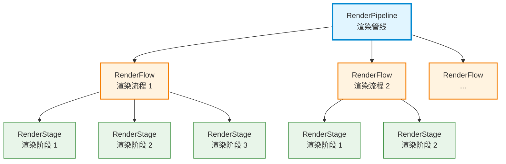
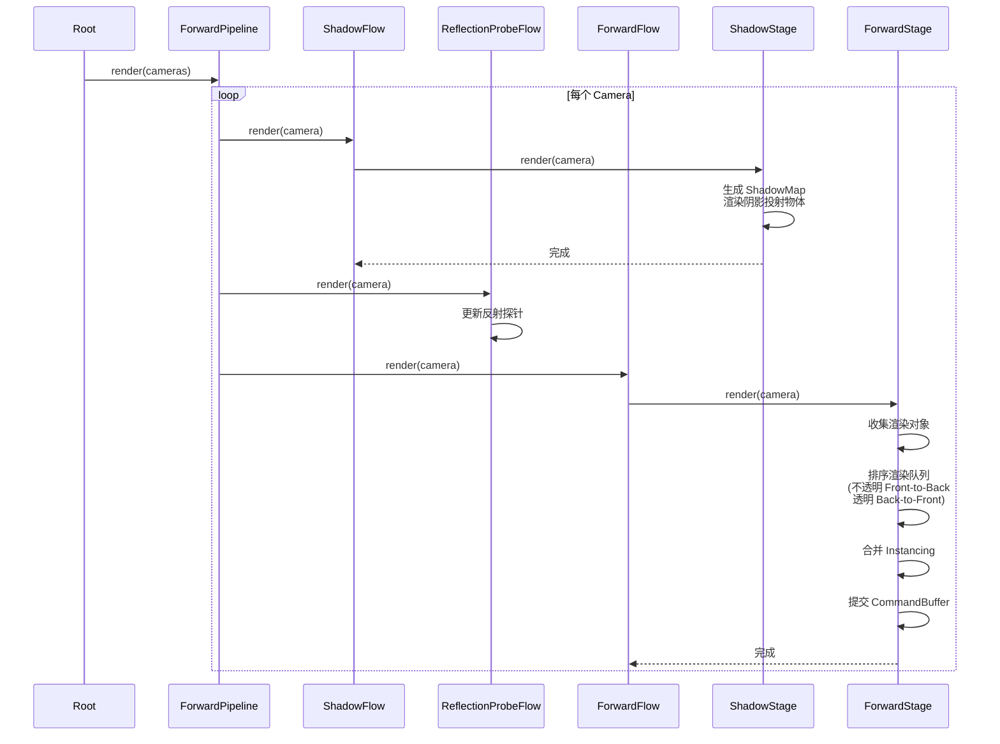
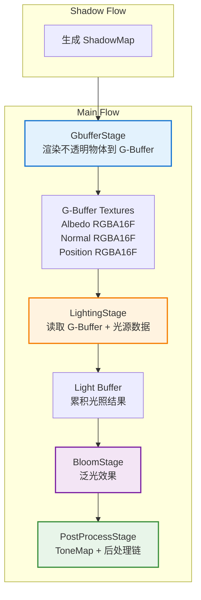
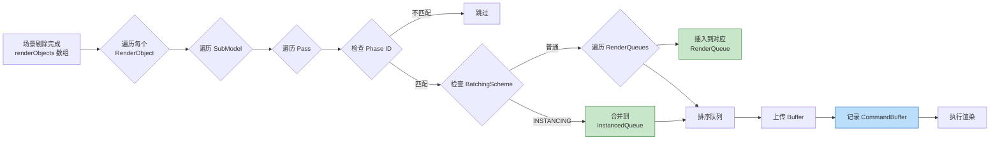
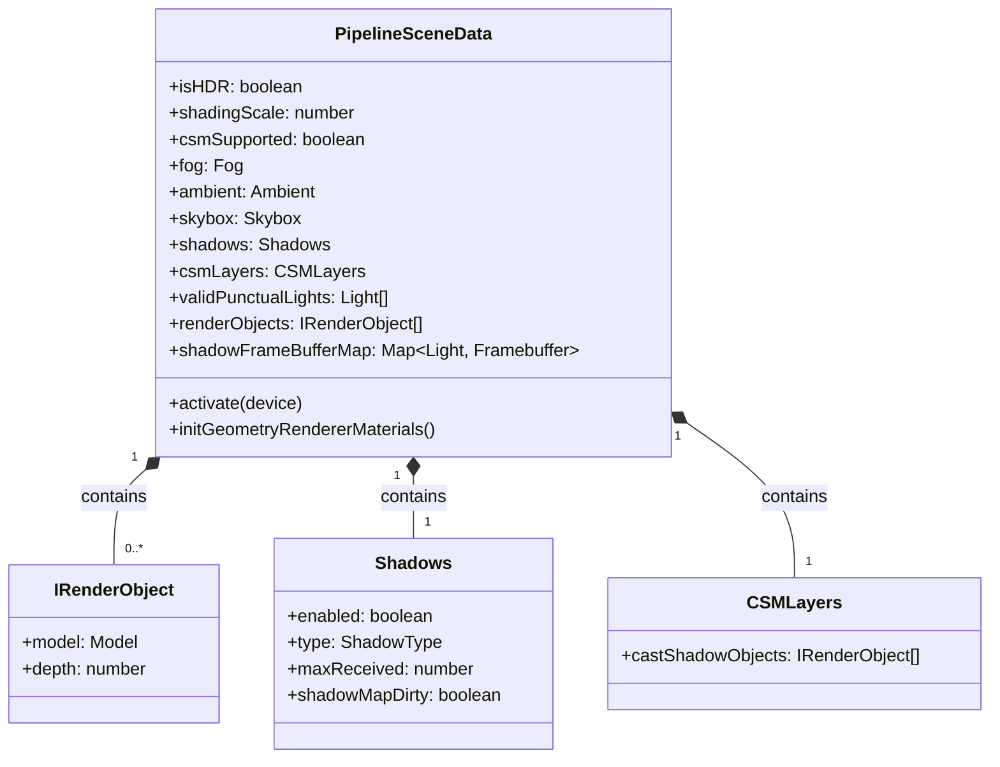
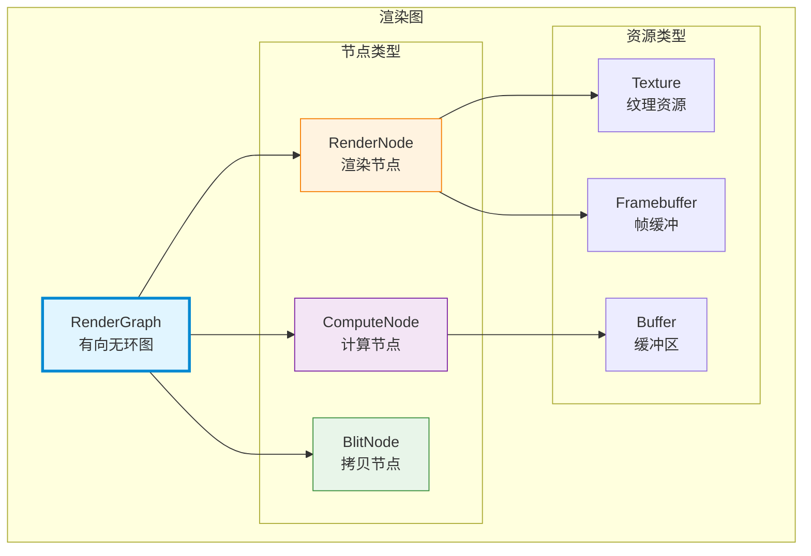

渲染管线架构是 Cocos Engine 图形渲染系统的核心设计，它定义了从场景数据到最终屏幕像素的完整渲染流程。引擎采用**分层抽象的管线架构**，通过 `RenderPipeline` → `RenderFlow` → `RenderStage` 三级结构实现高度可扩展的渲染系统设计。本文档深入解析渲染管线的架构设计、核心组件交互机制以及内置管线实现方案。

## 核心架构设计

Cocos 渲染管线采用**三层 hierarchical 架构**，每一层都有明确的职责边界和生命周期管理。这种设计使得开发者可以灵活定制渲染流程，同时保持系统的整体一致性。

**渲染管线层次结构**：

**RenderPipeline** 是渲染系统的最高层级抽象，它管理全局渲染资源、GFX 设备上下文以及多个 RenderFlow。管线负责初始化渲染所需的全局 Uniform Buffer、Descriptor Set、Render Pass 等底层图形资源，并协调所有 Flow 的执行顺序。引擎提供了 `ForwardPipeline`（前向渲染）、`DeferredPipeline`（延迟渲染）以及基于 Render Graph 的自定义管线三种实现方案。

**RenderFlow** 是管线的子过程，它将渲染任务分解为逻辑上独立的阶段序列。每个 Flow 都有明确的优先级（priority）和标签（tag），用于控制执行顺序和场景关联。典型的 Flow 包括阴影计算流（ShadowFlow）、主渲染流（MainFlow/ForwardFlow）和 UI 渲染流。Flow 在激活时会对内部的 Stages 按优先级排序，确保渲染顺序的正确性。

**RenderStage** 是渲染的实际执行者，它负责收集渲染对象、执行 GFX 命令提交、管理渲染队列。Stage 是渲染管线中最细粒度的控制单元，开发者可以通过自定义 Stage 实现特定的渲染效果，如 G-Buffer 填充、光照计算、后处理等。每个 Stage 都包含渲染队列描述（RenderQueueDesc），用于定义如何收集和排序渲染对象。

Sources: [render-pipeline.ts](cocos/rendering/render-pipeline.ts#L128-L185) [render-flow.ts](cocos/rendering/render-flow.ts#L45-L75) [render-stage.ts](cocos/rendering/render-stage.ts#L45-L75)

## 渲染管线类型与特性对比

Cocos Engine 提供多种内置渲染管线实现，每种管线针对不同的使用场景和硬件能力进行了优化。选择合适的管线类型对项目的性能和视觉效果至关重要。

**内置渲染管线类型对比**：

| 特性维度 | ForwardPipeline 前向管线 | DeferredPipeline 延迟管线 | Custom Pipeline 自定义管线 |
|---------|---------------------------|----------------------------|------------------------------|
| **管线类型标识** | `CC_PIPELINE_TYPE = 0` | `CC_PIPELINE_TYPE = 1` | 运行时动态定义 |
| **适用场景** | 移动端、WebGL、轻度 3D 游戏 | 高端 3D 游戏、复杂光照场景 | 特殊渲染需求、技术研究 |
| **光照处理** | 每 Pass 处理所有光照 | G-Buffer + Lighting Pass 分离 | 完全可定制 |
| **透明物体支持** | 原生支持，Back-to-Front 排序 | 需额外 Transparent Pass | 完全可定制 |
| **阴影支持** | ShadowMap + 平面阴影 | ShadowMap + CSM | 完全可定制 |
| **内存占用** | 较低 | 较高（多 Render Target） | 取决于实现 |
| **Draw Call** | 较高（多光源叠加） | 较低（光照与几何分离） | 完全可优化 |
| **HDR 支持** | 支持 | 原生支持（RGBA16F G-Buffer） | 完全可定制 |
| **后处理集成** | 基础支持 | 完整支持（Bloom、ToneMap） | 完全可定制 |
| **平台兼容性** | 全平台 | 桌面端、高端移动端 | 取决于实现 |

**前向渲染管线**（ForwardPipeline）是引擎的默认管线，适用于大多数应用场景。它在初始化时自动创建三个核心 Flow：`ShadowFlow`（阴影流）、`ReflectionProbeFlow`（反射探针流）和 `ForwardFlow`（前向渲染流）。前向管线的特点是实现简单、兼容性好，但在多光源场景下会产生较多的 Draw Call，因为每个光源都需要独立的渲染 Pass。

**延迟渲染管线**（DeferredPipeline）采用 G-Buffer 技术将几何信息和光照计算分离。它在初始化时创建 `ShadowFlow` 和 `MainFlow`，其中 MainFlow 包含四个核心 Stage：`GbufferStage`（几何缓冲填充）、`LightingStage`（光照计算）、`BloomStage`（泛光效果）和 `PostProcessStage`（后处理）。延迟渲染在处理大量动态光源时具有显著优势，但需要较高的显存带宽和 Render Target 资源。

Sources: [forward-pipeline.ts](cocos/rendering/forward/forward-pipeline.ts#L47-L82) [deferred-pipeline.ts](cocos/rendering/deferred/deferred-pipeline.ts#L62-L105) [custom/pipeline.ts](cocos/rendering/custom/pipeline.ts#L51-L135)

## 前向渲染管线执行流程

前向渲染管线的执行流程遵循**Shadow → Reflection → Forward** 的顺序，每个 Flow 按优先级依次执行。理解这一流程对于性能优化和自定义渲染至关重要。

**前向管线渲染流程图**：

**ShadowFlow** 负责阴影贴图的生成。它首先检查场景中的阴影配置，如果启用了 ShadowMap，则为每个支持阴影的光源（平行光、聚光灯）创建 Framebuffer 和 RenderPass。在渲染阶段，ShadowFlow 会收集所有阴影投射物体（Cast Shadow Objects），并根据光源类型（CSM 或单级 ShadowMap）渲染深度信息到 ShadowMap 纹理。这些 ShadowMap 随后会在主渲染阶段作为采样器绑定到 Shader 中用于阴影计算。

**ForwardFlow** 包含单个 `ForwardStage`，负责最终的屏幕渲染。Stage 在激活时会创建多个渲染队列：不透明队列（Front-to-Back 排序）和透明队列（Back-to-Front 排序）。在渲染时，ForwardStage 遍历 `PipelineSceneData.renderObjects`，根据 Pass 的 Phase ID 和 BatchingScheme 将渲染对象分发到不同的队列。Instancing 物体被合并到 `RenderInstancedQueue`，普通物体插入到对应的 RenderQueue。最后，Stage 按顺序记录 CommandBuffer：不透明物体 → Instancing 物体 → 加性光照 → 平面阴影 → 透明物体 → UI。

Sources: [forward-flow.ts](cocos/rendering/forward/forward-flow.ts#L35-L65) [forward-stage.ts](cocos/rendering/forward/forward-stage.ts#L52-L180) [shadow-flow.ts](cocos/rendering/shadow/shadow-flow.ts#L62-L145)

## 延迟渲染管线执行流程

延迟渲染管线采用**G-Buffer 多 Pass 架构**，将几何信息收集与光照计算分离，适合处理复杂光照场景。理解延迟渲染的数据流对于优化渲染性能至关重要。

**延迟管线渲染流程图**：

**GbufferStage** 负责将场景几何信息渲染到多个 Render Target（G-Buffer）。它使用专用的 G-Buffer RenderPass，包含三个颜色附件（RGBA16F 格式）和一个深度附件。在渲染时，Stage 遍历所有不透明渲染对象，将位置、法线、颜色等信息编码到 G-Buffer 纹理中。透明物体在此阶段被跳过，留待后续处理。G-Buffer 的创建在 `DeferredPipeline.activate` 中完成，使用 `Format.RGBA16F` 确保 HDR 精度。

**LightingStage** 执行光照计算。它首先通过 `gatherLights` 方法收集相机视锥体内的所有动态光源（球型光、聚光灯、点光源），并将光源数据打包到 `UBODeferredLight` Uniform Buffer 中。每个光源的位置、颜色、范围、类型等信息被编码为 `vec4` 数组。然后，Stage 使用全屏 Quad 遍历 G-Buffer 像素，对每个片段执行 Phong 或 PBR 光照计算。光照结果累积到 Light Buffer 中。延迟渲染的优势在于光照计算的复杂度与屏幕像素数成正比，而非几何复杂度。

**BloomStage** 和 **PostProcessStage** 负责后处理效果链。Bloom 采用多尺度下采样和上采样策略，提取高亮区域并应用模糊滤波。PostProcess 阶段执行 ToneMap、色彩校正、FXAA 等最终处理，将 HDR 结果转换为 LDR 输出到屏幕。

Sources: [deferred/main-flow.ts](cocos/rendering/deferred/main-flow.ts#L42-L80) [deferred/gbuffer-stage.ts](cocos/rendering/deferred/gbuffer-stage.ts#L47-L165) [deferred/lighting-stage.ts](cocos/rendering/deferred/lighting-stage.ts#L95-L200)

## 渲染队列与排序机制

渲染队列是连接场景剔除与最终渲染的关键数据结构，它负责管理渲染对象的排序和批次合并。Cocos 的渲染队列系统支持多种排序策略，以适应不同渲染需求。

**渲染队列处理流程**：

**渲染队列排序策略对比**：

| 队列类型 | 排序模式 | 排序函数 | 排序依据 | 适用场景 |
|---------|---------|---------|---------|---------|
| **不透明队列** | FRONT_TO_BACK | `opaqueCompareFn` | 优先级 → 深度 (前→后) → ShaderID | 不透明物体，优化 Z-Prepass |
| **透明队列** | BACK_TO_FRONT | `transparentCompareFn` | 优先级 → 深度 (后→前) → ShaderID | 透明物体，正确混合顺序 |
| **Instancing 队列** | 无排序 | - | 按合并顺序 | 相同 Mesh 的批量渲染 |

**RenderQueue** 内部使用 `CachedArray<IRenderPass>` 存储渲染过程数据。每个 `IRenderPass` 包含优先级、哈希值、深度值、ShaderID、SubModel 引用和 Pass 索引。当 `insertRenderPass` 被调用时，队列会检查 Pass 的混合状态（透明/不透明）和 Phase ID 是否匹配，只有符合条件的渲染过程才会被插入。

排序函数 `opaqueCompareFn` 和 `transparentCompareFn` 使用多级比较策略。不透明物体优先按深度从前向后排序，这有助于早期 Z 测试剔除被遮挡的像素。透明物体则从后向前排序，确保混合顺序正确。哈希值由 `priority << 16 | subModelPriority << 8 | passIndex` 组成，用于在深度相同时保持稳定的排序结果。

**Instancing 合并**通过 `RenderInstancedQueue` 实现。当 Pass 的 `batchingScheme` 为 `BatchingSchemes.INSTANCING` 时，渲染对象会被合并到 InstancedBuffer 中，多个相同 Mesh 的实例可以在一次 DrawCall 中渲染，显著降低 CPU 开销。

Sources: [render-queue.ts](cocos/rendering/render-queue.ts#L35-L145) [forward-stage.ts](cocos/rendering/forward/forward-stage.ts#L125-L160) [define.ts](cocos/rendering/define.ts#L68-L95)

## 场景数据管理与剔除

`PipelineSceneData` 是渲染管线与场景系统之间的数据桥梁，它存储了当前帧的剔除结果和全局渲染配置。理解这一机制对于编写自定义渲染管线至关重要。

**PipelineSceneData 核心数据结构**：

**renderObjects 数组**存储了当前帧所有可见的渲染对象。每个 `IRenderObject` 包含 Model 引用和深度值。这个数组在每帧的场景剔除阶段（`sceneCulling`）被填充，剔除逻辑会遍历相机视锥体内的所有 Model，根据 Layer 掩码、LOD 距离、遮挡剔除等条件过滤不可见物体。剔除完成后，`PipelineSceneData.renderObjects` 成为所有 RenderStage 的数据源。

**validPunctualLights 数组**存储了当前相机可见的精确光源（点光源、聚光灯、球型光）。光源剔除基于视锥体 - 球体相交测试，只有光源的影响范围与视锥体相交时才会被加入数组。这个数组在 `LightingStage` 中被用于构建光源 Uniform Buffer，数组长度受 `UBODeferredLight.LIGHTS_PER_PASS` 限制（通常为 128 或 256）。

**shadowFrameBufferMap** 是一个 `Map<Light, Framebuffer>`，存储每个光源对应的 ShadowMap Framebuffer。当 ShadowFlow 激活时，它会为每个支持阴影的光源创建专用的 Framebuffer 和 RenderPass。Framebuffer 包含深度纹理（ShadowMap）和可选的颜色纹理（用于 VSM）。这个映射关系在管线生命周期内保持，仅在分辨率变化或光源销毁时更新。

Sources: [pipeline-scene-data.ts](cocos/rendering/pipeline-scene-data.ts#L35-L125) [scene-culling.ts](cocos/rendering/scene-culling.ts#L1-L50)

## 自定义渲染管线架构

Cocos Engine 提供了基于 **Render Graph** 的自定义管线系统，允许开发者以声明式方式定义复杂的渲染流程。这是引擎最高级的渲染定制能力，适用于实现特殊的渲染算法或研究目的。

**Render Graph 核心概念**：

**PipelineRuntime 接口**是经典管线和自定义管线的统一运行时抽象。它定义了管线必须实现的核心方法：`activate`（激活）、`destroy`（销毁）、`render`（渲染），以及访问 GFX 设备、全局描述符集、命令缓冲等资源的 getter。`ForwardPipeline` 和 `DeferredPipeline` 都继承自 `RenderPipeline` 并实现 `PipelineRuntime` 接口，而自定义管线可以直接实现此接口以获得完全的控制权。

**Render Graph 数据结构**使用邻接图（Adjacency Graph）表示渲染依赖关系。图中的节点（Node）代表渲染 Pass 或计算 Pass，边（Edge）代表资源依赖。这种表示法使得管线可以自动推导资源生命周期、优化 Barrier 插入、并行执行独立 Pass。`ResourceDesc` 描述资源的维度（Buffer/Texture）、格式、采样数等属性，`ResourceTraits` 定义资源的驻留策略（MANAGED/TRANSIENT/PERSISTENT）。

**自定义管线实现步骤**：
1. 实现 `PipelineRuntime` 接口，提供 `activate`、`destroy`、`render` 方法
2. 创建自定义的 Render Graph 或使用内置的 Layout Graph
3. 定义资源描述（Texture、Buffer、Framebuffer）
4. 添加渲染节点（RenderPass、ComputePass）
5. 建立节点间的依赖关系
6. 在 Executor 中编译并执行 Graph

Sources: [custom/pipeline.ts](cocos/rendering/custom/pipeline.ts#L51-L175) [custom/render-graph.ts](cocos/rendering/custom/render-graph.ts#L45-L200) [custom/types.ts](cocos/rendering/custom/types.ts#L1-L100)

## 宏定义与着色器配置

渲染管线通过宏定义（Macro）向 Shader 传递平台和管线配置信息。这些宏在管线激活时设置，并在整个渲染过程中保持不变（常量宏）或动态更新（状态宏）。

**核心管线宏定义**：

| 宏名称 | 类型 | 取值范围 | 含义 | 设置位置 |
|-------|------|---------|------|---------|
| **CC_PIPELINE_TYPE** | 整型 | 0=Forward, 1=Deferred | 管线类型标识 | ForwardPipeline/DeferredPipeline |
| **CC_SHADOWMAP_FORMAT** | 整型 | 0=FLOAT, 1=RGBE | ShadowMap 纹理格式 | ShadowFlow.activate |
| **CC_SHADOWMAP_USE_LINEAR_DEPTH** | 整型 | 0=Off, 1=On | 是否使用线性深度 | ShadowFlow.activate |
| **CC_SUPPORT_CASCADED_SHADOW_MAP** | 整型 | 0=No, 1=Yes | 是否支持 CSM | ShadowFlow.activate |
| **CC_SHADOW_TYPE** | 整型 | 0=None, 1=Planar, 2=ShadowMap | 阴影类型 | ShadowFlow |
| **CC_DIR_SHADOW_PCF_TYPE** | 整型 | 0=Hard, 1/2/3=Soft | PCF 滤波类型 | ShadowFlow |
| **CC_DIR_LIGHT_SHADOW_TYPE** | 整型 | 0=None, 1=Uniform, 2=Cascaded, 3=Variance | 平行光阴影类型 | ShadowFlow |
| **CC_CASCADED_LAYERS_TRANSITION** | 整型 | 0=Off, 1=On | CSM 层级过渡 | ShadowFlow |

**常量宏（constantMacros）** 在管线生命周期内不可变，通常用于传递设备能力相关的信息，如 `CC_PLATFORM`、`CC_GFX_API` 等。这些宏在 `RenderPipeline.constantMacros` getter 中返回，并在 Shader 编译时嵌入。

**状态宏（macros）** 可以动态修改，用于控制运行时渲染特性，如 HDR 开关、雾效启用、IBL 质量等。修改宏后需要调用 `onGlobalPipelineStateChanged()` 触发管线状态更新，这会重新编译受影响的 Shader Variant。

**UBO 绑定策略**：管线通过 `PipelineGlobalBindings` 枚举定义全局 Uniform Buffer 和 Sampler 的绑定槽位。`UBO_GLOBAL`（帧级全局数据）、`UBO_CAMERA`（相机视图数据）、`UBO_SHADOW`（阴影数据）是三个核心 UBO，它们在管线激活时创建并绑定到全局 DescriptorSet。

Sources: [define.ts](cocos/rendering/define.ts#L112-L145) [forward-pipeline.ts](cocos/rendering/forward/forward-pipeline.ts#L88-L100) [deferred-pipeline.ts](cocos/rendering/deferred/deferred-pipeline.ts#L78-L90)

## 性能优化策略

基于对渲染管线架构的深入理解，开发者可以采用以下策略优化渲染性能。

**渲染管线性能优化维度**：

| 优化维度 | 具体策略 | 预期收益 | 适用管线 |
|---------|---------|---------|---------|
| **减少 Draw Call** | 启用 Instancing 合并 使用合批材质 减少 SubModel 数量 | 30-60% CPU 开销降低 | Forward |
| **优化排序** | 合理使用 RenderQueue 避免透明与不透明混合 | 10-20% Overdraw 减少 | 全部 |
| **阴影优化** | 降低 ShadowMap 分辨率 使用 CSM 替代单级 ShadowMap 限制阴影距离 | 20-40% 阴影 Pass 加速 | 全部 |
| **延迟渲染优化** | 使用 Tile-Based Deferred 限制动态光源数量 启用光照裁剪 | 40-60% 光照 Pass 加速 | Deferred |
| **带宽优化** | 降低 Render Target 格式 使用 MSAA 替代 Post AA 减少 G-Buffer 通道 | 15-30% 显存带宽降低 | Deferred |
| **剔除优化** | 启用遮挡剔除 合理使用 Layer 掩码 LOD 系统 | 20-50% 渲染物体减少 | 全部 |

**Instancing 合并**是前向管线最有效的优化手段。当多个物体使用相同 Mesh 和材质时，引擎会自动将它们合并到 `RenderInstancedQueue`，在一次 DrawCall 中渲染所有实例。这要求材质的 `batchingScheme` 设置为 `BatchingSchemes.INSTANCING`，并且实例数量达到阈值（通常为 10 个以上）。

**CSM（级联阴影贴图）** 通过将视锥体划分为多个层级，为每个层级生成不同分辨率的 ShadowMap。近处使用高分辨率保证质量，远处使用低分辨率节省资源。启用 CSM 需要设备支持足够的 Uniform Vector 数量（`maxFragmentUniformVectors >= 125`），这可以通过 `CC_SUPPORT_CASCADED_SHADOW_MAP` 宏检测。

**延迟渲染的光照裁剪**通过视锥体 - 球体相交测试实现。`LightingStage.gatherLights` 方法会剔除视锥体外的光源，并将可见光源打包到 UBO 中。对于大型场景，建议将光源的影响范围（range）设置为合理值，避免过多光源同时可见。

Sources: [forward-stage.ts](cocos/rendering/forward/forward-stage.ts#L130-L145) [deferred/lighting-stage.ts](cocos/rendering/deferred/lighting-stage.ts#L98-L180) [shadow-flow.ts](cocos/rendering/shadow/shadow-flow.ts#L95-L115)

## 扩展阅读建议

深入理解渲染管线架构后，建议按以下顺序继续学习相关主题：

**推荐学习路径**：
1. **[图形设备抽象层 (GFX)](16-tu-xing-she-bei-chou-xiang-ceng-gfx)** — 理解底层图形 API 抽象，掌握 CommandBuffer、RenderPass、Framebuffer 等核心概念
2. **[着色器与效果系统](18-zhao-se-qi-yu-xiao-guo-xi-tong)** — 深入学习 Shader 变体管理、Pass 配置、材质系统
3. **[后处理系统](19-hou-chu-li-xi-tong)** — 掌握 Bloom、ToneMap、FXAA 等后处理效果的实现原理
4. **[引擎架构设计](4-yin-qing-jia-gou-she-ji)** — 从更高层面理解渲染系统在整个引擎中的定位

**实践建议**：
- 通过修改 `ForwardStage.renderQueues` 配置实验不同的渲染排序策略
- 使用 `PipelineSceneData.renderObjects` 调试场景剔除结果
- 在自定义 RenderFlow 中实现特殊的渲染效果（如轮廓线、X-Ray）
- 分析不同平台上的管线性能瓶颈（使用 Profiler 工具）