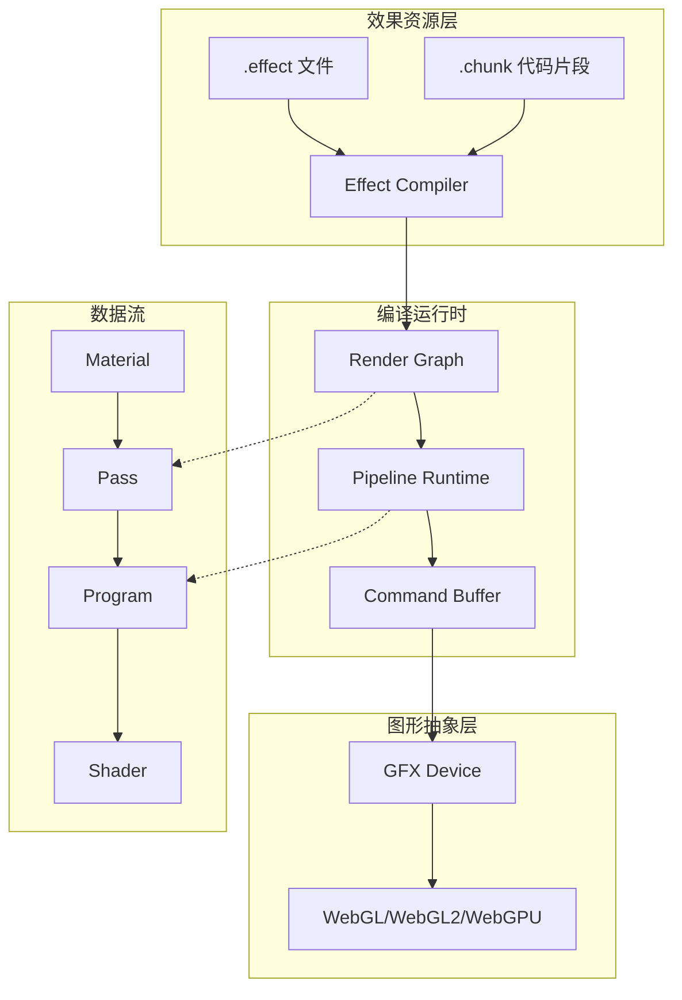
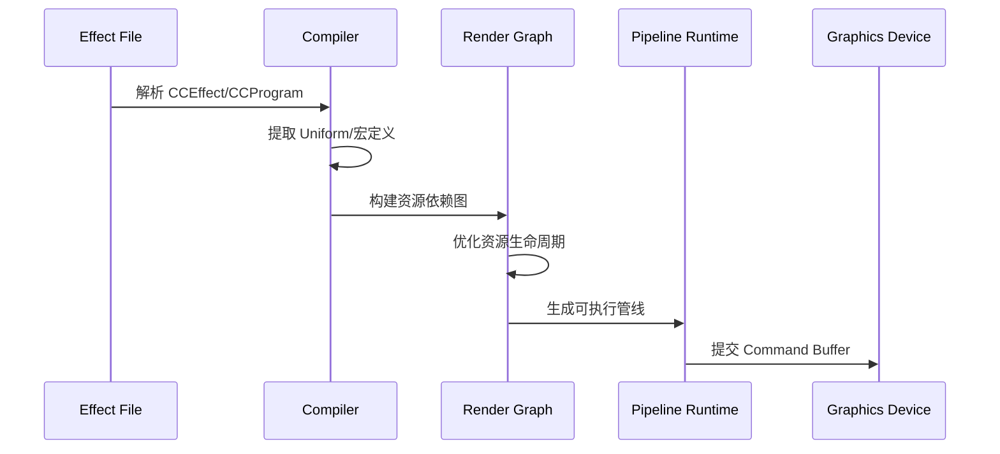

着色器与效果系统是 Cocos Creator 3.x 渲染架构的核心组件，负责定义材质如何与光照交互、表面属性如何计算以及最终像素颜色如何生成。本页面深入解析引擎的着色器编译流程、效果资源结构以及自定义着色器的开发方法。

## 系统架构概览

Cocos Creator 的着色器系统采用**分层抽象架构**，从底层的图形 API 抽象到高层的效果资源管理，形成完整的技术栈。系统核心由**效果编译器**、**渲染图（Render Graph）**和**材质系统**三部分组成。



效果文件（`.effect`）是开发者与渲染系统交互的主要接口，它定义了渲染技术（Technique）、渲染通道（Pass）以及着色器程序（Program）。编译后的效果数据通过 [`effectSettings`](cocos/core/effect-settings.ts#L30-L67) 类加载，支持原生平台和 Web 平台的统一资源管理。

Sources: [effect-settings.ts](cocos/core/effect-settings.ts#L30-L67), [pipeline.ts](cocos/rendering/custom/pipeline.ts#L58-L130)

## 效果文件格式与结构

`.effect` 文件采用**声明式 YAML 语法**，包含三个主要部分：`CCEffect`、`CCProgram` 和宏定义系统。这种设计使得美术和程序可以独立调整渲染参数而无需修改底层着色器代码。

### CCEffect 块：渲染流程定义

`CCEffect` 块定义渲染技术和通道配置，包括混合状态、深度测试、剔除模式等图形状态。以内置标准材质为例：

```yaml
CCEffect %{
  techniques:
  - name: opaque
    passes:
    - vert: standard-vs
      frag: standard-fs
      properties: &props
        tilingOffset: { value: [1.0, 1.0, 0.0, 0.0] }
        mainColor: { value: [1.0, 1.0, 1.0, 1.0] }
        roughness: { value: 0.5 }
        metallic: { value: 0.0 }
    - vert: standard-vs
      frag: standard-fs
      phase: forward-add
      embeddedMacros: { CC_FORWARD_ADD: true }
      depthStencilState:
        depthFunc: equal
        depthTest: true
        depthWrite: false
```

每个 Pass 可以指定不同的渲染阶段（phase），如 `forward-add` 用于前向渲染的附加光照计算，`shadow-caster` 用于阴影投射，`gbuffer` 用于延迟渲染的几何缓冲填充。这种多 Pass 设计允许单个材质适应不同的渲染管线路径。

Sources: [builtin-standard.effect](editor/assets/effects/builtin-standard.effect#L3-L60)

### CCProgram 块：着色器代码组织

`CCProgram` 块将着色器代码模块化为可重用的程序片段。标准效果包含以下程序块：

| 程序块名称 | 用途 | 着色阶段 |
|-----------|------|---------|
| `shared-ubos` | 共享 Uniform 缓冲定义 | Vertex & Fragment |
| `macro-remapping` | 宏重映射配置 | 预处理 |
| `surface-vertex` | 表面顶点处理逻辑 | Vertex |
| `surface-fragment` | 表面片段处理逻辑 | Fragment |
| `standard-vs` | 标准顶点着色器入口 | Vertex |
| `standard-fs` | 标准片段着色器入口 | Fragment |
| `shadow-caster-vs/fs` | 阴影投射着色器 | Vertex & Fragment |
| `planar-shadow-vs/fs` | 平面阴影着色器 | Vertex & Fragment |
| `reflect-map-fs` | 反射贴图着色器 | Fragment |

这种模块化设计通过 `#include` 机制组合代码片段，支持**表面函数覆盖**模式。开发者可以定义如 `SurfacesFragmentModifyBaseColorAndTransparency()` 等函数来修改默认渲染行为，而无需重写整个着色器。

Sources: [builtin-standard.effect](editor/assets/effects/builtin-standard.effect#L108-L150)

## 着色器编译流程

Cocos Creator 3.x 引入**渲染图（Render Graph）**作为编译和执行的中间表示。编译流程分为词法分析、图构建、优化和代码生成四个阶段。



### 编译时宏系统

宏定义系统支持条件编译和平台适配。效果文件中的宏分为三类：

1. **用户宏（User Macros）**：通过材质面板调整，如 `USE_NORMAL_MAP`、`USE_ALPHA_TEST`
2. **内置宏（Built-in Macros）**：由引擎自动设置，如 `CC_PIPELINE_TYPE` 区分前向/延迟渲染
3. **常量宏（Constant Macros）**：平台相关且不可变，通过 [`constantMacros`](cocos/rendering/custom/pipeline.ts#L118-L122) 属性访问

```typescript
// 宏重映射示例
CCProgram macro-remapping %{
  #pragma define-meta HAS_SECOND_UV
  #pragma define-meta USE_TWOSIDE
  #define CC_SURFACES_USE_SECOND_UV HAS_SECOND_UV
  #define CC_SURFACES_USE_TWO_SIDED USE_TWOSIDE
}
```

宏系统在 [`PipelineRuntime`](cocos/rendering/custom/pipeline.ts#L58-L175) 接口中提供运行时查询方法：`getMacroString()`、`getMacroInt()`、`getMacroBool()`，支持动态调整渲染策略。

Sources: [pipeline.ts](cocos/rendering/custom/pipeline.ts#L145-L175), [builtin-standard.effect](editor/assets/effects/builtin-standard.effect#L113-L127)

### 资源图与生命周期管理

[`RenderGraph`](cocos/rendering/custom/render-graph.ts#L180-L200) 管理渲染资源的生命周期，包括纹理、缓冲区和帧缓冲。资源分为三种驻留类型：

- **MANAGED**：由渲染图自动管理生命周期
- **PERSISTENT**：持久化资源，手动创建和销毁
- **TRANSIENT**：临时资源，单帧有效

编译器通过深度优先搜索（DFS）分析资源依赖，构建最优的屏障（Barrier）和状态转换。[`CompilerContext`](cocos/rendering/custom/compiler.ts#L40-L60) 中的 `PassVisitor` 类负责遍历渲染图并生成对应的图形 API 调用。

Sources: [render-graph.ts](cocos/rendering/custom/render-graph.ts#L180-L200), [compiler.ts](cocos/rendering/custom/compiler.ts#L40-L150)

## 渲染管线集成

着色器效果需要与渲染管线协同工作。Cocos Creator 提供两种内置管线：**前向渲染管线（ForwardPipeline）**和**延迟渲染管线（DeferredPipeline）**，它们通过 [`PipelineType`](cocos/rendering/custom/pipeline.ts#L195-L215) 枚举区分。

### 前向渲染管线

前向管线采用传统的多 Pass 渲染策略，每个光源产生一个额外的 Pass。管线初始化时创建三个渲染流：

```typescript
// ForwardPipeline 初始化流程
const shadowFlow = new ShadowFlow();      // 阴影流
const reflectionFlow = new ReflectionProbeFlow(); // 反射探针流
const forwardFlow = new ForwardFlow();    // 前向渲染流
```

前向管线的宏配置为 `CC_PIPELINE_TYPE: 0`，在效果文件中通过 `embeddedMacros` 条件启用特定 Pass：

```yaml
- &deferred-forward
  vert: standard-vs
  frag: standard-fs
  phase: deferred-forward
  embeddedMacros: { CC_PIPELINE_TYPE: 0 }
```

Sources: [forward-pipeline.ts](cocos/rendering/forward/forward-pipeline.ts#L54-L78)

### 延迟渲染管线

延迟管线将几何信息和光照计算分离，首先生成 G-Buffer，然后在屏幕空间进行光照累积。管线宏配置为 `CC_PIPELINE_TYPE: 1`：

```typescript
// DeferredPipeline 激活
this._macros = { CC_PIPELINE_TYPE: PIPELINE_TYPE }; // PIPELINE_TYPE = 1
```

延迟管线的 G-Buffer Pass 通过 `phase: gbuffer` 标识：

```yaml
- &deferred
  vert: standard-vs
  frag: standard-fs
  pass: gbuffer
  phase: gbuffer
  embeddedMacros: { CC_PIPELINE_TYPE: 1 }
```

延迟渲染的优势在于光照复杂度与光源数量无关，但无法原生支持透明物体和次表面散射效果。

Sources: [deferred-pipeline.ts](cocos/rendering/deferred/deferred-pipeline.ts#L68-L95)

## 自定义效果开发

开发自定义效果需要理解**表面函数系统**和**Chunk 代码复用机制**。

### 表面函数覆盖模式

标准效果提供一系列可覆盖的虚函数，允许开发者介入渲染流程的关键节点：

```glsl
// 修改基础颜色和透明度
#define CC_SURFACES_FRAGMENT_MODIFY_BASECOLOR_AND_TRANSPARENCY
vec4 SurfacesFragmentModifyBaseColorAndTransparency() {
    vec4 baseColor = albedo;
    #if USE_ALBEDO_MAP
        vec4 texColor = texture(albedoMap, ALBEDO_UV);
        texColor.rgb = SRGBToLinear(texColor.rgb);
        baseColor *= texColor;
    #endif
    return baseColor;
}

// 修改世界空间法线
#define CC_SURFACES_FRAGMENT_MODIFY_WORLD_NORMAL
vec3 SurfacesFragmentModifyWorldNormal() {
    vec3 normal = FSInput_worldNormal;
    #if USE_NORMAL_MAP
        vec3 nmmp = texture(normalMap, NORMAL_UV).xyz - vec3(0.5);
        normal = CalculateNormalFromTangentSpace(nmmp, emissiveScaleParam.w, ...);
    #endif
    return normalize(normal);
}
```

通过定义对应的宏（如 `CC_SURFACES_FRAGMENT_MODIFY_BASECOLOR_AND_TRANSPARENCY`），编译器会在主着色器函数中插入自定义逻辑。

Sources: [builtin-standard.effect](editor/assets/effects/builtin-standard.effect#L230-L280)

### Chunk 代码复用

`.chunk` 文件存储可重用的着色器函数库。引擎内置的 Chunk 包括：

| Chunk 文件 | 功能描述 |
|-----------|---------|
| `common-functions.chunk` | 通用数学函数和工具 |
| `eye.chunk` | 眼睛渲染特殊函数 |
| `fsr.chunk` | AMD FSR 超分辨率算法 |
| `hbao.chunk` | 环境光遮蔽算法 |
| `depth.chunk` | 深度缓冲操作函数 |

在效果文件中引用 Chunk：

```glsl
#include "common-functions.chunk"
#include "../pipeline/post-process/chunks/fsr.chunk"
```

Sources: [chunks 目录结构](editor/assets/effects/pipeline/post-process/chunks/)

## 高级特性

### 次通道渲染（Subpass Rendering）

基于 Tile 的 GPU 支持在像素着色器中读取当前像素的深度/颜色值。[`SubpassCapabilities`](cocos/rendering/custom/pipeline.ts#L220-L250) 枚举定义了设备能力：

```typescript
enum SubpassCapabilities {
    NONE = 0,
    INPUT_DEPTH_STENCIL = 1 << 0,      // 读取深度/模板值
    INPUT_COLOR = 1 << 1,              // 读取第 0 个颜色值
    INPUT_COLOR_MRT = 1 << 2,          // 读取任意颜色值
    HETEROGENEOUS_SAMPLE_COUNT = 1 << 3, // 每个 Subpass 独立采样数
}
```

此特性用于实现延迟光照的 Tile-based 优化、屏幕空间环境光遮蔽（SSAO）等算法。

Sources: [pipeline.ts](cocos/rendering/custom/pipeline.ts#L220-L250)

### 描述符绑定系统

着色器通过描述符（Descriptor）访问资源。[`Setter`](cocos/rendering/custom/pipeline.ts#L265-L340) 接口提供类型安全的资源绑定方法：

```typescript
interface Setter {
    setMat4(name: string, mat: Mat4): void;
    setTexture(name: string, texture: Texture): void;
    setBuffer(name: string, buffer: Buffer): void;
    setSampler(name: string, sampler: Sampler): void;
    setBuiltinCameraConstants(camera: Camera): void;
}
```

内置相机常量（如 `cc_matView`、`cc_matProj`）通过 `setBuiltinCameraConstants()` 自动设置，无需手动声明 Uniform。

Sources: [pipeline.ts](cocos/rendering/custom/pipeline.ts#L265-L340)

## 调试与优化

### 效果热重载

编辑器支持效果文件的热重载。修改 `.effect` 文件后，引擎通过 [`effectSettings.init()`](cocos/core/effect-settings.ts#L30-L50) 重新加载二进制数据，无需重启项目。

### 性能分析

使用 Profiler 模型查看着色器性能：

```typescript
const profiler = pipeline.profiler; // 获取 Profiler 渲染实例
```

通过 `PipelineRuntime.shadingScale` 调整渲染倍率，平衡画质与性能：

```typescript
pipeline.shadingScale = 0.8; // 降低渲染分辨率至 80%
```

Sources: [pipeline.ts](cocos/rendering/custom/pipeline.ts#L133-L143), [effect-settings.ts](cocos/core/effect-settings.ts#L30-L50)

## 下一步

完成着色器与效果系统学习后，建议继续阅读：

- **[后处理系统](19-hou-chu-li-xi-tong)**：了解如何在渲染管线末尾添加屏幕空间效果
- **[渲染管线架构](17-xuan-ran-guan-xian-jia-gou)**：深入理解渲染图和资源管理
- **[图形设备抽象层 (GFX)](16-tu-xing-she-bei-chou-xiang-ceng-gfx)**：探索底层图形 API 抽象

对于需要自定义渲染流程的高级用户，可以参考 `editor/assets/effects/advanced/` 目录中的高级材质示例，如水、布料、头发等复杂表面效果的实现。