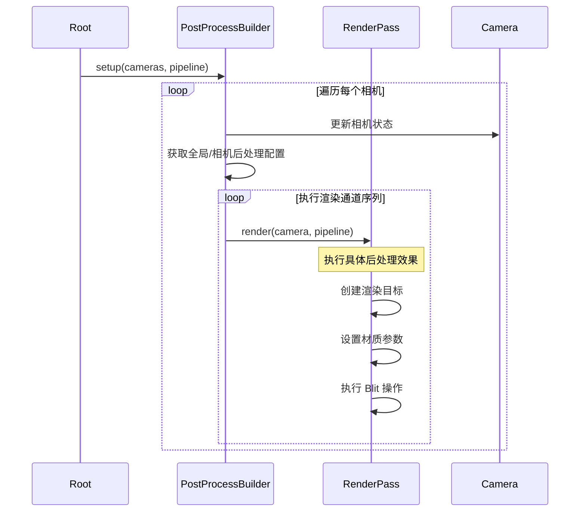

后处理系统（Post-Processing System）是 Cocos Creator 渲染管线中的关键组件，负责在场景主渲染完成后对最终图像进行像素级处理。该系统采用**基于组件的可配置架构**，支持多种后处理效果的动态组合，为开发者提供电影级视觉效果的实现能力。

后处理系统位于渲染管线的末端阶段，在 [渲染管线架构](17-xuan-ran-guan-xian-jia-gou) 完成场景几何渲染后介入，通过一系列可配置的渲染通道（Render Pass）对帧缓冲区图像进行处理。系统核心设计遵循**数据驱动**和**组件化**原则，允许开发者在运行时动态启用/禁用特定效果。

Sources: [post-process-builder.ts](cocos/rendering/post-process/post-process-builder.ts#L1-L100)

## 系统架构

后处理系统采用**三层架构设计**：组件层（Component）、通道层（Pass）和上下文层（Context），各层职责清晰且松耦合。

```mermaid
graph TB
    subgraph "组件层 Component Layer"
        PP[PostProcess 组件]
        S1[Bloom 设置]
        S2[FXAA 设置]
        S3[DOF 设置]
        S4[TAA 设置]
        S5[ColorGrading 设置]
    end
    
    subgraph "通道层 Pass Layer"
        BP[BasePass 基类]
        SP[SettingPass 设置通道]
        BloomP[BloomPass]
        FXAAP[FXAAPass]
        DOFP[DOFPass]
        TAAP[TAAPass]
        FSRP[FSRPass]
    end
    
    subgraph "上下文层 Context Layer"
        PC[PassContext 上下文]
        PB[Pipeline Builder]
    end
    
    PP --> S1
    PP --> S2
    PP --> S3
    PP --> S4
    PP --> S5
    
    S1 -.-> BloomP
    S2 -.-> FXAAP
    S3 -.-> DOFP
    S4 -.-> TAAP
    
    BP <|-- SP
    SP <|-- BloomP
    SP <|-- FXAAP
    SP <|-- DOFP
    SP <|-- TAAP
    SP <|-- FSRP
    
    BloomP --> PC
    FXAAP --> PC
    DOFP --> PC
    TAAP --> PC
    FSRP --> PC
    
    PC --> PB
```

**组件层**负责在编辑器中暴露可配置参数，每个后处理效果对应一个继承自 `PostProcessSetting` 的组件类。这些组件挂载到带有 `PostProcess` 组件的节点上，通过 `settings` Map 进行管理。

**通道层**是渲染逻辑的核心实现，每个效果对应一个继承自 `SettingPass` 的渲染通道类。通道类负责构建渲染流程、设置着色器参数、管理渲染目标。

**上下文层**通过 `PassContext` 单例对象在各渲染通道间共享状态，包括管线引用、相机信息、渲染视口、着色比例等关键数据。

Sources: [post-process.ts](cocos/rendering/post-process/components/post-process.ts#L1-L70) [base-pass.ts](cocos/rendering/post-process/passes/base-pass.ts#L50-L124) [pass-context.ts](cocos/rendering/post-process/utils/pass-context.ts#L1-L80)

## 渲染管线集成

后处理系统通过 `PostProcessBuilder` 集成到自定义渲染管线中。该构建器实现了 `PipelineBuilder` 接口，负责定义默认的渲染通道序列。



默认的前向渲染管线（Forward Pipeline）包含以下通道序列：

| 阶段 | 通道名称 | 功能描述 | 是否默认启用 |
|------|----------|----------|-------------|
| 阴影 | ShadowPass | 生成阴影贴图 | 是 |
| 不透明物体 | ForwardPass | 前向渲染不透明物体 | 是 |
| 蒙皮 | SkinPass | 处理骨骼蒙皮 | 是 |
| 环境光遮蔽 | HBAOPass | 基于深度的环境光遮蔽 | 否 |
| HDR 处理 | FloatOutputProcessPass | 浮点输出处理（HDR+ 雾效） | 条件 |
| 透明物体 | ForwardTransparencyPass | 前向渲染透明物体 | 是 |
| 景深 | DofPass | 景深效果 | 否 |
| 时间性抗锯齿 | TAAPass | 时间性抗锯齿 | 否 |
| 快速抗锯齿 | FxaaPass | 快速近似抗锯齿 | 否 |
| 颜色分级 | ColorGradingPass | 颜色映射和调色 | 否 |
| 屏幕绘制 | BlitScreenPass | 屏幕拷贝 | 是 |
| 泛光 | BloomPass | 泛光效果 | 否 |
| 超分辨率 | FSRPass | AMD FSR 超采样 | 否 |
| 最终输出 | PostFinalPass | 最终输出到屏幕 | 是 |

Sources: [post-process-builder.ts](cocos/rendering/post-process/post-process-builder.ts#L35-L85)

## 核心组件

### PostProcess 组件

`PostProcess` 组件是后处理系统的控制中心，挂载到相机节点上。它管理所有后处理效果的启用状态和全局参数。

```typescript
@ccclass('cc.PostProcess')
export class PostProcess extends Component {
    static all: PostProcess[] = [];  // 全局后处理实例列表
    
    @tooltip('i18n:postprocess.global')
    @property
    global = true;  // 是否作为全局后处理配置
    
    @tooltip('i18n:postprocess.shadingScale')
    @slide
    @range([0.01, 4, 0.01])
    @property
    get shadingScale (): number {
        return this._shadingScale;  // 渲染缩放比例
    }
}
```

**关键属性**：
- `global`: 标记该后处理配置是否应用于所有相机。当相机未指定专属后处理时，使用全局配置
- `shadingScale`: 控制渲染分辨率缩放。值小于 1 时降低渲染分辨率提升性能，大于 1 时提升渲染质量
- `settings`: Map 结构存储所有子效果组件的引用

Sources: [post-process.ts](cocos/rendering/post-process/components/post-process.ts#L10-L50)

### PostProcessSetting 基类

所有后处理效果组件都继承自 `PostProcessSetting`，该类提供统一的启用/禁用生命周期管理。

```typescript
@ccclass('cc.PostProcessSetting')
@requireComponent(PostProcess)
@executeInEditMode
export class PostProcessSetting extends Component {
    onEnable (): void {
        const pp = this.getComponent(PostProcess);
        pp?.addSetting(this);  // 注册到 PostProcess 组件
    }
    onDisable (): void {
        const pp = this.getComponent(PostProcess);
        pp?.removeSetting(this);  // 从 PostProcess 组件移除
    }
}
```

Sources: [post-process-setting.ts](cocos/rendering/post-process/components/post-process-setting.ts#L6-L18)

## 内置后处理效果

### Bloom（泛光）

Bloom 效果模拟真实相机的高光溢出效果，使明亮区域产生柔和的光晕。实现采用**多尺度高斯模糊**算法。

**技术参数**：

| 参数 | 类型 | 范围 | 默认值 | 说明 |
|------|------|------|--------|------|
| threshold | number | [0, ∞) | 0.8 | 亮度阈值，超过此值的像素产生泛光 |
| iterations | number | [1, 6] | 3 | 模糊迭代次数，影响泛光范围 |
| intensity | number | [0, ∞) | 2.3 | 泛光强度 |
| enableAlphaMask | boolean | - | false | 启用 Alpha 通道遮罩 |
| useHdrIlluminance | boolean | - | false | 使用 HDR 光照强度（需开启浮点输出） |

**渲染流程**：
1. **预过滤（Prefilter）**: 提取亮度超过阈值的像素
2. **下采样（Downsample）**: 迭代生成多尺度模糊纹理
3. **上采样（Upsample）**: 逐层融合并放大模糊纹理
4. **合成（Combine）**: 将泛光效果叠加到原图

Sources: [bloom.ts](cocos/rendering/post-process/components/bloom.ts#L1-L75) [bloom-pass.ts](cocos/rendering/post-process/passes/bloom-pass.ts#L20-L109)

### FXAA（快速近似抗锯齿）

FXAA 是一种基于像素的后处理抗锯齿技术，通过检测并平滑边缘锯齿来改善图像质量。相比 MSAA，FXAA 性能开销更低但可能产生轻微模糊。

```typescript
@ccclass('cc.FXAA')
export class FXAA extends PostProcessSetting {
    // 当前实现无额外参数
    // 效果强度由内置着色器算法决定
}
```

Sources: [fxaa.ts](cocos/rendering/post-process/components/fxaa.ts#L4-L11)

### DOF（景深）

景深效果模拟相机镜头的光学特性，使特定距离范围内的物体保持清晰，而前景和背景产生模糊。

**技术参数**：

| 参数 | 类型 | 范围 | 默认值 | 说明 |
|------|------|------|--------|------|
| focusDistance | number | [0, ∞) | 0.0 | 焦点距离，此距离处物体最清晰 |
| focusRange | number | [0, ∞) | 0.0 | 焦点范围，清晰区域的深度范围 |
| bokehRadius | number | [1, 10] | 1.0 | 散景模糊半径 |

**渲染流程**：
1. **CoC 计算**: 根据深度图计算每个像素的模糊圈（Circle of Confusion）
2. **预过滤**: 下采样颜色和 CoC 纹理
3. **散景模糊**: 应用基于 CoC 的可变模糊
4. **滤波**: 进一步平滑模糊结果
5. **合成**: 将模糊层与原图按 CoC 混合

Sources: [dof.ts](cocos/rendering/post-process/components/dof.ts#L10-L47) [dof-pass.ts](cocos/rendering/post-process/passes/dof-pass.ts#L13-L105)

### TAA（时间性抗锯齿）

TAA 利用时间域信息，通过累积多帧采样来实现高质量抗锯齿。相比空间抗锯齿，TAA 能更有效地消除闪烁和锯齿。

**技术参数**：

| 参数 | 类型 | 范围 | 默认值 | 说明 |
|------|------|------|--------|------|
| sampleScale | number | [0.01, 5] | 1 | 采样偏移缩放系数 |
| feedback | number | [0, 1] | 0.95 | 历史帧反馈权重 |

**核心技术**：
- **Halton 序列采样**: 使用 Halton(2,3) 序列生成亚像素偏移模式
- **相机抖动（Camera Jitter）**: 每帧应用微小子偏移实现采样多样性
- **运动矢量重投影**: 将历史帧像素重投影到当前帧
- **钳制混合**: 限制历史颜色范围防止鬼影

Sources: [taa.ts](cocos/rendering/post-process/components/taa.ts#L5-L38) [taa-pass.ts](cocos/rendering/post-process/passes/taa-pass.ts#L1-L100)

### HBAO（基于深度的环境光遮蔽）

HBAO 是一种高效的屏幕空间环境光遮蔽算法，通过深度图计算相邻几何体之间的遮挡关系，增强场景深度感。

**技术参数**：

| 参数 | 类型 | 范围 | 默认值 | 说明 |
|------|------|------|--------|------|
| radiusScale | number | [0, 10] | 1.0 | AO 半径缩放 |
| angleBiasDegree | number | [0, 100] | 10.0 | 角度偏差（度） |
| blurSharpness | number | [0, 10] | 3 | 模糊锐度 |
| aoSaturation | number | [0, 10] | 1.0 | AO 饱和度 |
| needBlur | boolean | - | true | 是否启用模糊滤波 |

Sources: [hbao.ts](cocos/rendering/post-process/components/hbao.ts#L24-L107) [hbao-pass.ts](cocos/rendering/post-process/passes/hbao-pass.ts#L160-L250)

### FSR（FidelityFX 超分辨率）

AMD FSR 是一种空间超采样技术，通过高质量上采样算法将低分辨率图像提升至目标分辨率，在保持性能的同时提升画质。

**技术参数**：

| 参数 | 类型 | 范围 | 默认值 | 说明 |
|------|------|------|--------|------|
| sharpness | number | [0, 1] | 0.8 | 锐化强度 |

**两阶段处理**：
1. **EASU（Edge Adaptive Spatial Upsampling）**: 边缘自适应空间上采样
2. **RCAS（Robust Contrast Adaptive Sharpening）**: 鲁棒对比度自适应锐化

Sources: [fsr.ts](cocos/rendering/post-process/components/fsr.ts#L6-L26) [fsr-pass.ts](cocos/rendering/post-process/passes/fsr-pass.ts#L14-L64)

### Color Grading（颜色分级）

颜色分级通过 LUT（查找表）对图像进行色调映射和色彩校正，实现电影级调色效果。

**技术参数**：

| 参数 | 类型 | 范围 | 默认值 | 说明 |
|------|------|------|--------|------|
| contribute | number | [0, 1] | 0.0 | 效果贡献度（混合权重） |
| colorGradingMap | Texture2D | - | null | 颜色分级 LUT 纹理 |

Sources: [color-grading.ts](cocos/rendering/post-process/components/color-grading.ts#L7-L38)

## 渲染通道机制

### BasePass 基类

所有渲染通道都继承自 `BasePass` 抽象类，该类提供通用的渲染基础设施。

```typescript
abstract class BasePass {
    abstract name: string;
    effectName = 'pipeline/post-process/blit-screen';
    
    get material (): Material {
        // 懒加载材质实例
        if (!this._material) {
            const mat = new Material();
            mat.initialize({ effectName: this.effectName });
            this._material = mat;
        }
        return this._material;
    }
    
    slotName (camera: Camera, index = 0): string {
        // 生成唯一的渲染目标名称
        const name = this.outputNames[index] + this.name;
        return `${name}_${this._id}_${getCameraUniqueID(camera)}`;
    }
    
    abstract render (camera: Camera, ppl: Pipeline): any;
}
```

**核心职责**：
- 材质管理：根据 `effectName` 自动创建和缓存材质
- 渲染目标命名：生成带相机 ID 和通道 ID 的唯一 RT 名称
- 启用控制：通过 `checkEnable` 方法动态判断是否执行

Sources: [base-pass.ts](cocos/rendering/post-process/passes/base-pass.ts#L50-L124)

### SettingPass 设置通道

`SettingPass` 继承自 `BasePass`，增加对组件配置的读取能力。

```typescript
abstract class SettingPass extends BasePass {
    getSetting = getSetting;
    
    checkEnable (camera: Camera): boolean {
        const enable = super.checkEnable(camera);
        const setting = this.setting;
        return enable && !!setting && setting.enabledInHierarchy;
    }
}
```

`getSetting` 函数通过 `PassContext` 获取当前相机关联的 `PostProcess` 组件中的对应设置：

```typescript
function getSetting<T extends PostProcessSetting> (settingClass: new () => T): T {
    const setting = passContext.postProcess && 
                    passContext.postProcess.getSetting(cls) as T;
    return setting!;
}
```

Sources: [setting-pass.ts](cocos/rendering/post-process/passes/setting-pass.ts#L5-L22)

### PassContext 上下文

`PassContext` 是渲染通道间的共享状态容器，采用单例模式。

**关键状态**：
- `ppl`: 当前渲染管线引用
- `camera`: 当前渲染相机
- `material`: 当前使用的材质
- `pass`: 当前渲染通道构建器
- `viewport` / `passViewport`: 视口信息
- `shadingScale`: 渲染缩放比例
- `postProcess`: 当前相机的后处理配置
- `isFinalCamera` / `isFinalPass`: 标记是否为最后一个相机/通道

**链式 API 设计**：
```typescript
passContext
    .updatePassViewPort(shadingScale)
    .addRenderPass('bloom-prefilter', `bloom-prefilter${cameraID}`)
    .setPassInput(input, 'outputResultMap')
    .addRasterView(output, Format.RGBA8)
    .blitScreen(0)
    .version();
```

Sources: [pass-context.ts](cocos/rendering/post-process/utils/pass-context.ts#L15-L200)

## 浮点输出与 HDR

后处理系统支持浮点纹理输出以实现真正的 HDR 渲染。`CC_USE_FLOAT_OUTPUT` 宏控制是否启用浮点格式。

```typescript
function getRTFormatBeforeToneMapping (ppl: BasicPipeline): Format {
    const useFloatOutput = ppl.getMacroBool('CC_USE_FLOAT_OUTPUT');
    return ppl.pipelineSceneData.isHDR && useFloatOutput && 
           supportsRGBA16HalfFloatTexture(ppl.device) 
           ? Format.RGBA16F 
           : Format.RGBA8;
}

function forceEnableFloatOutput (ppl: PipelineRuntime): boolean {
    let enabled = ppl.getMacroBool('CC_USE_FLOAT_OUTPUT');
    if (ppl.pipelineSceneData.isHDR && !enabled) {
        const supportFloatOutput = supportsRGBA16HalfFloatTexture(ppl.device);
        ppl.setMacroBool('CC_USE_FLOAT_OUTPUT', supportFloatOutput);
        enabled = supportFloatOutput;
    }
    return enabled;
}
```

**支持的效果**：
- Bloom 的 `useHdrIlluminance` 参数依赖浮点输出
- Tone Mapping 前的所有中间渲染目标使用浮点格式
- 最终输出根据平台能力自动降级为 LDR

Sources: [base-pass.ts](cocos/rendering/post-process/passes/base-pass.ts#L15-L35)

## 调试支持

系统提供调试视图支持，在调试模式下自动禁用后处理效果以避免干扰。

```typescript
function disablePostProcessForDebugView (): boolean {
    const debugView = cclegacy.director.root.debugView;
    return debugView.singleMode as number > 0;
}
```

各渲染通道在 `checkEnable` 方法中检查此状态：

```typescript
checkEnable (camera: Camera): boolean {
    let enable = super.checkEnable(camera);
    if (disablePostProcessForDebugView()) {
        enable = false;  // 调试视图模式下禁用
    }
    return enable;
}
```

Sources: [base-pass.ts](cocos/rendering/post-process/passes/base-pass.ts#L37-L40) [bloom-pass.ts](cocos/rendering/post-process/passes/bloom-pass.ts#L18-L24)

## 性能优化策略

### 1. 渲染比例缩放

通过 `PostProcess.shadingScale` 控制渲染分辨率：

```typescript
updateViewPort (): void {
    let shadingScale = 1;
    if (this.postProcess && (!EDITOR || this.postProcess.enableShadingScaleInEditor)) {
        shadingScale *= this.postProcess.shadingScale;
    }
    this.shadingScale = shadingScale;
    
    const area = getRenderArea(camera, 
        camera.window.width * shadingScale, 
        camera.window.height * shadingScale);
}
```

**使用建议**：
- 移动平台推荐值：0.5-0.75
- 桌面平台推荐值：0.75-1.0
- 结合 FSR 使用可在低分辨率下保持画质

### 2. 条件渲染

各通道根据配置动态启用：

```typescript
checkEnable (camera: Camera): boolean {
    const enable = super.checkEnable(camera);
    const setting = this.setting;
    return enable && !!setting && setting.enabledInHierarchy;
}
```

### 3. 渲染目标复用

系统通过 `slotName` 生成唯一 RT 名称，底层管线自动管理资源生命周期和复用。

### 4. 材质缓存

`BasePass` 缓存材质实例避免重复创建：

```typescript
get material (): Material {
    if (!this._material) {
        const mat = new Material();
        mat.initialize({ effectName: this.effectName });
        this._material = mat;
    }
    return this._material;
}
```

## 使用示例

### 基础配置

```typescript
import { _decorator, Component, Node, PostProcess, Bloom, FXAA } from 'cc';

@ccclass('PostProcessExample')
export class PostProcessExample extends Component {
    onLoad () {
        // 获取或创建 PostProcess 组件
        let pp = this.node.getComponent(PostProcess);
        if (!pp) {
            pp = this.node.addComponent(PostProcess);
            pp.global = true;
            pp.shadingScale = 0.75;  // 降低渲染分辨率
        }
        
        // 添加 Bloom 效果
        let bloom = this.node.getComponent(Bloom);
        if (!bloom) {
            bloom = this.node.addComponent(Bloom);
            bloom.threshold = 1.0;
            bloom.intensity = 2.0;
            bloom.iterations = 4;
        }
        
        // 添加 FXAA 抗锯齿
        if (!this.node.getComponent(FXAA)) {
            this.node.addComponent(FXAA);
        }
    }
}
```

### 动态切换效果

```typescript
toggleBloom (enabled: boolean) {
    const bloom = this.node.getComponent(Bloom);
    if (bloom) {
        bloom.enabled = enabled;
    }
}

adjustBloomIntensity (value: number) {
    const bloom = this.node.getComponent(Bloom);
    if (bloom) {
        bloom.intensity = value;
    }
}
```

### 相机专属后处理

```typescript
// 为特定相机配置独立后处理
const cameraNode = new Node('Camera');
const camera = cameraNode.addComponent(Camera);
const pp = cameraNode.addComponent(PostProcess);
pp.global = false;  // 仅作用于当前相机

// 添加 DOF 效果
const dof = cameraNode.addComponent(DOF);
dof.focusDistance = 10;
dof.focusRange = 5;
```

## 扩展自定义效果

### 创建自定义 Pass

```typescript
import { Camera } from '../../../render-scene/scene';
import { Pipeline } from '../../custom/pipeline';
import { SettingPass } from './setting-pass';
import { Format } from '../../../gfx';
import { passContext } from '../utils/pass-context';

export class CustomPass extends SettingPass {
    name = 'CustomPass';
    effectName = 'pipeline/post-process/custom-effect';
    outputNames = ['CustomColor'];
    
    checkEnable (camera: Camera): boolean {
        return super.checkEnable(camera);
    }
    
    render (camera: Camera, ppl: Pipeline): void {
        const cameraID = this.getCameraUniqueID(camera);
        
        passContext.material = this.material;
        passContext.clearBlack();
        
        // 设置自定义参数
        this.material.setProperty('customParam', someValue);
        
        const input = this.lastPass!.slotName(camera, 0);
        const output = this.slotName(camera, 0);
        
        passContext
            .updatePassViewPort()
            .addRenderPass('custom-effect', `custom${cameraID}`)
            .setPassInput(input, 'inputTexture')
            .addRasterView(output, Format.RGBA8)
            .blitScreen(0)
            .version();
    }
}
```

### 注册到管线

```typescript
import { PostProcessBuilder } from './post-process-builder';
import { CustomPass } from './passes/custom-pass';

const builder = new PostProcessBuilder();
builder.addPass(new CustomPass(), 'forward');  // 插入到默认位置
```

## 与其他系统的关系

后处理系统与以下核心模块紧密协作：

- **[渲染管线架构](17-xuan-ran-guan-xian-jia-gou)**: 后处理作为管线的最终阶段，接收前向/延迟渲染的输出
- **[着色器与效果系统](18-zhao-se-qi-yu-xiao-guo-xi-tong)**: 所有后处理效果通过 Effect 资产定义着色器逻辑
- **[图形设备抽象层 (GFX)](16-tu-xing-she-bei-chou-xiang-ceng-gfx)**: 使用 GFX API 创建渲染目标、执行绘制命令

## 平台兼容性

| 效果 | WebGL | Mobile | Desktop | 备注 |
|------|-------|--------|---------|------|
| Bloom | ✓ | ✓ | ✓ | 性能消耗中等 |
| FXAA | ✓ | ✓ | ✓ | 推荐移动端使用 |
| DOF | ✓ | ⚠️ | ✓ | 移动端需降低迭代次数 |
| TAA | ✓ | ⚠️ | ✓ | 需要运动矢量支持 |
| HBAO | ⚠️ | ✗ | ✓ | 移动端性能消耗高 |
| FSR | ✓ | ✓ | ✓ | 适合性能受限场景 |
| ColorGrading | ✓ | ✓ | ✓ | 性能消耗低 |

**注意事项**：
- 移动平台建议最多启用 2-3 个后处理效果
- TAA 和 DOF 同时启用时注意鬼影问题
- HDR 渲染需要设备支持浮点纹理

## 故障排查

### 常见问题

| 问题 | 可能原因 | 解决方案 |
|------|----------|----------|
| 后处理不生效 | 未挂载 PostProcess 组件 | 确保相机节点有 PostProcess 组件 |
| 效果过强/过弱 | 参数配置不当 | 调整 intensity/threshold 等参数 |
| 性能下降严重 | 启用过多效果 | 禁用非必要效果，降低 shadingScale |
| 画面闪烁 | TAA 反馈权重过高 | 降低 TAA.feedback 值 |
| 边缘模糊 | FXAA+Bloom 叠加 | 考虑只启用其中一种 |
| 颜色异常 | 浮点输出未启用 | 检查 `CC_USE_FLOAT_OUTPUT` 宏 |

### 调试技巧

1. **逐个启用效果**: 先禁用所有效果，逐个启用定位问题
2. **检查渲染目标**: 使用调试视图查看中间 RT 内容
3. **性能分析**: 使用 Profiler 查看各 Pass 的耗时
4. **参数可视化**: 在编辑器中实时调整参数观察效果