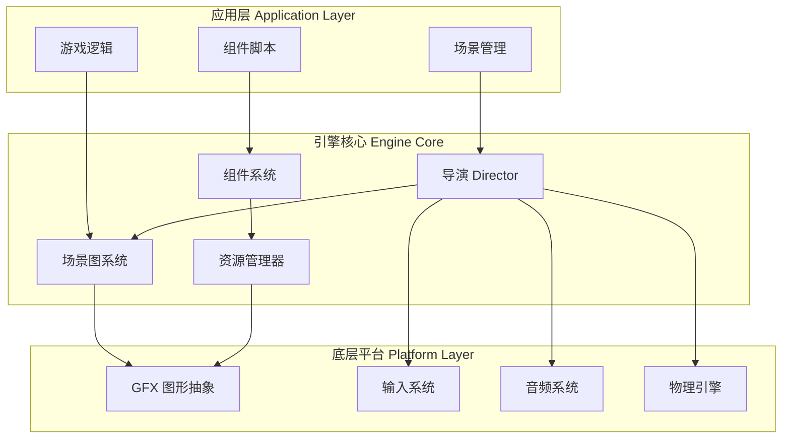
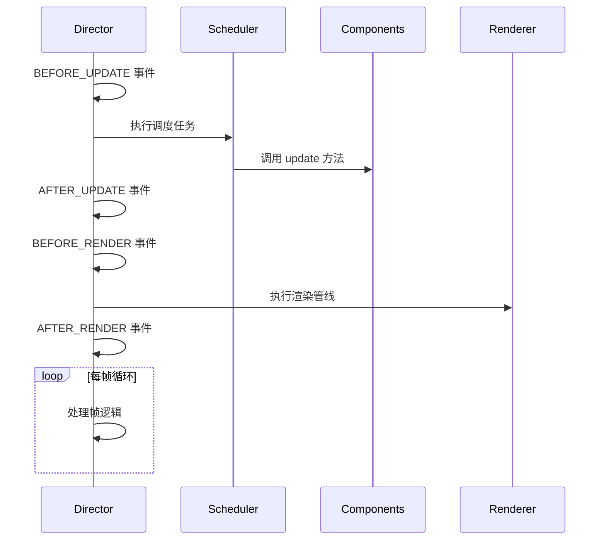

本文档旨在帮助初学者快速了解 Cocos Creator 引擎的基本结构、核心概念和开发工作流。通过本指南，你将掌握引擎的组成部分、开发环境搭建方法以及基本使用模式，为后续深入学习打下坚实基础。

## 引擎概述

Cocos Creator 是一个跨平台的 2D 和 3D 游戏开发引擎，采用 C++ 和 TypeScript 实现。引擎作为 Cocos Creator 编辑器的运行时框架，提供了完整的游戏开发能力，包括渲染系统、物理系统、动画系统、音频管理和资源管理等核心模块。

引擎架构采用分层设计，主要包含三个层次：



引擎的 TypeScript 实现主要集中在 `cocos` 目录，包含 2D/3D 渲染、动画、物理、UI 等模块；原生平台的底层实现在 `native` 目录中，通过绑定层与 TypeScript 层通信。这种架构设计使得引擎能够同时支持 Web、iOS、Android、Windows、macOS 等多个平台。

Sources: [README.zh-CN.md](README.zh-CN.md#L1-L86), [package.json](package.json#L1-L87)

## 核心模块结构

Cocos Creator 引擎由多个协同工作的核心模块组成，理解这些模块的职责和关系是快速上手的关键。

### 场景图与节点系统

场景图（Scene Graph）是引擎的核心数据结构，采用树形组织管理游戏中的所有对象。`Node` 是场景图的基本单元，每个节点可以持有多个组件，并维护空间变换信息（位置、旋转、缩放）。

```typescript
// 节点基本结构示例
import { Node, Vec3 } from 'cc';

const node = new Node('MyNode');
node.setPosition(new Vec3(100, 100, 0));
node.setRotationFromEuler(0, 0, 45);
node.setScale(1.5, 1.5, 1);
```

节点系统支持层级嵌套，父节点的变换会影响所有子节点，这种设计使得复杂的游戏对象管理变得直观高效。

Sources: [cocos/scene-graph/node.ts](cocos/scene-graph/node.ts#L100-L150)

### 组件系统

组件（Component）是游戏功能的载体，所有附加到节点的功能都通过组件实现。引擎提供了丰富的内置组件，包括渲染组件、物理组件、动画组件等，开发者也可以创建自定义组件。

```typescript
import { Component, _decorator } from 'cc';
const { ccclass, property } = _decorator;

@ccclass('MyComponent')
export class MyComponent extends Component {
    onLoad() {
        // 组件初始化逻辑
    }
    
    update(deltaTime: number) {
        // 每帧更新逻辑
    }
}
```

组件遵循 ECS（Entity-Component-System）设计思想，通过组合而非继承来构建游戏对象，这种模式提高了代码的复用性和可维护性。

Sources: [cocos/scene-graph/component.ts](cocos/scene-graph/component.ts#L50-L100)

### 导演（Director）系统

Director 是引擎的核心控制器，负责管理游戏状态、场景切换、主循环执行等关键任务。它通过事件机制协调各个系统的工作，确保游戏按正确的顺序运行。



Director 定义了完整的生命周期事件，包括场景加载、更新循环、渲染提交等关键节点，开发者可以通过监听这些事件来插入自定义逻辑。

Sources: [cocos/game/director.ts](cocos/game/director.ts#L50-L150)

### 资源管理系统

AssetManager 负责游戏资源的加载、缓存和管理，支持异步加载、资源预加载、依赖自动解析等高级功能。

```typescript
import { assetManager, resources } from 'cc';

// 加载资源
assetManager.loadAny('path/to/texture', (err, texture) => {
    if (!err) {
        console.log('资源加载完成');
    }
});

// 从 resources 目录加载
resources.load('prefab/player', (err, prefab) => {
    // 使用预制体
});
```

资源管理系统采用管道（Pipeline）架构，资源加载经过预处理、下载、解析、加载等多个阶段，每个阶段都可以自定义处理逻辑。

Sources: [cocos/asset/asset-manager/asset-manager.ts](cocos/asset/asset-manager/asset-manager.ts#L60-L100)

## 开发环境搭建

### 前置要求

在开始使用 Cocos Creator 引擎进行开发之前，需要确保开发环境满足以下要求：

| 工具 | 版本要求 | 用途 |
|------|----------|------|
| Node.js | >= 18.0.0 | JavaScript 运行时 |
| npm | 最新稳定版 | 包管理工具 |
| Cocos Creator | 3.x | 游戏编辑器 |
| TypeScript | 4.9.5+ | 开发语言 |

### 引擎安装与构建

对于大多数开发者，推荐直接使用 Cocos Creator 编辑器，引擎会作为运行时自动集成。如需进行引擎定制开发，可按以下步骤操作：

```bash
# 克隆引擎仓库
git clone https://github.com/cocos/cocos-engine.git

# 进入目录并安装依赖
cd cocos-engine
npm install

# 构建引擎
npm run build
```

构建完成后，引擎将生成可在项目中使用的 JavaScript 文件和类型声明文件。编辑器会在打开项目时自动编译和构建引擎， standalone 使用时需要手动执行构建命令。

Sources: [README.zh-CN.md](README.zh-CN.md#L40-L60), [package.json](package.json#L15-L30)

## 项目结构与模板

Cocos Creator 项目遵循标准化的目录结构，理解这个结构有助于快速定位资源和代码。

### 标准项目结构

```
project/
├── assets/              # 游戏资源目录
│   ├── scenes/         # 场景文件
│   ├── scripts/        # TypeScript 脚本
│   ├── textures/       # 纹理资源
│   ├── models/         # 3D 模型
│   └── audio/          # 音频文件
├── settings/           # 项目配置
├── library/            # 引擎生成的缓存
└── profiles/           # 编辑器配置文件
```

### 构建模板

引擎提供了多种平台的项目模板，位于 `templates` 目录，包括：

| 模板类型 | 目录 | 目标平台 |
|---------|------|---------|
| Web 移动端 | `web-mobile` | 移动浏览器 |
| Web 桌面端 | `web-desktop` | 桌面浏览器 |
| 微信小程序 | `wechatgame` | 微信小程序 |
| Android | `android` | Android 设备 |
| iOS | `ios` | iOS 设备 |
| HarmonyOS | `harmonyos-next` | 鸿蒙系统 |

每个模板包含平台特定的配置文件和入口文件，构建时引擎会根据选择的平台自动应用相应的模板。

Sources: [templates/web-mobile/index.ejs](templates/web-mobile/index.ejs#L1-L49)

## 快速上手流程

### 第一步：创建项目

1. 打开 Cocos Creator 编辑器
2. 选择"新建项目"
3. 选择合适的模板（推荐初学者选择"空项目"或"2D 项目"）
4. 设置项目名称和存储路径

### 第二步：理解编辑器界面

Cocos Creator 编辑器包含以下主要面板：

- **层级管理器**：显示场景图结构，管理节点层级关系
- **属性检查器**：编辑选中节点或组件的属性
- **资源管理器**：浏览和管理项目资源
- **场景编辑器**：可视化编辑场景内容
- **控制台**：显示日志和错误信息

### 第三步：创建第一个场景

```typescript
// 创建脚本：assets/scripts/hello-world.ts
import { Component, Label, _decorator } from 'cc';
const { ccclass, property } = _decorator;

@ccclass('HelloWorld')
export class HelloWorld extends Component {
    @property(Label)
    public label: Label = null!;

    start() {
        this.label.string = 'Hello, Cocos Creator!';
    }
}
```

将脚本添加到场景中的节点，运行项目即可看到效果。

### 第四步：学习资源管理

资源是游戏开发的基础，Cocos Creator 提供了完善的资源管理工作流：

1. 将资源文件（图片、音频、模型等）放入 `assets` 目录
2. 编辑器会自动导入并生成对应的资源文件
3. 在脚本中通过 `@property` 装饰器引用资源
4. 使用 `assetManager` 进行动态加载

### 第五步：构建与发布

完成开发后，通过编辑器构建项目：

1. 选择"构建发布"面板
2. 选择目标平台
3. 配置构建选项
4. 点击"构建"生成最终包

Sources: [exports/base.ts](exports/base.ts#L1-L64), [cocos/core/index.ts](cocos/core/index.ts#L1-L50)

## 核心概念速查

### 生命周期方法

组件在运行过程中会按顺序调用特定的生命周期方法：

| 方法 | 调用时机 | 用途 |
|------|---------|------|
| `onLoad` | 组件首次加载时 | 初始化引用和资源 |
| `onEnable` | 组件启用时 | 注册事件监听器 |
| `start` | 第一次 update 之前 | 执行需要等待初始化的逻辑 |
| `update` | 每帧 | 游戏逻辑更新 |
| `lateUpdate` | update 之后 | 依赖其他对象更新后的逻辑 |
| `onDisable` | 组件禁用时 | 清理临时状态 |
| `onDestroy` | 组件销毁时 | 释放资源和清理引用 |

### 常用 API 分类

引擎 API 按功能模块组织，主要入口包括：

| 模块 | 导入路径 | 主要功能 |
|------|---------|---------|
| 核心模块 | `cc` | 基础类型、数学库、工具函数 |
| 场景图 | `cc` | Node、Scene、Component |
| 资源管理 | `cc` | assetManager、resources |
| 输入系统 | `cc` | input、SystemEvent |
| 动画系统 | `cc` | Animation、AnimationClip |
| 物理系统 | `cc` | PhysicsSystem、Collider |
| UI 系统 | `cc` | UI、Widget、Layout |

### 调试技巧

开发过程中常用的调试方法：

```typescript
import { log, warn, error, debug } from 'cc';

// 日志输出
log('普通日志');
warn('警告信息');
error('错误信息');
debug('调试信息');

// 断言检查
import { assert } from 'cc';
assert(condition, '条件不满足时的错误信息');

// 性能分析
import { profiler } from 'cc';
profiler.showStats(); // 显示性能统计
```

## 学习路径建议

根据目录结构，建议按以下顺序深入学习：

1. **基础阶段**：先阅读 [概述](1-gai-shu) 了解引擎全貌，然后通过本文档快速上手
2. **核心概念**：深入学习 [引擎架构设计](4-yin-qing-jia-gou-she-ji)、[场景图与节点系统](5-chang-jing-tu-yu-jie-dian-xi-tong)、[组件系统](6-zu-jian-xi-tong)
3. **2D 开发**：掌握 [2D 渲染与精灵](7-2d-xuan-ran-yu-jing-ling)、[UI 系统](8-ui-xi-tong)、[2D 物理](9-2d-wu-li)
4. **3D 开发**：学习 [3D 渲染管线](10-3d-xuan-ran-guan-xian)、[3D 模型与材质](11-3d-mo-xing-yu-cai-zhi)、[3D 物理系统](12-3d-wu-li-xi-tong)
5. **高级特性**：探索 [动画系统](13-dong-hua-jian-ji-yu-zhuang-tai)、[图形设备抽象层](16-tu-xing-she-bei-chou-xiang-ceng-gfx)、[渲染管线架构](17-xuan-ran-guan-xian-jia-gou)

## 常见问题

### Q: 我应该直接使用引擎代码还是通过编辑器使用？

**A**: 99% 的开发者应该通过 Cocos Creator 编辑器使用引擎。编辑器提供了可视化工作流、资源管理、调试工具等完整开发环境。直接操作引擎代码仅适用于需要深度定制引擎的高级开发者。

### Q: TypeScript 和 JavaScript 哪个更适合？

**A**: 强烈推荐使用 TypeScript。Cocos Creator 引擎本身使用 TypeScript 编写，提供了完整的类型定义。TypeScript 的类型系统可以在编译时发现错误，提供更好的代码提示和重构支持。

### Q: 如何在多个平台间切换开发？

**A**: Cocos Creator 的跨平台特性使得大部分代码可以直接复用。开发时应：
- 使用引擎提供的统一 API，避免平台特定代码
- 通过 `sys` 模块检测运行平台
- 使用条件编译处理平台差异
- 在目标平台上充分测试

### Q: 性能优化的最佳实践是什么？

**A**: 性能优化应遵循以下原则：
- 优先使用对象池减少对象创建销毁
- 合理使用 LOD 技术降低渲染负载
- 使用图集（Atlas）减少 Draw Call
- 避免在 update 中进行昂贵操作
- 使用性能分析工具定位瓶颈

Sources: [cocos/game/game.ts](cocos/game/game.ts#L50-L100)

## 下一步

完成快速开始后，建议继续阅读 [项目结构解析](3-xiang-mu-jie-gou-jie-xi) 深入了解项目的组织方式，然后进入 [核心概念](4-yin-qing-jia-gou-she-ji) 部分系统学习引擎的设计思想。实践方面，可以参考官方示例项目 [cocos-example-projects](https://github.com/cocos/cocos-example-projects) 和教程项目 [Mind Your Step 3D](https://github.com/cocos/cocos-tutorial-mind-your-step) 进行动手练习。