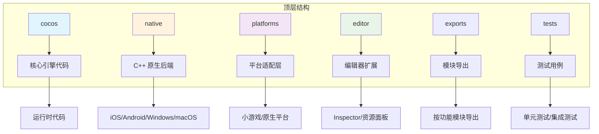
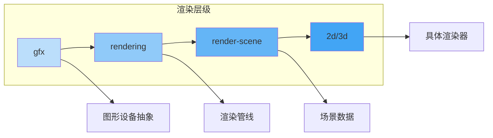

本文档深入解析 Cocos Creator 引擎的源代码组织结构，帮助初学者快速理解引擎的模块化设计和文件布局。通过系统性的目录分析，你将掌握如何定位功能模块、理解依赖关系，并为后续深入学习引擎架构奠定基础。

## 整体架构概览

Cocos Engine 采用**分层架构设计**，核心代码以 TypeScript 实现，原生平台支持通过 C++ 后端提供。项目结构清晰地划分为运行时引擎、编辑器扩展、平台适配和测试验证四大区域。



根目录包含以下关键配置文件：[`package.json`](package.json#L1-L30) 定义项目依赖和构建脚本，[`tsconfig.json`](tsconfig.json) 配置 TypeScript 编译选项，[`cc.config.json`](cc.config.json) 存储引擎配置信息。

Sources: [README.zh-CN.md](README.zh-CN.md#L1-L50)

## 核心引擎目录 (cocos)

`cocos` 目录是引擎的**核心运行时实现**，包含所有游戏运行所需的模块。该目录按功能垂直切分，每个子目录代表一个独立的功能领域。

### 核心基础模块

| 目录 | 职责 | 关键文件 |
|------|------|----------|
| `core` | 引擎基础架构 | [`index.ts`](cocos/core/index.ts#L1-L50) 导出数学库、事件系统、调度器 |
| `scene-graph` | 场景图与节点系统 | [`node.ts`](cocos/scene-graph/node.ts#L1-L100) 实现 Node 基类 |
| `game` | 游戏生命周期管理 | [`director.ts`](cocos/game/director.ts#L1-L80) 场景管理、主循环 |
| `asset` | 资源管理系统 | [`asset-manager`](cocos/asset/asset-manager) 资源加载与缓存 |

`core` 模块提供数学运算 (`math`)、内存优化 (`memop`)、几何算法 (`geometry`)、事件系统 (`event`) 和数据序列化 (`data`) 等基础能力。[`core/index.ts`](cocos/core/index.ts#L26-L50) 作为统一入口，导出所有核心功能。

`scene-graph` 模块实现场景树的核心数据结构，`Node` 类作为所有场景对象的基类，维护变换层级和组件容器。[`scene-graph/node.ts`](cocos/scene-graph/node.ts#L88-L100) 定义了节点的空间变换和组件管理接口。

`game` 模块中的 `Director` 是引擎的**指挥中心**，负责场景切换、时间管理和系统调度。[`game/director.ts`](cocos/game/director.ts#L45-L80) 定义了场景生命周期事件。

Sources: [cocos/core/index.ts](cocos/core/index.ts#L26-L50)

### 渲染系统

渲染系统采用**分层抽象设计**，从底层图形 API 到高层渲染管线形成完整的技术栈。



| 目录 | 职责 | 关键文件 |
|------|------|----------|
| `gfx` | 图形设备抽象层 | [`index.ts`](cocos/gfx/index.ts#L1-L48) 封装 WebGL/WebGPU |
| `rendering` | 渲染管线架构 | [`render-pipeline.ts`](cocos/rendering/render-pipeline.ts#L1-L80) 管线基类 |
| `render-scene` | 场景渲染数据 | 相机、模型、材质管理 |
| `2d/renderer` | 2D 渲染器 | 精灵批处理、UI 渲染 |
| `3d/models` | 3D 模型渲染 | 网格、骨骼动画渲染 |

`gfx` 模块提供跨平台的图形 API 抽象，支持 WebGL、WebGL2 和 WebGPU。[`gfx/index.ts`](cocos/gfx/index.ts#L25-L48) 导出设备、缓冲区、纹理、着色器等图形资源接口。

`rendering` 模块实现渲染管线的核心架构，包括渲染阶段 (`render-stage`)、渲染流 (`render-flow`) 和渲染队列 (`render-queue`)。[`rendering/render-pipeline.ts`](cocos/rendering/render-pipeline.ts#L55-L80) 定义了渲染管线的基类和配置接口。

Sources: [cocos/gfx/index.ts](cocos/gfx/index.ts#L25-L48)

### 功能模块

| 模块分类 | 目录 | 功能说明 |
|----------|------|----------|
| **2D 系统** | `2d` | 精灵、UI 组件、2D 渲染器 |
| **3D 系统** | `3d` | 模型、光照、LOD、骨骼动画 |
| **动画系统** | `animation` | 动画剪辑、状态机、曲线插值 |
| **物理系统** | `physics` / `physics-2d` | 3D/2D 物理引擎集成 |
| **粒子系统** | `particle` / `particle-2d` | GPU/CPU 粒子发射器 |
| **音频系统** | `audio` | 音频剪辑、音源管理 |
| **输入系统** | `input` | 触摸、键盘、手柄输入 |
| **地形系统** | `terrain` | 高度图地形、LOD |
| **瓦片地图** | `tiledmap` | TMX 地图解析与渲染 |
| **UI 系统** | `ui` | 按钮、滚动视图、布局组件 |
| **动画补间** | `tween` | 属性动画补间系统 |

`animation` 模块提供完整的动画解决方案，包括动画剪辑 ([`animation-clip.ts`](cocos/animation/animation-clip.ts))、动画状态机 ([`animation-state.ts`](cocos/animation/animation-state.ts)) 和骨骼动画工具 ([`skeletal-animation-utils.ts`](cocos/animation/skeletal-animation-utils.ts))。

`physics` 和 `physics-2d` 分别集成 3D 物理引擎 (Bullet、PhysX、Cannon) 和 2D 物理引擎 (Box2D)，通过统一的框架接口 ([`framework`](cocos/physics/framework)) 提供物理模拟能力。

Sources: [cocos/scene-graph/node.ts](cocos/scene-graph/node.ts#L88-L100)

## 原生后端 (native)

`native` 目录包含引擎的**C++ 原生实现**，为 iOS、Android、Windows 和 macOS 平台提供底层支持。

```
native/
├── cocos/          # C++ 引擎核心
│   ├── 2d/         # 2D 原生实现
│   ├── 3d/         # 3D 原生实现
│   ├── renderer/   # 原生渲染器
│   ├── platform/   # 平台抽象层
│   └── bindings/   # JS 绑定
├── extensions/     # 原生扩展
├── tools/          # 构建工具
└── tests/          # 原生测试
```

[`native/README.md`](native/README.md#L1-L40) 说明了原生部分的编译要求和系统依赖。关键特性包括：

- **C++17 标准**：使用现代 C++ 特性，支持 `std::string_view` 和 `constexpr if`
- **跨平台支持**：iOS 11+、Android 4.4+、Windows 7+、macOS 10.14+
- **图形后端**：支持 Vulkan、Metal、OpenGL ES

`bindings` 目录实现 TypeScript 与 C++ 之间的绑定，使游戏逻辑可以调用原生功能。`platform` 目录封装各平台的系统 API，提供统一的抽象接口。

Sources: [native/README.md](native/README.md#L1-L40)

## 平台适配层 (platforms)

`platforms` 目录提供**平台特定的适配代码**，处理不同运行环境的差异。

| 子目录 | 目标平台 | 说明 |
|--------|----------|------|
| `native` | 原生平台 | 原生平台启动代码和模块配置 |
| `minigame` | 小游戏 | 微信、支付宝、百度等小游戏适配 |
| `runtime` | 小游戏运行时 | 通用小游戏运行时适配 |

[`platforms/native/modules.json`](platforms/native/modules.json#L1-L50) 定义了原生平台的模块配置，控制引擎功能的裁剪和组合。该配置文件支持按需加载，优化包体大小。

小游戏适配层通过 `pal` (Platform Adaptation Layer) 提供统一的 API 抽象，屏蔽不同小游戏平台的差异。`pal` 目录位于根目录，包含音频、输入、系统信息等模块的适配实现。

Sources: [platforms/native/modules.json](platforms/native/modules.json#L1-L50)

## 编辑器扩展 (editor)

`editor` 目录包含**Cocos Creator 编辑器的扩展代码**，定义引擎在编辑器中的行为和资源处理逻辑。

```
editor/
├── assets/         # 默认资源
├── engine-features/# 引擎特性配置
├── exports/        # 编辑器导出模块
├── i18n/           # 国际化文件
├── inspector/      # 组件检查器
└── src/            # 编辑器脚本
```

`inspector` 目录定义各组件在编辑器属性检查器中的显示逻辑，包括自定义 UI 和序列化行为。`assets` 目录包含引擎的默认资源，如默认材质、默认粒子纹理、默认地形贴图等。

[`editor/engine-features/render-config.json`](editor/engine-features/render-config.json) 配置渲染相关的引擎特性，控制编辑器中可用的渲染功能。

Sources: [editor/inspector/components.js](editor/inspector/components.js#L1-L10)

## 模块导出系统 (exports)

`exports` 目录定义引擎的**模块化导出接口**，每个文件对应一个可独立引用的功能模块。

| 导出文件 | 对应模块 | 使用场景 |
|----------|----------|----------|
| `base.ts` | 基础核心 | 引擎最小依赖集 |
| `2d.ts` | 2D 功能 | 纯 2D 游戏 |
| `3d.ts` | 3D 功能 | 3D 游戏 |
| `animation.ts` | 动画系统 | 需要动画功能 |
| `physics-framework.ts` | 物理框架 | 物理模拟 |
| `ui.ts` | UI 系统 | UI 界面开发 |
| `particle.ts` | 粒子系统 | 特效制作 |

[`exports/base.ts`](exports/base.ts#L1-L64) 是引擎的基础导出文件，导入核心模块并建立全局命名空间。其他导出文件在此基础上添加特定功能模块。

这种设计支持**按需打包**，开发者可以根据项目需求选择需要的模块，减少最终构建体积。

Sources: [exports/base.ts](exports/base.ts#L1-L64)

## 测试体系 (tests)

`tests` 目录包含引擎的**完整测试套件**，覆盖各功能模块的单元测试和集成测试。

```
tests/
├── core/           # 核心模块测试
├── scene-graph/    # 场景图测试
├── animation/      # 动画系统测试
├── asset-manager/  # 资源管理测试
├── physics/        # 物理系统测试
├── ui/             # UI 系统测试
└── utils/          # 测试工具
```

测试使用 Jest 框架，[`jest.config.js`](jest.config.js) 配置测试环境。每个模块的测试文件遵循 `*.test.ts` 命名约定，测试用例按功能分类组织。

例如，`tests/animation/` 目录包含动画剪辑、动画状态、骨骼动画混合等专项测试，验证动画系统的正确性。

Sources: [tests/init.ts](tests/init.ts#L1-L30)

## 外部依赖与模板

### 外部库 (external)

`external` 目录包含引擎依赖的**第三方库**，如压缩算法、序列化库等。

| 目录 | 功能 | 文件示例 |
|------|------|----------|
| `compression` | 压缩解压 | `ZipUtils.js`, `gzip.js` |
| `deserialize` | 序列化 | `notepack_encode.ts` |

### 项目模板 (templates)

`templates` 目录提供**项目初始化模板**，支持各目标平台的快速创建。

| 模板类型 | 目录 | 目标平台 |
|----------|------|----------|
| Web 模板 | `web-mobile`, `web-desktop` | 浏览器 |
| 原生模板 | `android`, `ios`, `windows`, `mac`, `linux` | 桌面/移动端 |
| 小游戏模板 | `wechatgame`, `alipay-mini-game` 等 | 各大小游戏平台 |
| XR 模板 | `xr-meta`, `xr-pico` 等 | VR/AR 设备 |

每个模板包含平台特定的启动代码、配置文件和资源目录，通过 CMake 或平台原生构建系统进行编译。

Sources: [templates/project.json](templates/project.json#L1-L20)

## 构建与开发工作流

### 构建脚本 (scripts)

`scripts` 目录包含引擎的**构建和开发工具**。

| 脚本文件 | 功能 |
|----------|------|
| `build-h5-source.js` | 构建 H5 源码版本 |
| `build-h5-minified.js` | 构建 H5 压缩版本 |
| `build-declarations.js` | 生成 TypeScript 声明文件 |
| `compile-native-ts.js` | 编译原生 TypeScript |
| `clear-cache.js` | 清理构建缓存 |

[`package.json`](package.json#L14-L30) 定义了常用的 npm 脚本：
- `npm run build`：完整构建引擎
- `npm run test`：运行测试套件
- `npm run clear`：清理缓存文件

### 类型声明 (@types)

`@types` 目录包含引擎的**TypeScript 类型声明**，为 WebGL、WebGPU、Box2D 等外部 API 提供类型支持。

Sources: [package.json](package.json#L14-L30)

## 学习路径建议

根据目录结构，建议初学者按以下顺序深入学习：

1. **入门阶段**：阅读 [`cocos/core`](cocos/core) 了解基础架构，学习 [`cocos/scene-graph`](cocos/scene-graph) 掌握节点系统
2. **2D 开发**：深入研究 [`cocos/2d`](cocos/2d) 和 [`cocos/ui`](cocos/ui) 理解 2D 渲染和 UI 系统
3. **3D 开发**：学习 [`cocos/3d`](cocos/3d) 和 [`cocos/gfx`](cocos/gfx) 掌握 3D 渲染原理
4. **高级主题**：探索 [`cocos/animation`](cocos/animation)、[`cocos/particle`](cocos/particle) 等特效系统
5. **原生扩展**：参考 [`native`](native) 目录学习 C++ 原生开发

下一步建议阅读 [引擎架构设计](4-yin-qing-jia-gou-she-ji) 深入了解各模块的协作机制，或查看 [场景图与节点系统](5-chang-jing-tu-yu-jie-dian-xi-tong) 学习节点系统的详细实现。