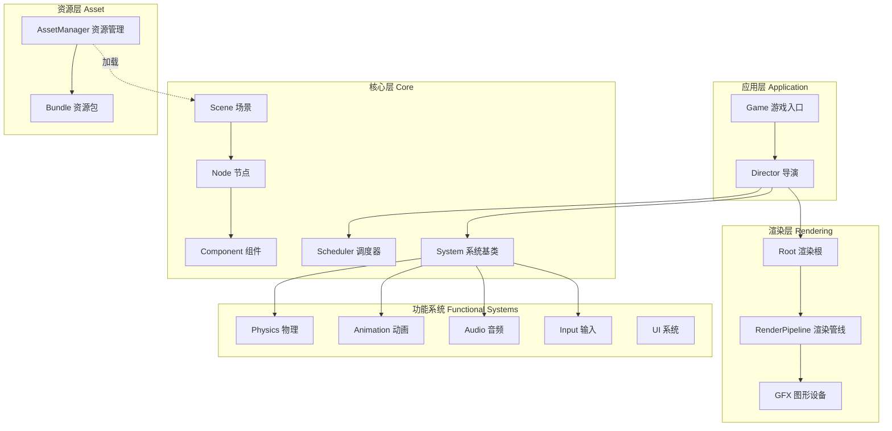
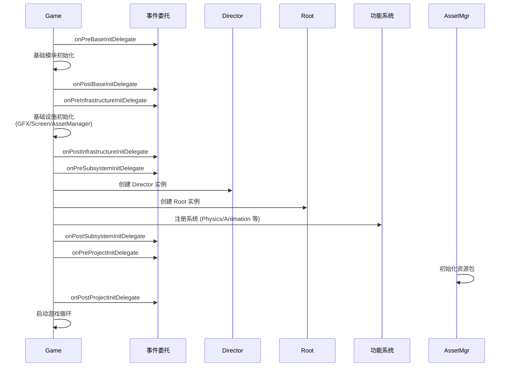
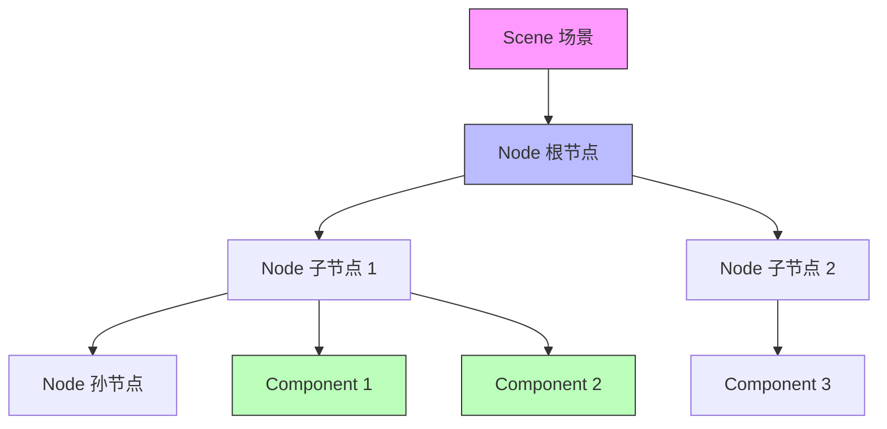
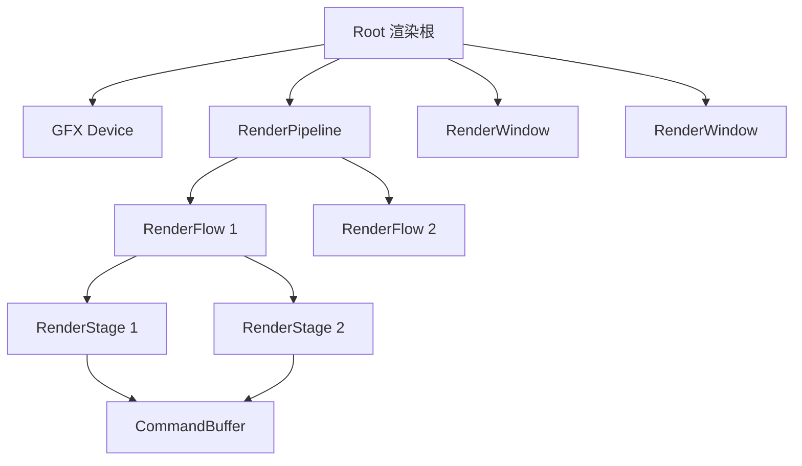
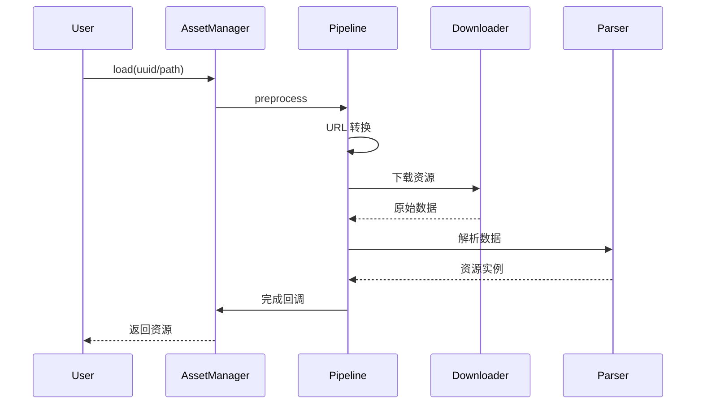

本文档深入解析 Cocos Creator 引擎的核心架构设计，帮助初学者理解引擎的整体组织方式、模块间的协作关系以及关键设计模式。通过本文档，你将掌握引擎的初始化流程、核心组件交互机制以及扩展开发的基础知识。

## 核心架构概览

Cocos Creator 引擎采用**分层架构设计**，以游戏循环为核心驱动，通过事件系统和调度器协调各个模块的运行。引擎架构可以概括为以下层次：



**架构设计原则**：

| 原则 | 说明 | 实现位置 |
|------|------|----------|
| **单一职责** | 每个模块专注于特定功能领域 | [`cocos/game/game.ts`](cocos/game/game.ts#L1-L50) |
| **事件驱动** | 模块间通过事件解耦通信 | [`cocos/game/director.ts`](cocos/game/director.ts#L36-L150) |
| **组件组合** | 功能通过组件附加到节点实现 | [`cocos/scene-graph/component.ts`](cocos/scene-graph/component.ts#L55-L150) |
| **面向接口** | 系统间通过抽象接口交互 | [`cocos/core/system.ts`](cocos/core/system.ts#L30-L101) |

Sources: [`cocos/game/game.ts`](cocos/game/game.ts#L1-L50), [`cocos/game/director.ts`](cocos/game/director.ts#L36-L150), [`cocos/core/system.ts`](cocos/core/system.ts#L30-L101)

## 游戏启动与初始化流程

引擎的启动过程遵循严格的初始化顺序，确保各模块在正确的时机完成配置。整个流程由 [`Game`](cocos/game/game.ts) 类主导，通过多个异步委托（AsyncDelegate）提供扩展点。

### 初始化阶段划分



**关键初始化阶段**：

1. **基础模块初始化**：加载核心配置、常量定义
2. **基础设施初始化**：初始化 GFX 设备、屏幕适配、资源管理器
3. **子系统初始化**：创建 Director、Root、注册各功能系统
4. **项目数据初始化**：加载资源包、准备场景数据

Sources: [`cocos/game/game.ts`](cocos/game/game.ts#L480-L550)

### 游戏配置接口

开发者可以通过 `IGameConfig` 接口自定义引擎行为：

```typescript
interface IGameConfig {
    settingsPath?: string;           // 引擎配置文件路径
    effectSettingsPath?: string;     // Effect 配置文件路径
    debugMode?: DebugMode;           // 调试模式
    overrideSettings?: {             // 覆盖默认设置
        [k in Settings.Category]: Record<string, any>
    };
    assetOptions?: IAssetManagerOptions;  // 资源管理器配置
}
```

Sources: [`cocos/game/game.ts`](cocos/game/game.ts#L55-L180)

## 导演系统（Director）

[`Director`](cocos/game/director.ts) 是引擎的核心控制器，负责管理游戏逻辑流程、场景切换和帧循环。作为单例对象，它协调所有系统按正确顺序执行。

### Director 的核心职责

| 职责 | 说明 | 相关方法 |
|------|------|----------|
| **场景管理** | 加载、切换、卸载场景 | `loadScene`, `runScene` |
| **帧循环控制** | 驱动游戏逻辑更新和渲染 | `tick`, `startAnimation` |
| **系统调度** | 管理所有功能系统的生命周期 | `_systems`, `registerSystem` |
| **事件分发** | 提供生命周期事件通知 | `emit(DirectorEvent.*)` |

### 帧循环执行顺序

每一帧的执行遵循严格的顺序，确保逻辑和渲染的正确性：


**关键事件节点**：

- `BEFORE_UPDATE` / `AFTER_UPDATE`：组件更新前后
- `BEFORE_PHYSICS` / `AFTER_PHYSICS`：物理模拟前后
- `BEFORE_DRAW` / `AFTER_DRAW`：渲染过程前后
- `BEFORE_COMMIT` / `AFTER_COMMIT`：渲染提交前后

Sources: [`cocos/game/director.ts`](cocos/game/director.ts#L36-L150), [`cocos/game/director.ts`](cocos/game/director.ts#L450-L550)

## 节点与组件系统

Cocos Creator 采用**ECS 变体架构**（Entity-Component-System），以节点（Node）为实体容器，组件（Component）为功能单元，系统（System）为逻辑处理器。

### 节点树结构

[`Node`](cocos/scene-graph/node.ts) 是场景图的基本单位，维护空间变换和组件列表：



**Node 核心特性**：

- **层级管理**：父子节点关系，形成场景树
- **空间变换**：位置、旋转、缩放的局部/世界坐标转换
- **组件容器**：持有并管理附加的组件实例
- **事件传播**：支持事件冒泡和捕获机制

Sources: [`cocos/scene-graph/node.ts`](cocos/scene-graph/node.ts#L90-L150)

### 组件生命周期

[`Component`](cocos/scene-graph/component.ts) 定义了组件的生命周期回调，由 Director 的调度器管理：

```typescript
class Component {
    // 组件启用时调用
    onEnable(): void {}
    
    // 组件禁用时调用
    onDisable(): void {}
    
    // 每帧更新（在节点激活且组件启用时）
    update(dt: number): void {}
    
    // 在 update 之后调用
    lateUpdate(dt: number): void {}
    
    // 组件销毁时调用
    onDestroy(): void {}
}
```

**生命周期执行顺序**：

1. `onLoad`：组件首次加载（仅一次）
2. `onEnable`：组件启用时
3. `update`：每帧逻辑更新
4. `lateUpdate`：所有 update 完成后
5. `onDisable`：组件禁用时
6. `onDestroy`：组件销毁时

Sources: [`cocos/scene-graph/component.ts`](cocos/scene-graph/component.ts#L110-L150)

## 渲染架构

Cocos Creator 的渲染系统采用**管线化设计**，通过 [`Root`](cocos/root.ts) 管理 GFX 设备和渲染管线，支持前向渲染和延迟渲染等多种模式。

### 渲染层次结构



**核心概念**：

| 概念 | 职责 | 说明 |
|------|------|------|
| **Root** | 渲染管理器 | 管理 GFX 设备、窗口、管线 | [`cocos/root.ts`](cocos/root.ts#L50-L200) |
| **RenderPipeline** | 渲染管线 | 定义渲染流程和资源配置 | [`cocos/rendering/render-pipeline.ts`](cocos/rendering/render-pipeline.ts#L100-L150) |
| **RenderFlow** | 渲染流程 | 管线的子流程（如主流程、阴影流程） |
| **RenderStage** | 渲染阶段 | 流程中的具体阶段（如 GBuffer、光照） |
| **GFX Device** | 图形设备抽象 | 封装 WebGL/WebGPU/原生 API | [`cocos/gfx/index.ts`](cocos/gfx/index.ts#L1-L48) |

### 渲染管线类型

引擎内置多种渲染管线以适应不同需求：

- **ForwardPipeline**：前向渲染管线，适合移动端和简单场景
- **DeferredPipeline**：延迟渲染管线，适合复杂光照场景
- **CustomPipeline**：自定义管线，支持用户扩展

Sources: [`cocos/root.ts`](cocos/root.ts#L50-L200), [`cocos/rendering/render-pipeline.ts`](cocos/rendering/render-pipeline.ts#L100-L150), [`cocos/gfx/index.ts`](cocos/gfx/index.ts#L1-L48)

## 资源管理系统

[`AssetManager`](cocos/asset/asset-manager/asset-manager.ts) 负责资源的加载、缓存、依赖管理和生命周期控制。它通过管道化处理流程实现高度可扩展的资源加载机制。

### 资源加载流程



**核心模块**：

| 模块 | 职责 |
|------|------|
| **Pipeline** | 正常加载管线（含解析） |
| **FetchPipeline** | 预加载管线（不含解析） |
| **Downloader** | 资源下载器，支持并发控制 |
| **Parser** | 资源解析器，将原始数据转为资源实例 |
| **Bundle** | 资源包，管理一组相关资源 |
| **Cache** | 资源缓存，避免重复加载 |

Sources: [`cocos/asset/asset-manager/asset-manager.ts`](cocos/asset/asset-manager/asset-manager.ts#L100-L150)

### Bundle 机制

Bundle 是资源的逻辑分组，每个 Bundle 独立管理其资源：

```typescript
// 加载 Bundle 中的资源
assetManager.loadBundle('main', (err, bundle) => {
    bundle.load('texture', SpriteFrame, (err, asset) => {
        // 使用资源
    });
});
```

Sources: [`cocos/asset/asset-manager/asset-manager.ts`](cocos/asset/asset-manager/asset-manager.ts#L100-L150)

## 功能系统架构

引擎的功能模块（物理、动画、音频等）均继承自 [`System`](cocos/core/system.ts) 基类，由 Director 统一调度。这种设计保证了模块间的一致性和可扩展性。

### System 基类接口

```typescript
class System {
    priority: number;      // 优先级，决定执行顺序
    id: string;            // 系统唯一标识
    
    init(): void {}        // 初始化
    update(dt: number): void {}    // 每帧更新
    postUpdate(dt: number): void {} // 帧后处理
    destroy(): void {}     // 销毁
}
```

### 内置系统示例

以物理系统为例：

```typescript
class PhysicsSystem extends System {
    static readonly ID = 'PHYSICS';
    
    get enable(): boolean { }
    set enable(value: boolean) { }
    
    get fixedTimeStep(): number { }  // 固定时间步长
    get maxSubSteps(): number { }    // 最大子步数
    
    update(dt: number): void {
        // 执行物理模拟
        this.physicsWorld.step();
    }
}
```

**系统优先级**：

| 优先级 | 值 | 说明 |
|--------|---|------|
| LOW | 0 | 低优先级系统 |
| MEDIUM | 100 | 中等优先级 |
| HIGH | 200 | 高优先级 |
| SCHEDULER | 2^31 | 调度器（最高） |

Sources: [`cocos/core/system.ts`](cocos/core/system.ts#L30-L101), [`cocos/physics/framework/physics-system.ts`](cocos/physics/framework/physics-system.ts#L50-L150)

## 跨平台适配层（PAL）

引擎通过 **PAL（Platform Adaptation Layer）** 实现跨平台能力，将平台相关代码隔离到独立模块：

```
pal/
├── audio/          # 音频适配
├── env/            # 环境检测
├── input/          # 输入适配
├── minigame/       # 小游戏平台
├── pacer/          # 帧率控制
├── screen-adapter/ # 屏幕适配
└── system-info/    # 系统信息
```

**PAL 设计原则**：

- **接口统一**：上层通过统一 API 访问，无需关心平台差异
- **运行时适配**：根据运行环境动态选择实现
- **热插拔**：新增平台只需添加对应实现模块

Sources: `pal/` 目录结构

## 扩展开发指南

### 创建自定义系统

```typescript
import { System } from 'cc';

class MySystem extends System {
    static readonly ID = 'MY_SYSTEM';
    
    init() {
        // 初始化逻辑
    }
    
    update(dt: number) {
        // 每帧更新逻辑
    }
}

// 注册系统
director.registerSystem(MySystem.ID, new MySystem(), SystemPriority.MEDIUM);
```

### 使用生命周期事件

```typescript
import { director, DirectorEvent } from 'cc';

director.on(DirectorEvent.BEFORE_UPDATE, () => {
    // 在所有组件 update 之前执行
});

director.on(DirectorEvent.AFTER_RENDER, () => {
    // 在渲染完成后执行
});
```

Sources: [`cocos/game/director.ts`](cocos/game/director.ts#L36-L150), [`cocos/core/system.ts`](cocos/core/system.ts#L30-L101)

## 下一步学习路径

理解引擎架构后，建议按以下顺序深入学习：

1. **[场景图与节点系统](5-chang-jing-tu-yu-jie-dian-xi-tong)** - 深入节点树管理和空间变换
2. **[组件系统](6-zu-jian-xi-tong)** - 学习组件开发和生命周期
3. **[渲染管线架构](17-xuan-ran-guan-xian-jia-gou)** - 理解渲染流程和自定义管线
4. **[图形设备抽象层 (GFX)](16-tu-xing-she-bei-chou-xiang-ceng-gfx)** - 探索底层图形 API 封装

通过本文档，你已掌握 Cocos Creator 引擎的整体架构。接下来的文档将深入各个模块的具体实现和使用方法。