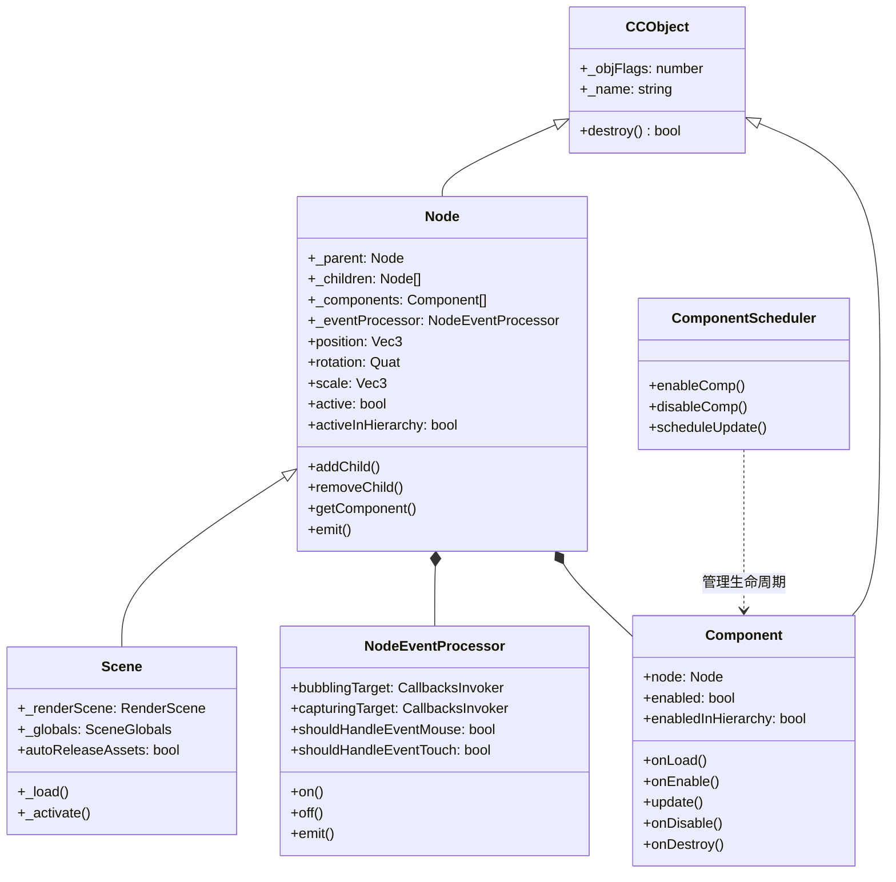
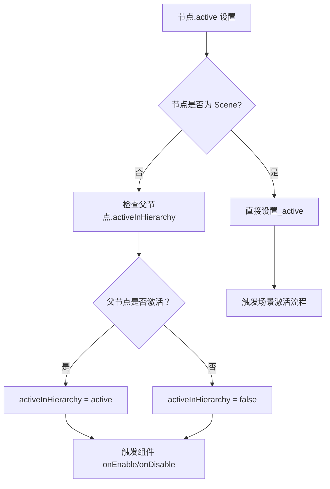
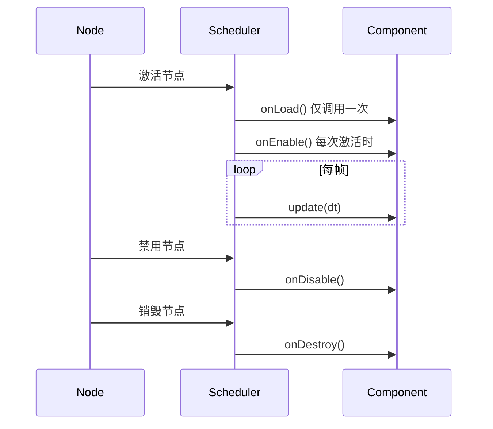
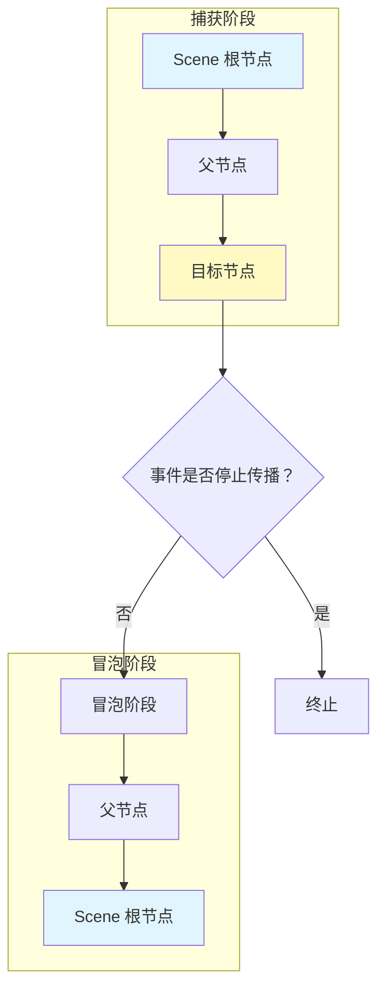

场景图与节点系统是 Cocos Creator 引擎的核心架构基础，它提供了游戏对象组织、层级管理、组件附加和事件传播的完整框架。本文档深入解析场景图的内部结构、节点生命周期管理以及组件系统的协作机制。

## 核心架构概览

场景图系统采用**树状层级结构**组织游戏中的所有对象，以 `Node` 为基本单元，`Scene` 为根节点，形成一个完整的运行时环境。系统由三大核心模块构成：节点管理、组件系统和事件处理器。



**设计原则**：
- **单一职责**：Node 负责层级和变换，Component 负责功能逻辑，EventProcessor 负责事件分发
- **组合优于继承**：通过组件系统扩展节点功能，而非深度继承链
- **惰性初始化**：事件处理器、UI 属性等按需创建，优化内存使用

Sources: [node.ts](cocos/scene-graph/node.ts#L100-L150), [scene.ts](cocos/scene-graph/scene.ts#L40-L80), [component.ts](cocos/scene-graph/component.ts#L50-L100)

## 节点层级管理

### 父子关系与场景树

`Node` 通过 `_parent` 和 `_children` 维护树状结构。每个节点最多有一个父节点，但可以有多个子节点。`Scene` 作为特殊的根节点，继承自 `Node` 但不允许直接添加组件。

```typescript
// 层级操作示例
parent.addChild(childNode);        // 添加子节点
childNode.parent = null;           // 移除子节点
const index = parent.getChildIndex(childNode);
```

**关键特性**：

| 特性 | 说明 | 实现位置 |
|------|------|----------|
| 层级遍历 | `walk()` 方法支持深度优先遍历 | [node.ts#L720-L740](cocos/scene-graph/node.ts#L720-L740) |
| 路径查找 | `getChildByPath()` 通过 `/` 分隔符查找子节点 | [node.ts#L680-L700](cocos/scene-graph/node.ts#L680-L700) |
| 全局查找 | `find()` 函数从场景根节点开始搜索 | [find.ts](cocos/scene-graph/find.ts#L35-L55) |
| 兄弟索引 | `_siblingIndex` 维护子节点顺序 | [node.ts#L280-L300](cocos/scene-graph/node.ts#L280-L300) |

### 节点激活状态

节点有两个激活状态：`_active`（自身状态）和 `_activeInHierarchy`（层级中的有效状态）。只有当节点自身激活且所有父节点都激活时，`activeInHierarchy` 才为 `true`。



**状态变更传播**：
- 当父节点激活状态改变时，递归更新所有子节点的 `activeInHierarchy`
- 组件的 `enabledInHierarchy` 随之更新，触发 `onEnable()`/`onDisable()` 回调
- 通过 `NodeActivator` 批量处理激活操作，优化性能

Sources: [node.ts](cocos/scene-graph/node.ts#L350-L400), [node-activator.ts](cocos/scene-graph/node-activator.ts#L50-L120)

## 空间变换系统

### 本地与全局变换

每个节点维护三套变换数据：**位置**（position）、**旋转**（rotation）、**缩放**（scale）。系统区分本地变换（相对于父节点）和全局变换（世界空间）。

```typescript
// 变换属性
node.position = new Vec3(10, 0, 0);  // 本地坐标
node.worldPosition = new Vec3(10, 0, 0);  // 世界坐标（getter/setter）

// 变换矩阵
node.matrix;        // 本地矩阵
node.worldMatrix;   // 世界矩阵（惰性计算）
```

**变换更新机制**：

| 变换类型 | 触发条件 | 更新范围 |
|---------|---------|---------|
| 本地变换 | 修改 position/rotation/scale | 仅当前节点 |
| 全局变换 | 子节点访问 worldMatrix | 当前节点及所有子节点 |
| 脏标记 | `TransformBit` 标记具体变更部分 | 惰性更新 |

### 变换脏标记系统

`TransformBit` 枚举用于精确追踪变换变更的部分，避免不必要的矩阵重计算：

```typescript
enum TransformBit {
    POSITION = 1 << 0,
    ROTATION = 1 << 1,
    SCALE = 1 << 2,
    // 组合标记
    TRS = POSITION | ROTATION | SCALE
}
```

当节点变换改变时，设置相应的脏标记，子节点在访问世界矩阵时检查父节点的脏标记并级联更新。这种**惰性更新策略**显著减少了每帧的矩阵运算量。

Sources: [node.ts](cocos/scene-graph/node.ts#L1800-L1950), [node-enum.ts](cocos/scene-graph/node-enum.ts#L40-L60)

## 组件系统架构

### 组件生命周期

组件通过 `Component` 基类定义标准化的生命周期方法，由 `ComponentScheduler` 统一管理：



**执行顺序控制**：
- 组件可通过 `@executionOrder` 装饰器指定优先级
- 负值优先执行，正值延后执行，0 为默认
- 同一优先级的组件按添加顺序执行

### 组件查找与操作

`Node` 提供多种组件查找方法，支持类型安全和字符串查询：

| 方法 | 作用域 | 返回值 | 示例 |
|------|-------|--------|------|
| `getComponent()` | 当前节点 | 单个组件或 null | `node.getComponent(Sprite)` |
| `getComponents()` | 当前节点 | 组件数组 | `node.getComponents('Script')` |
| `getComponentInChildren()` | 子节点树（DFS） | 第一个匹配项 | `node.getComponentInChildren(BoxCollider)` |
| `getComponentsInChildren()` | 子节点树 | 所有匹配项 | `node.getComponentsInChildren(Renderer)` |

Sources: [component.ts](cocos/scene-graph/component.ts#L120-L180), [component-scheduler.ts](cocos/scene-graph/component-scheduler.ts#L100-L180), [node.ts](cocos/scene-graph/node.ts#L850-L950)

## 事件系统

### 事件处理器架构

`NodeEventProcessor` 负责管理节点的事件注册和分发，支持**捕获阶段**和**冒泡阶段**两种事件传播模式：

```typescript
// 事件注册
node.on(NodeEventType.TOUCH_START, callback, this);  // 冒泡
node.on(NodeEventType.TOUCH_START, callback, this, true);  // 捕获

// 事件分发
node.emit(NodeEventType.TRANSFORM_CHANGED, TransformBit.POSITION);
```

**事件类型分类**：

| 事件类别 | 事件枚举 | 传播方式 |
|---------|---------|---------|
| 节点事件 | `POSITION_CHANGED`, `ROTATION_CHANGED` | 不冒泡 |
| 层级事件 | `CHILD_ADDED`, `CHILD_REMOVED` | 不冒泡 |
| 输入事件 | `TOUCH_START`, `MOUSE_DOWN` | 冒泡 + 捕获 |
| 组件事件 | `COMPONENT_ADDED`, `COMPONENT_REMOVED` | 不冒泡 |

### 事件传播机制



**优化策略**：
- `shouldHandleEventMouse`/`shouldHandleEventTouch` 标记节点是否注册了相关事件
- 事件系统跳过未注册事件的节点，减少遍历开销
- 使用 `CallbacksInvoker` 池化技术复用事件回调数组

Sources: [node-event-processor.ts](cocos/scene-graph/node-event-processor.ts#L80-L150), [node-event.ts](cocos/scene-graph/node-event.ts#L20-L80)

## 层系统（Layers）

### 层掩码机制

`Layers` 类提供 32 位层掩码管理，其中 **0-19 位为用户自定义层**，**20-31 位为系统保留层**：

```typescript
// 内置层定义
Layers.Enum = {
    NONE: 0,
    IGNORE_RAYCAST: 1 << 20,    // 忽略射线检测
    GIZMOS: 1 << 21,            // 编辑器 Gizmo
    EDITOR: 1 << 22,            // 编辑器专用
    UI_3D: 1 << 23,             // 3D UI
    SCENE_GIZMO: 1 << 24,       // 场景 Gizmo
    UI_2D: 1 << 25,             // 2D UI
    DEFAULT: 1 << 30,           // 默认层
    ALL: 0xffffffff             // 所有层
}
```

### 层检测器

系统提供包含式和排除式两种层检测器创建方法：

| 方法 | 用途 | 示例 |
|------|------|------|
| `makeMaskInclude()` | 只接受指定层 | `Layers.makeMaskInclude([Layers.Enum.UI_2D])` |
| `makeMaskExclude()` | 排除指定层 | `Layers.makeMaskExclude([Layers.Enum.IGNORE_RAYCAST])` |

**应用场景**：
- **射线检测**：相机射线只检测特定层的对象
- **物理碰撞**：碰撞矩阵定义哪些层之间发生碰撞
- **渲染剔除**：相机只渲染指定层的节点

Sources: [layers.ts](cocos/scene-graph/layers.ts#L30-L100)

## Prefab 集成

### Prefab 实例结构

场景图系统与 Prefab 系统深度集成，通过 `PrefabInstance` 类维护预制体实例信息：

```typescript
class PrefabInstance {
    prefab: Prefab;              // 预制体资源引用
    root: Node;                  // 实例根节点
    mountedChildren: MountedChildrenInfo[];  // 挂载的子节点
    mountedComponents: MountedComponentsInfo[];  // 挂载的组件
    propertyOverrides: PropertyOverrideInfo[];  // 属性覆盖
}
```

**实例化流程**：

1. **深度克隆**：通过 `_instantiate()` 递归复制节点树
2. **组件初始化**：调用 `onLoad()` 初始化组件
3. **覆盖应用**：应用 `propertyOverrides` 中的属性覆盖
4. **挂载处理**：处理用户额外挂载的子节点和组件

Sources: [prefab-info.ts](cocos/scene-graph/prefab/prefab-info.ts#L140-L200), [node.ts](cocos/scene-graph/node.ts#L1420-L1460)

## 性能优化策略

### 惰性计算模式

场景图系统广泛采用惰性计算优化性能：

| 优化项 | 触发条件 | 实现方式 |
|-------|---------|---------|
| 世界矩阵 | 访问 `worldMatrix` 时 | 脏标记检查 + 级联更新 |
| 事件处理器 | 注册事件监听时 | `_eventProcessor` 延迟创建 |
| UI 属性 | 使用 UI 相关功能时 | `_uiProps` 延迟初始化 |
| 组件调度 | 节点激活时 | 生命周期方法批量调用 |

### 批量操作

- **节点激活**：`NodeActivator` 收集待激活节点，统一处理
- **组件调度**：按执行顺序排序后批量调用 `update()`
- **事件分发**：使用对象池复用事件参数数组

Sources: [node-activator.ts](cocos/scene-graph/node-activator.ts#L30-L80), [component-scheduler.ts](cocos/scene-graph/component-scheduler.ts#L180-L250)

## 最佳实践

### 节点操作建议

1. **缓存查找结果**：避免每帧调用 `find()` 或 `getComponent()`
   ```typescript
   // 推荐：启动时缓存
   start() {
       this.targetNode = this.node.find('Child/Target');
   }
   update() {
       // 直接使用缓存结果
   }
   ```

2. **合理使用层级**：避免过深的嵌套（建议不超过 10 层）
3. **批量添加子节点**：一次性添加多个子节点减少重排序

### 组件使用建议

1. **执行顺序**：依赖其他组件时使用 `@executionOrder` 明确顺序
2. **生命周期**：避免在 `onLoad()` 中访问其他组件（可能未初始化）
3. **内存管理**：在 `onDestroy()` 中清理定时器和事件监听

### 事件系统建议

1. **及时注销**：组件销毁前调用 `off()` 移除事件监听
2. **使用层过滤**：射线检测时指定层掩码减少检测对象
3. **避免频繁 emit**：高频事件考虑使用状态标记替代

## 相关文档

- 深入理解组件生命周期：[组件系统](6-zu-jian-xi-tong)
- 场景切换与资源管理：[引擎架构设计](4-yin-qing-jia-gou-she-ji)
- 2D 节点渲染机制：[2D 渲染与精灵](7-2d-xuan-ran-yu-jing-ling)
- UI 节点特殊处理：[UI 系统](8-ui-xi-tong)