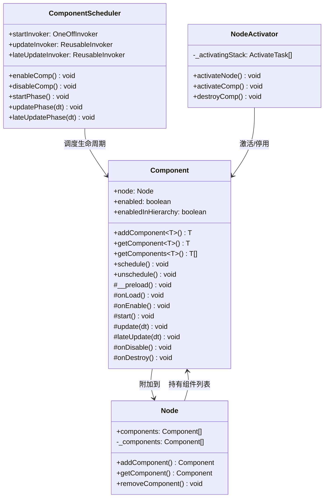
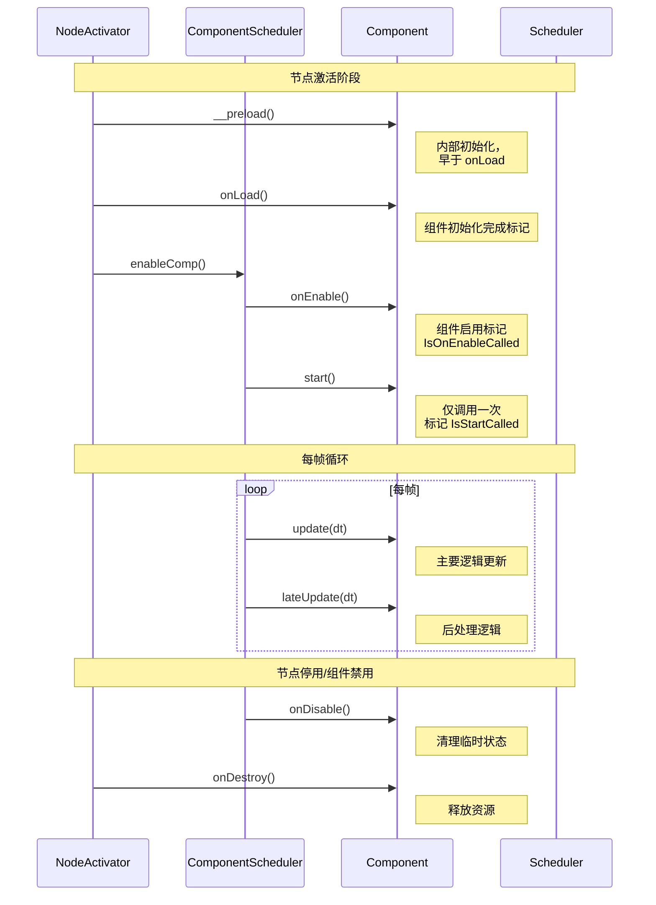
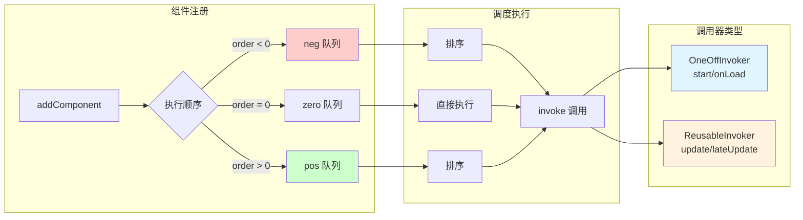
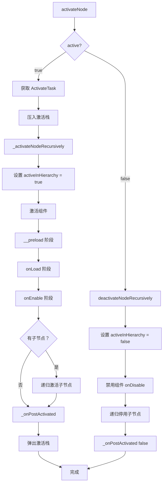
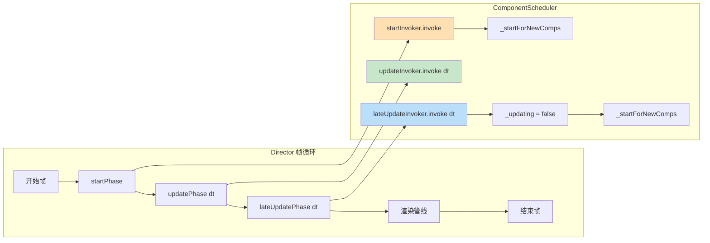

组件系统是 Cocos Creator 引擎的核心架构之一，它基于**实体 - 组件模式（Entity-Component Pattern）**构建，为游戏开发提供了模块化、可复用的功能单元。每个组件都附加到场景图的节点上，通过生命周期方法与引擎深度集成，实现从初始化、更新到销毁的完整管理。

本页面深入解析组件系统的架构设计、生命周期调度机制、执行顺序控制以及与场景图的协同工作原理。

## 组件架构设计

Cocos Creator 的组件系统采用**三层架构**：组件基类提供生命周期接口，调度器管理执行时序，激活器处理状态切换。这种设计确保了组件行为的可预测性和高性能执行。



**组件基类** `Component` 定义了所有组件的公共接口和生命周期方法 [`component.ts#L57-L727`](cocos/scene-graph/component.ts#L57-L727)。每个组件必须附加到一个 [`Node`](cocos/scene-graph/node.ts#L111-L3014)，通过 `node` 属性访问其所属节点。组件的启用状态由 `enabled` 属性控制，但实际是否参与更新还取决于 `enabledInHierarchy` —— 只有当组件启用且所在节点在场景树中激活时，组件才会被调度执行。

**调度器** `ComponentScheduler` 负责管理组件的生命周期调用时序 [`component-scheduler.ts#L351-L551`](cocos/scene-graph/component-scheduler.ts#L351-L551)。它使用三种调用器（Invoker）分别处理 `start`、`update` 和 `lateUpdate` 阶段，确保组件按正确的顺序执行。

**激活器** `NodeActivator` 处理节点和组件的激活/停用逻辑 [`node-activator.ts#L135-L423`](cocos/scene-graph/node-activator.ts#L135-L423)。它维护一个激活任务栈，支持递归激活场景树中的节点和组件，并在激活过程中处理组件依赖关系。

Sources: [component.ts](cocos/scene-graph/component.ts#L57-L727) [component-scheduler.ts](cocos/scene-graph/component-scheduler.ts#L351-L551) [node-activator.ts](cocos/scene-graph/node-activator.ts#L135-L423) [node.ts](cocos/scene-graph/node.ts#L111-L3014)

## 生命周期流程

组件的生命周期是一个严格的状态机，每个阶段都有明确的触发条件和执行时机。理解这个流程对于正确实现组件逻辑至关重要。



生命周期方法的执行顺序遵循以下规则：

| 阶段 | 方法 | 调用时机 | 调用次数 | 标志位 |
|------|------|----------|----------|--------|
| 预加载 | `__preload` | 组件激活时，`onLoad` 之前 | 一次 | `IsPreloadStarted` |
| 加载 | `onLoad` | `__preload` 之后，`start` 之前 | 一次 | `IsOnLoadCalled` |
| 启用 | `onEnable` | 组件启用且节点激活时 | 多次 | `IsOnEnableCalled` |
| 启动 | `start` | 第一次更新前，所有 `onLoad` 完成后 | 一次 | `IsStartCalled` |
| 更新 | `update` | 每帧，`start` 之后 | 多次 | - |
| 后更新 | `lateUpdate` | 每帧，`update` 之后 | 多次 | - |
| 禁用 | `onDisable` | 组件禁用或节点停用时 | 多次 | - |
| 销毁 | `onDestroy` | 组件销毁时 | 一次 | - |

**`__preload`** 用于内部初始化，通常由引擎内置组件使用，用户代码应避免依赖此方法 [`component.ts#L556-L573`](cocos/scene-graph/component.ts#L556-L573)。**`onLoad`** 总是会在任何 `start` 方法之前执行，这允许你安排脚本的初始化顺序 [`component.ts#L576-L592`](cocos/scene-graph/component.ts#L576-L592)。**`start`** 在所有组件的 `onLoad` 调用完毕后执行，适合处理需要跨组件初始化的逻辑 [`component.ts#L595-L611`](cocos/scene-graph/component.ts#L595-L611)。

**`onEnable`** 和 **`onDisable`** 可能在组件生命周期中被多次调用，适合处理临时状态的设置和清理 [`component.ts#L614-L643`](cocos/scene-graph/component.ts#L614-L643)。**`update`** 和 **`lateUpdate`** 每帧调用，传入参数 `dt` 表示上一帧耗时（秒）[`component.ts#L522-L553`](cocos/scene-graph/component.ts#L522-L553)。

Sources: [component.ts](cocos/scene-graph/component.ts#L522-L727) [node-activator.ts](cocos/scene-graph/node-activator.ts#L195-L233)

## 组件调度机制

组件调度器的核心设计是**分优先级队列**，通过 `_executionOrder` 静态属性控制组件的执行顺序。这种机制确保了关键组件（如物理系统）可以在普通组件之前执行。



调度器使用三种队列管理组件：

- **neg 队列**：存储 `_executionOrder < 0` 的组件，优先执行
- **zero 队列**：存储 `_executionOrder = 0` 的组件，默认优先级
- **pos 队列**：存储 `_executionOrder > 0` 的组件，延后执行

**OneOffInvoker** 用于一次性生命周期方法（`__preload`、`onLoad`、`onEnable`、`start`）[`component-scheduler.ts#L137-L172`](cocos/scene-graph/component-scheduler.ts#L137-L172)。它在每次调用后清空队列，确保这些方法只执行一次。**ReusableInvoker** 用于每帧调用的方法（`update`、`lateUpdate`）[`component-scheduler.ts#L175-L219`](cocos/scene-graph/component-scheduler.ts#L175-L219)。它在组件注册时保持队列有序，每次执行时不修改队列结构。

执行顺序通过二分查找插入位置来维护 [`component-scheduler.ts#L43-L69`](cocos/scene-graph/component-scheduler.ts#L43-L69)。当组件的 `_executionOrder` 相同时，按组件的 `_id` 排序，确保确定性行为。

```typescript
// 组件执行顺序示例
@ccclass('PlayerController')
class PlayerController extends Component {
    static _executionOrder = -100  // 优先执行，处理输入
}

@ccclass('PhysicsSystem')
class PhysicsSystem extends Component {
    static _executionOrder = -50   // 次优先，物理更新
}

@ccclass('GameLogic')
class GameLogic extends Component {
    static _executionOrder = 0     // 默认顺序
}

@ccclass('UIRenderer')
class UIRenderer extends Component {
    static _executionOrder = 100   // 最后执行，渲染 UI
}
```

Sources: [component-scheduler.ts](cocos/scene-graph/component-scheduler.ts#L43-L219)

## 组件激活与停用

节点激活是一个递归过程，涉及场景树中所有子节点和组件的状态切换。`NodeActivator` 使用**任务栈**管理这个过程，确保在复杂场景下的正确性。



激活流程的关键特性：

1. **递归激活**：从根节点开始，深度优先遍历场景树，依次激活每个节点和组件 [`node-activator.ts#L249-L286`](cocos/scene-graph/node-activator.ts#L249-L286)
2. **阶段分离**：`__preload`、`onLoad`、`onEnable` 分三个阶段执行，每个阶段完成后才进入下一阶段 [`node-activator.ts#L164-L167`](cocos/scene-graph/node-activator.ts#L164-L167)
3. **激活栈保护**：使用 `_activatingStack` 防止在激活过程中重复激活同一节点 [`node-activator.ts#L148-L183`](cocos/scene-graph/node-activator.ts#L148-L183)
4. **延迟清理**：停用时从激活栈中移除子节点，避免重复操作 [`node-activator.ts#L177-L182`](cocos/scene-graph/node-activator.ts#L177-L182)

停用流程同样递归执行，但顺序相反：先禁用组件的 `onDisable`，再递归停用子节点，最后触发 `activeInHierarchy` 变更事件 [`node-activator.ts#L288-L327`](cocos/scene-graph/node-activator.ts#L288-L327)。

**关键保护机制**：在激活过程中，如果节点被标记为 `Deactivating`，则禁止重新激活，防止死循环 [`node-activator.ts#L250-L259`](cocos/scene-graph/node-activator.ts#L250-L259)。这确保了状态切换的原子性。

Sources: [node-activator.ts](cocos/scene-graph/node-activator.ts#L148-L327)

## 组件操作 API

`Node` 类提供了完整的组件管理 API，支持通过构造函数或类名操作组件。这些 API 是开发者与组件系统交互的主要接口。

### 组件查询方法

| 方法 | 返回值 | 搜索范围 | 示例 |
|------|--------|----------|------|
| `getComponent` | `T \| null` | 当前节点 | `node.getComponent(Sprite)` |
| `getComponents` | `T[]` | 当前节点 | `node.getComponents(Collider)` |
| `getComponentInChildren` | `T \| null` | 递归子节点（深度优先） | `node.getComponentInChildren(AudioSource)` |
| `getComponentsInChildren` | `T[]` | 递归子节点（深度优先） | `node.getComponentsInChildren(MeshRenderer)` |

所有查询方法支持两种参数形式：

```typescript
// 使用构造函数（推荐，类型安全）
import { Sprite } from 'cc';
const sprite = node.getComponent(Sprite);

// 使用类名（字符串）
const sprite = node.getComponent('Sprite');
```

### 组件添加与删除

**`addComponent`** 方法执行完整的组件初始化流程 [`node.ts#L1062-L1144`](cocos/scene-graph/node.ts#L1062-L1144)：

1. 验证组件类是否有效且继承自 `Component`
2. 检查 `_requireComponent` 依赖，自动添加缺失的依赖组件
3. 创建组件实例并设置 `node` 引用
4. 如果节点已激活，立即激活组件的生命周期
5. 在编辑器模式下调用 `resetInEditor`

```typescript
// 添加组件
const rigidbody = node.addComponent(Rigidbody);

// 自动添加依赖组件（如果 BoxCollider 要求 Rigidbody）
const collider = node.addComponent(BoxCollider);
```

**`removeComponent`** 实际上调用 `component.destroy()` [`node.ts#L1183-L1199`](cocos/scene-graph/node.ts#L1183-L1199)。组件不会立即从节点移除，而是在当前帧结束后的销毁阶段执行。这种延迟销毁模式确保了生命周期方法的完整性。

```typescript
// 推荐方式：直接销毁组件
const component = node.getComponent(MyComponent);
component?.destroy();

// 等价方式
node.removeComponent(MyComponent);
```

### 组件依赖声明

通过静态属性 `_requireComponent` 声明组件依赖 [`component.ts#L750-L761`](cocos/scene-graph/component.ts#L750-L761)：

```typescript
@ccclass('BoxCollider')
class BoxCollider extends Component {
    static _requireComponent = Rigidbody;  // 自动添加 Rigidbody
}
```

当添加 `BoxCollider` 时，如果节点上没有 `Rigidbody` 组件，引擎会自动添加。

Sources: [node.ts](cocos/scene-graph/node.ts#L859-L1199) [component.ts](cocos/scene-graph/component.ts#L69-L70) [component.ts](cocos/scene-graph/component.ts#L750-L761)

## 调度器集成

组件系统通过 `legacyCC.director` 与全局调度器集成，实现帧循环中的生命周期调用。`Director` 在每帧中按固定顺序调用三个阶段。



**`startPhase`** 在每帧开始时执行，调用所有待执行的 `start` 方法 [`component-scheduler.ts#L473-L496`](cocos/scene-graph/component-scheduler.ts#L473-L496)。它会处理在 `start` 执行期间新激活的组件，确保它们在当前帧内完成 `start` 调用。

**`updatePhase`** 调用所有组件的 `update` 方法，传入帧时间 `dt` [`component-scheduler.ts#L503-L505`](cocos/scene-graph/component-scheduler.ts#L503-L505)。这是组件执行主要逻辑的阶段。

**`lateUpdatePhase`** 在所有 `update` 完成后执行 [`component-scheduler.ts#L512-L521`](cocos/scene-graph/component-scheduler.ts#L512-L521)。适合处理后处理逻辑，如摄像机跟随、UI 更新等。执行完成后将 `_updating` 标志设为 `false`，并处理在 `update`/`lateUpdate` 期间新激活的组件。

**延迟调度机制**：当在生命周期方法中激活新组件时，如果 `_updating` 为 `true`，组件会被加入 `_deferredComps` 队列 [`component-scheduler.ts#L397-L401`](cocos/scene-graph/component-scheduler.ts#L397-L401)。在 `startPhase` 或 `lateUpdatePhase` 结束时，这些组件会被立即调度，确保它们不会错过当前帧的执行。

Sources: [component-scheduler.ts](cocos/scene-graph/component-scheduler.ts#L351-L551)

## 编辑器特性

组件系统在编辑器模式下提供了额外的功能和保护机制，这些特性在生产构建中会被剥离。

### 编辑器专用生命周期

| 方法 | 调用时机 | 用途 |
|------|----------|------|
| `resetInEditor` | 组件首次添加或点击 Reset 菜单 | 初始化默认值 |
| `onFocusInEditor` | 节点在编辑器中获得焦点 | 高亮、Gizmo 显示 |
| `onLostFocusInEditor` | 节点在编辑器中失去焦点 | 清理高亮 |
| `onRestore` | 执行 Undo/Redo 或 Reset 后 | 恢复内部状态 |

**`resetInEditor`** 在编辑器下当组件首次添加到节点或用户点击 Inspector 的 Reset 菜单时调用 [`component.ts#L666-L670`](cocos/scene-graph/component.ts#L666-L670)。适合将组件属性重置为默认值。

**`onRestore`** 用于处理复杂的撤销/重做场景 [`component.ts#L688-L726`](cocos/scene-graph/component.ts#L688-L726)。当组件包含"内部状态"（不在 `@property` 中定义的临时变量）时，需要手动同步这些状态与公开属性。

### 编辑器执行模式

通过 `_executeInEditMode` 静态属性控制组件是否在编辑器中执行 [`component.ts#L732-L779`](cocos/scene-graph/component.ts#L732-L779)：

```typescript
@ccclass('EditorComponent')
class EditorComponent extends Component {
    static _executeInEditMode = true;  // 在编辑器中执行生命周期
    
    static _playOnFocus = true;  // 仅在节点获得焦点时执行
}
```

`_playOnFocus` 需要与 `_executeInEditMode` 同时使用，确保组件仅在编辑器中选中该节点时执行，避免性能浪费。

### 组件菜单与图标

通过装饰器配置组件在编辑器中的显示：

```typescript
@ccclass('CustomComponent')
@menu('Custom/My Component')  // 菜单路径
@icon('icon://path/to/icon.png')  // 组件图标
@help('https://docs.example.com/component')  // 帮助文档链接
class CustomComponent extends Component {
    // ...
}
```

Sources: [component.ts](cocos/scene-graph/component.ts#L666-L779)

## 最佳实践

基于组件系统的架构特性，以下实践可以确保代码的可维护性和性能。

### 生命周期方法使用指南

```typescript
class BestPracticeComponent extends Component {
    // __preload: 避免使用，除非是引擎内置组件
    
    onLoad() {
        // ✓ 初始化引用、缓存组件
        this.sprite = this.getComponent(Sprite);
        this.audioSource = this.getComponent(AudioSource);
        
        // ✓ 注册一次性事件监听
        this.node.on(NodeEventType.TOUCH_START, this.onTouchStart, this);
    }

    onEnable() {
        // ✓ 注册临时事件、启动协程、恢复状态
        this.systemEvent.on(SystemEventType.KEY_DOWN, this.onKeyDown, this);
    }

    start() {
        // ✓ 依赖其他组件初始化的逻辑
        // ✓ 开始动画、播放音乐
        this.animation.play('idle');
    }

    update(dt: number) {
        // ✓ 每帧逻辑：移动、输入处理、状态机更新
        this.updateMovement(dt);
        
        // ✗ 避免：创建对象、复杂计算、频繁查找组件
    }

    lateUpdate(dt: number) {
        // ✓ 摄像机跟随、UI 更新、后处理
        this.cameraFollow();
    }

    onDisable() {
        // ✓ 取消事件监听、暂停协程、保存临时状态
        this.systemEvent.off(SystemEventType.KEY_DOWN, this.onKeyDown, this);
    }

    onDestroy() {
        // ✓ 释放资源、取消所有事件、清理引用
        this.node.off(NodeEventType.TOUCH_START, this.onTouchStart, this);
        this.texture?.destroy();
    }
}
```

### 性能优化建议

1. **缓存组件引用**：避免在 `update` 中调用 `getComponent`，在 `onLoad` 中缓存

2. **使用执行顺序**：为关键组件设置 `_executionOrder`，减少帧内依赖问题

3. **条件更新**：在 `update` 开始时检查 `this.enabledInHierarchy`，提前返回

4. **批量操作**：使用 `getComponents` 代替多次 `getComponent` 调用

### 常见陷阱

| 问题 | 原因 | 解决方案 |
|------|------|----------|
| `onLoad` 中访问其他组件为 `null` | 其他组件尚未初始化 | 在 `start` 中访问跨组件引用 |
| `update` 中频繁调用 `getComponent` | 性能开销大 | 在 `onLoad` 中缓存引用 |
| `onDestroy` 中未清理事件 | 内存泄漏 | 确保所有 `on` 都有对应的 `off` |
| 在 `onEnable` 中修改 `enabled` | 无限循环 | 使用标志位避免重复触发 |

## 相关页面

- 深入理解组件与节点的关系：[场景图与节点系统](5-chang-jing-tu-yu-jie-dian-xi-tong)
- 了解引擎整体架构：[引擎架构设计](4-yin-qing-jia-gou-she-ji)
- UI 组件的具体实现：[UI 系统](8-ui-xi-tong)
- 物理组件的使用：[2D 物理](9-2d-wu-li) / [3D 物理系统](12-3d-wu-li-xi-tong)