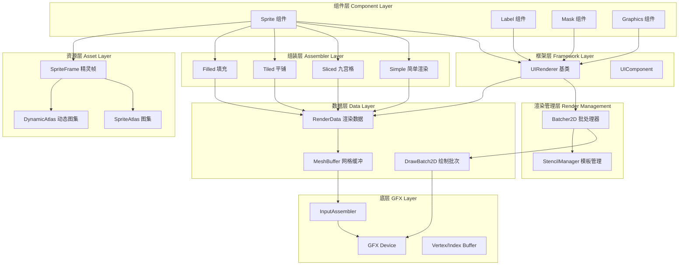
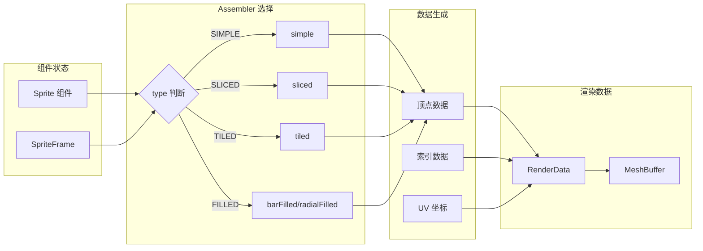
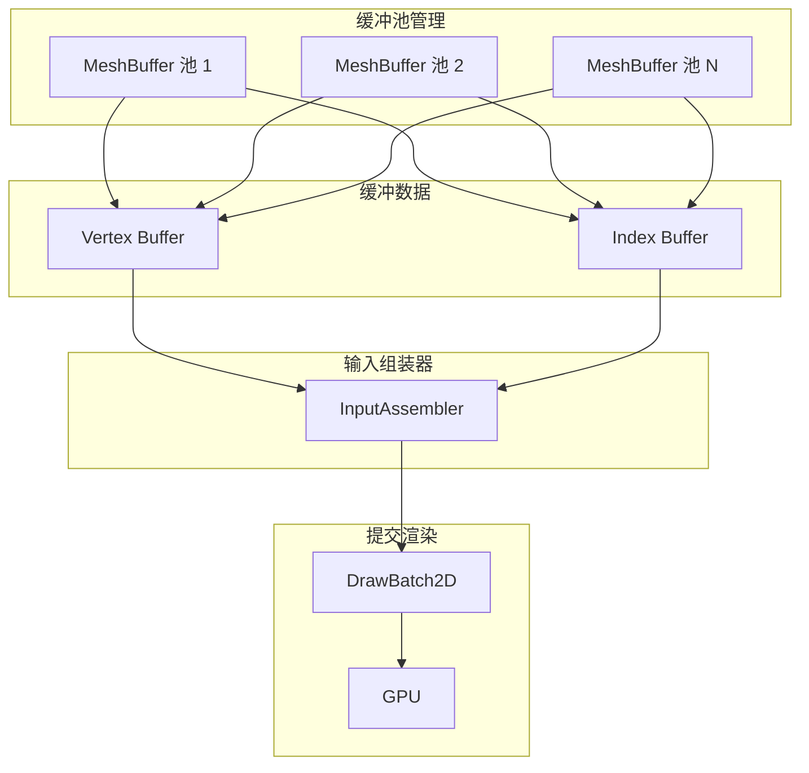
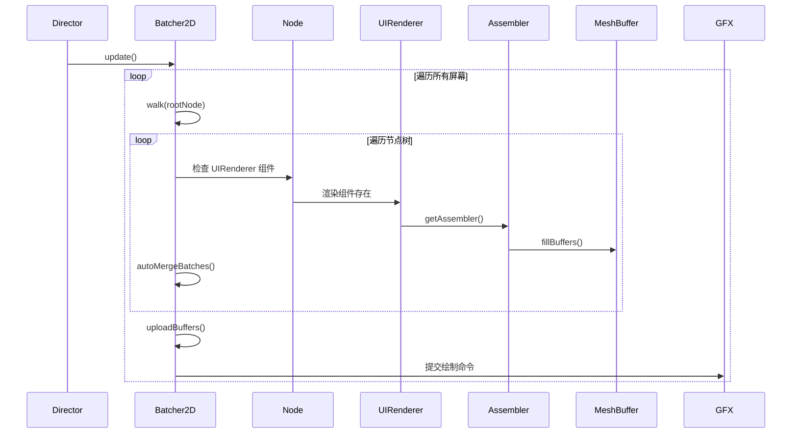
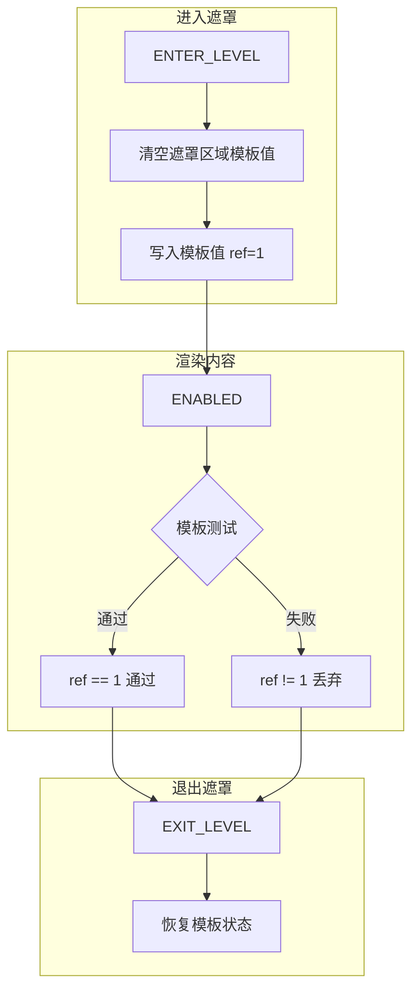
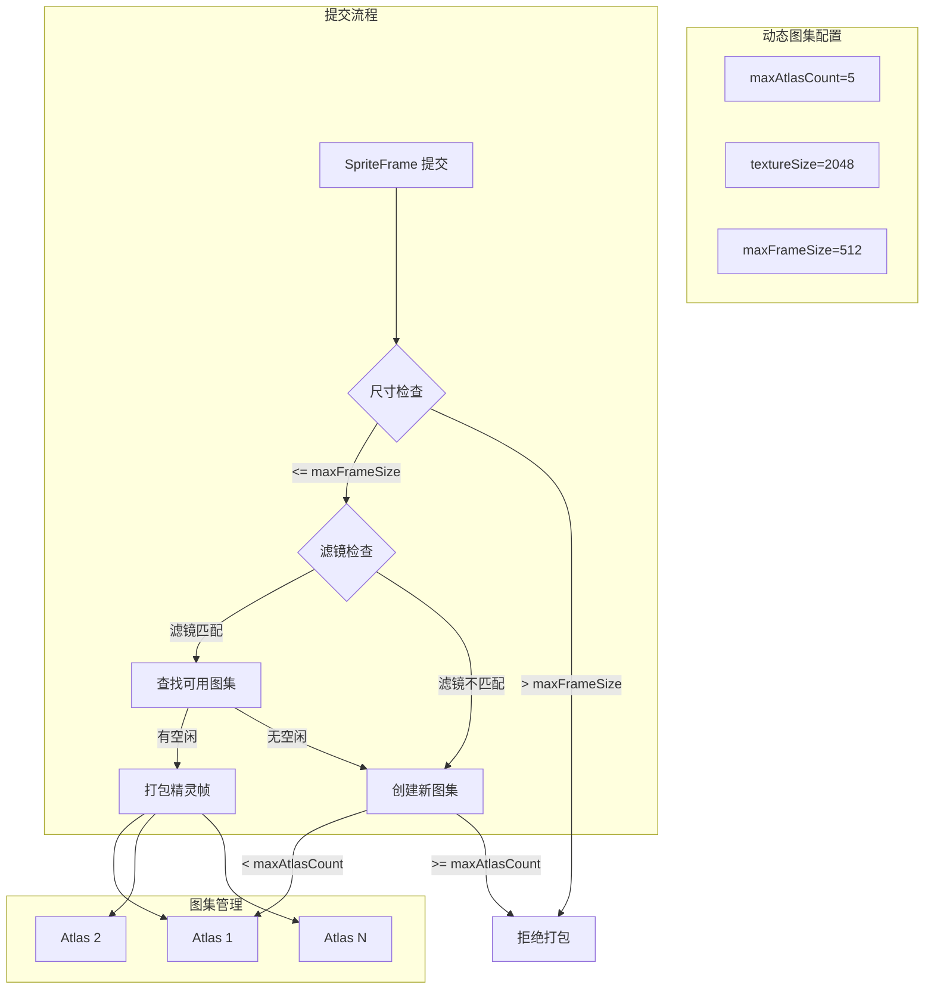

2D 渲染与精灵系统是 Cocos Creator 引擎中处理所有 2D 图形渲染的核心模块，负责将精灵、标签、图形等 2D 元素高效地渲染到屏幕上。该模块采用基于组件的架构设计，通过 **渲染数据生成** → **批处理合并** → **GPU 提交** 的流水线，实现高性能的 2D 渲染。

## 核心架构设计

2D 渲染系统采用分层架构，从上层组件到底层 GFX 设备抽象，形成完整的渲染链路：



**架构设计原则**：

1. **组件化设计**：所有 2D 渲染对象都是组件，继承自 `UIRenderer` 基类，统一渲染接口
2. **数据驱动**：渲染数据（RenderData）与组件分离，支持动态更新和复用
3. **批处理优化**：通过 `Batcher2D` 自动合并相同材质和贴图的绘制调用，减少 Draw Call
4. **组装器模式**：不同渲染类型（简单、九宫格、平铺、填充）使用独立的 Assembler 处理顶点数据生成
5. **动态图集**：运行时自动合并小尺寸精灵帧到动态图集，提升渲染效率

Sources: [batcher-2d.ts](cocos/2d/renderer/batcher-2d.ts#L1-L150), [ui-renderer.ts](cocos/2d/framework/ui-renderer.ts#L1-L100), [base.ts](cocos/2d/renderer/base.ts#L1-L54)

## Sprite 组件系统

`Sprite` 组件是 2D 渲染系统中最核心的组件，负责显示精灵图像。它支持多种渲染类型，每种类型都有专门的 Assembler 处理顶点数据生成。

### Sprite 渲染类型

```typescript
export enum SpriteType {
    SIMPLE = 0,    // 普通类型：直接拉伸渲染
    SLICED = 1,    // 切片（九宫格）类型：保持边框不变形
    TILED = 2,     // 平铺类型：重复平铺填充
    FILLED = 3,    // 填充类型：支持进度条效果
}
```

**渲染类型对比**：

| 类型 | 顶点数 | 适用场景 | 特性 |
|------|--------|----------|------|
| **SIMPLE** | 4 顶点 | 普通图片显示 | 简单拉伸，性能最优 |
| **SLICED** | 16 顶点 | UI 按钮、面板 | 九宫格拉伸，边框不变形 |
| **TILED** | 动态顶点 | 背景平铺、重复纹理 | 按 UV 重复平铺 |
| **FILLED** | 动态顶点 | 进度条、冷却效果 | 支持水平/垂直/径向填充 |

Sources: [sprite.ts](cocos/2d/components/sprite.ts#L47-L85), [sprite.ts](cocos/2d/components/sprite.ts#L234-L245)

### 填充类型详解

当 `type` 设置为 `FILLED` 时，可使用以下填充模式：

```typescript
enum FillType {
    HORIZONTAL = 0,  // 水平方向填充
    VERTICAL = 1,    // 垂直方向填充
    RADIAL = 2,      // 径向填充
}
```

**填充参数**：
- `fillCenter`：填充中心点（仅径向填充有效）
- `fillStart`：填充起始位置（0-1）
- `fillRange`：填充范围（-1 到 1）

Sources: [sprite.ts](cocos/2d/components/sprite.ts#L92-L110), [sprite.ts](cocos/2d/components/sprite.ts#L260-L350)

### Assembler 组装器机制

Assembler 是 2D 渲染的核心数据处理模块，负责将组件的渲染信息转换为 GPU 可识别的顶点数据。



**Assembler 接口**：
```typescript
interface IAssembler {
    createData?(comp: UIRenderer): BaseRenderData;      // 创建渲染数据
    fillBuffers?(comp: UIRenderer, renderer: IBatcher): void;  // 填充缓冲数据
    updateUVs?(comp: UIRenderer): void;                 // 更新 UV 坐标
    updateColor?(comp: UIRenderer): void;               // 更新颜色
    updateRenderData?(comp: UIRenderer): void;          // 更新渲染数据
}
```

Sources: [base.ts](cocos/2d/renderer/base.ts#L33-L45), [sprite/index.ts](cocos/2d/assembler/sprite/index.ts#L1-L65)

## 渲染数据与缓冲管理

### RenderData 数据结构

`RenderData` 是 2D 渲染的核心数据载体，存储顶点、索引、UV 等渲染所需的全部信息。

```typescript
class BaseRenderData {
    vertexCount: number;      // 顶点数量
    indexCount: number;       // 索引数量
    stride: number;           // 顶点步长（字节）
    floatStride: number;      // 顶点步长（float）
    vertexFormat: Attribute[]; // 顶点格式
}
```

**数据层级**：
- `BaseRenderData`：基础渲染数据，定义顶点格式和数量
- `MeshRenderData`：网格渲染数据，管理顶点和索引缓冲
- `RenderData`：完整渲染数据，包含材质和纹理引用

Sources: [render-data.ts](cocos/2d/renderer/render-data.ts#L1-L80)

### 顶点格式定义

2D 渲染使用标准化的顶点格式，确保不同组件间的数据兼容性：

```typescript
// 标准 2D 顶点格式：位置 + UV + 颜色
export const vfmtPosUvColor = [
    new Attribute(ATTR_POSITION, Format.RGB32F),   // 3D 位置 (x, y, z)
    new Attribute(ATTR_TEX_COORD, Format.RG32F),   // 2D UV (u, v)
    new Attribute(ATTR_COLOR, Format.RGBA32F),     // 4D 颜色 (r, g, b, a)
];
```

**顶点布局**（32 字节/顶点）：
| 属性 | 格式 | 字节偏移 | 说明 |
|------|------|----------|------|
| POSITION | RGB32F | 0-11 | 三维位置坐标 |
| TEX_COORD | RG32F | 12-19 | UV 纹理坐标 |
| COLOR | RGBA32F | 20-31 | RGBA 颜色值 |

Sources: [vertex-format.ts](cocos/2d/renderer/vertex-format.ts#L1-L80)

### MeshBuffer 缓冲管理

`MeshBuffer` 管理 GPU 顶点缓冲和索引缓冲，采用动态分配策略：



**缓冲管理策略**：
1. **动态扩容**：当缓冲空间不足时自动创建新的 MeshBuffer
2. **批次合并**：相同材质和纹理的渲染数据合并到同一批次
3. **缓冲复用**：每帧重置缓冲偏移量，复用已分配的内存

Sources: [mesh-buffer.ts](cocos/2d/renderer/mesh-buffer.ts#L1-L120), [draw-batch.ts](cocos/2d/renderer/draw-batch.ts#L1-L100)

## Batcher2D 批处理系统

`Batcher2D` 是 2D 渲染的核心调度器，负责遍历场景树、收集渲染数据、合并批次并提交给 GFX 设备。

### 批处理流程



### 批处理合并规则

Batcher2D 根据以下条件判断是否可以合并批次：

1. **材质相同**：使用相同的 Material 实例
2. **纹理相同**：使用相同的 Texture 或 SpriteFrame
3. **模板状态相同**：Stencil 状态一致（用于 Mask 遮罩）
4. **混合模式相同**：Blend State 一致
5. **层级可见性相同**：Layer 可见性掩码一致

**批次中断场景**：
- 材质切换
- 纹理切换
- Mask 遮罩进入/退出
- 混合模式变更
- 自定义渲染数据

Sources: [batcher-2d.ts](cocos/2d/renderer/batcher-2d.ts#L200-L350), [i-batcher.ts](cocos/2d/renderer/i-batcher.ts#L1-L87)

### 透明度继承机制

2D 渲染系统支持透明度继承，父节点的透明度会自动传递给子节点：

```typescript
// Batcher2D 内部维护透明度栈
private _pOpacity = 1;           // 当前累积透明度
private _opacityDirty = 0;       // 透明度脏标记

// 遍历节点时更新透明度
walk(node: Node) {
    const opacity = node._opacity;
    const parentOpacity = this._pOpacity;
    const finalOpacity = parentOpacity * (opacity / 255);
    
    // 递归遍历子节点
    for (const child of node.children) {
        this.walk(child);
    }
}
```

Sources: [batcher-2d.ts](cocos/2d/renderer/batcher-2d.ts#L1-L150)

## 模板测试与遮罩系统

Mask 组件使用模板测试（Stencil Test）实现遮罩效果，通过 `StencilManager` 管理模板缓冲状态。

### 模板状态机

```typescript
enum Stage {
    DISABLED = 0,         // 模板测试禁用
    CLEAR = 1,            // 清空模板缓冲
    ENTER_LEVEL = 2,      // 进入遮罩层级
    ENABLED = 3,          // 遮罩生效中
    EXIT_LEVEL = 4,       // 退出遮罩层级
    CLEAR_INVERTED = 5,   // 清空模板缓冲（反向）
    ENTER_LEVEL_INVERTED = 6, // 进入遮罩层级（反向）
}
```

### Mask 遮罩类型

```typescript
enum MaskType {
    GRAPHICS_RECT = 0,      // 矩形遮罩
    GRAPHICS_ELLIPSE = 1,   // 椭圆遮罩
    GRAPHICS_STENCIL = 2,   // 图形模版遮罩
    SPRITE_STENCIL = 3,     // 精灵帧模版遮罩
}
```

### 模板测试流程



**模板状态管理**：
- `maskStack`：遮罩层级栈，支持嵌套遮罩
- `pattern`：模板测试参数（比较函数、掩码、操作）
- `stage`：当前模板状态阶段

Sources: [stencil-manager.ts](cocos/2d/renderer/stencil-manager.ts#L1-L120), [mask.ts](cocos/2d/components/mask.ts#L1-L120)

## 精灵帧与图集系统

### SpriteFrame 精灵帧

`SpriteFrame` 是 2D 渲染的核心资源，封装了纹理引用、裁切矩形、偏移量等信息。

```typescript
interface ISpriteFrameInitInfo {
    texture?: TextureBase;        // 贴图资源
    originalSize?: Size;          // 原始尺寸
    rect?: Rect;                  // 裁切矩形
    offset?: Vec2;                // 偏移量
    borderTop?: number;           // 九宫格上边界
    borderBottom?: number;        // 九宫格下边界
    borderLeft?: number;          // 九宫格左边界
    borderRight?: number;         // 九宫格右边界
    vertices?: IVertices;         // 自定义网格顶点
}
```

**SpriteFrame 关键属性**：
- `texture`：引用的 Texture2D 资源
- `rect`：在图集中的裁切矩形（像素坐标）
- `offset`：裁切后中心点相对于原始中心的偏移
- `originalSize`：原始图片尺寸（裁切前）
- `capInsets`：九宫格边界（上、下、左、右）
- `vertices`：自定义网格顶点数据（用于多边形碰撞）

Sources: [sprite-frame.ts](cocos/2d/assets/sprite-frame.ts#L1-L150)

### 动态图集管理

`DynamicAtlasManager` 在运行时自动合并小尺寸精灵帧到动态图集，减少纹理切换，提升渲染效率。



**动态图集配置**：
- `maxAtlasCount`：最大图集数量（默认 5）
- `textureSize`：每张图集尺寸（默认 2048x2048）
- `maxFrameSize`：可打包的最大精灵帧尺寸（默认 512x512）
- `textureBleeding`：纹理出血（默认开启，防止 UV 精度问题）

**使用建议**：
1. 仅小尺寸精灵帧（≤512x512）会被打包到动态图集
2. 第一个提交的 SpriteFrame 决定图集的滤镜设置
3. 动态图集在场景切换时自动清空
4. 可通过 `dynamicAtlasManager.enabled` 开关控制

Sources: [atlas-manager.ts](cocos/2d/utils/dynamic-atlas/atlas-manager.ts#L1-L100)

## 性能优化策略

### 批处理优化

**减少 Draw Call 的核心策略**：

1. **纹理合并**：使用图集（SpriteAtlas）将多个精灵帧合并到一张纹理
2. **材质共享**：相同材质的渲染对象会自动合并批次
3. **节点排序**：相同材质的节点在场景树中相邻排列
4. **避免中断**：减少 Mask、混合模式变更等批次中断操作

**批处理效率对比**：

| 场景 | 优化前 Draw Call | 优化后 Draw Call | 提升 |
|------|-----------------|-----------------|------|
| 100 个相同纹理精灵 | 100 | 1-2 | 50-100x |
| 50 个不同纹理精灵 | 50 | 10-20 | 2.5-5x |
| 带 Mask 的 UI 列表 | 20 | 5-8 | 2.5-4x |

### 动态图集优化

**适用场景**：
- 大量小尺寸动态精灵（粒子、特效、动画序列帧）
- 运行时动态生成的纹理（文本缓存、渲染纹理）
- 频繁切换纹理的 UI 元素

**性能收益**：
- 减少纹理绑定次数
- 降低 GPU 状态切换开销
- 提升批处理合并率

### 渲染数据复用

**优化技巧**：
1. 静态 UI 使用 `UIStaticBatch` 组件预烘焙渲染数据
2. 避免频繁修改 SpriteFrame，优先使用颜色/UV 动画
3. 使用 `UIOpacity` 组件批量控制透明度，避免遍历节点

## 实践指南

### 创建 Sprite 组件

```typescript
import { Node, Sprite, SpriteFrame, resources } from 'cc';

// 创建节点和 Sprite 组件
const node = new Node('SpriteNode');
const sprite = node.addComponent(Sprite);

// 加载精灵帧并设置
resources.load('textures/sprite-frame', SpriteFrame, (err, spriteFrame) => {
    if (!err) {
        sprite.spriteFrame = spriteFrame;
        sprite.type = Sprite.Type.SIMPLE;
        sprite.color = new Color(255, 255, 255, 255);
    }
});
```

### 使用九宫格精灵

```typescript
import { Sprite } from 'cc';

// 设置九宫格类型
sprite.type = Sprite.Type.SLICED;

// 设置尺寸（九宫格会保持边框不变形）
node.setScale(2, 2);

// 注意：SpriteFrame 需要预设九宫格边界信息
// 可在编辑器中设置 capInsets，或通过代码设置：
spriteFrame.capInsets = [10, 10, 10, 10]; // 上、下、左、右边界
```

### 创建进度条效果

```typescript
import { Sprite } from 'cc';

// 设置填充类型
sprite.type = Sprite.Type.FILLED;
sprite.fillType = Sprite.FillType.HORIZONTAL;
sprite.fillStart = 0;      // 从左开始
sprite.fillRange = 0.75;   // 填充 75%

// 动态更新进度
function updateProgress(progress: number) {
    sprite.fillRange = progress; // 0-1
}
```

### 使用 Mask 遮罩

```typescript
import { Node, Mask, Sprite } from 'cc';

// 创建遮罩节点
const maskNode = new Node('Mask');
const mask = maskNode.addComponent(Mask);

// 设置矩形遮罩
mask.type = Mask.Type.GRAPHICS_RECT;
mask.size = new Size(200, 200);

// 添加子节点（会被遮罩裁切）
const content = new Node('Content');
content.parent = maskNode;
const sprite = content.addComponent(Sprite);
sprite.spriteFrame = spriteFrame;
```

## 与其他模块的关联

- **[UI 系统](8-ui-xi-tong)**：Sprite 是 UI 系统的基础渲染组件，与 Button、ScrollView 等 UI 组件紧密集成
- **[2D 物理](9-2d-wu-li)**：SpriteFrame 可定义多边形顶点数据，用于 2D 物理碰撞检测
- **[渲染管线架构](17-xuan-ran-guan-xian-jia-gou)**：2D 渲染批次最终提交到渲染管线，与 3D 渲染统一调度
- **[图形设备抽象层 (GFX)](16-tu-xing-she-bei-chou-xiang-ceng-gfx)**：顶点缓冲、索引缓冲、输入组装器等概念直接映射到 GFX API

## 下一步学习路径

1. 深入理解 **[UI 系统](8-ui-xi-tong)** 的布局、交互和事件处理机制
2. 探索 **[渲染管线架构](17-xuan-ran-guan-xian-jia-gou)** 了解 2D 批次如何融入整体渲染流程
3. 学习 **[着色器与效果系统](18-zhao-se-qi-yu-xiao-guo-xi-tong)** 自定义 2D 渲染效果