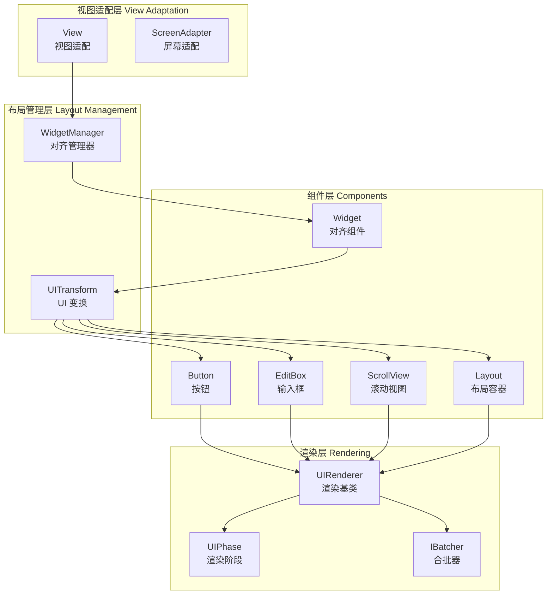

Cocos Creator UI 系统是一套完整的用户界面解决方案，提供从基础布局、交互控件到复杂界面管理的全套功能。该系统基于组件化架构设计，与引擎的渲染管线深度集成，支持高性能的 2D 界面渲染和跨平台适配。

UI 系统的核心设计哲学是**数据驱动**与**组件组合**：通过 `Widget` 组件实现响应式布局，通过 `UITransform` 管理界面变换，通过 `UIRenderer` 统一渲染流程。系统内置了丰富的 UI 控件（按钮、输入框、滚动视图等），并提供了灵活的扩展机制。

## 核心架构

UI 系统采用分层架构设计，从下到上分别为：**视图适配层**、**布局管理层**、**组件层**和**渲染层**。



**视图适配层**负责处理不同平台的屏幕适配问题，通过 `View` 单例管理设计分辨率与实际屏幕的映射关系 [`view.ts`](cocos/ui/view.ts#L1-L200)。**布局管理层**通过 `WidgetManager` 在每帧更新时自动计算 Widget 对齐位置，确保界面元素按预期排列 [`widget-manager.ts`](cocos/ui/widget-manager.ts#L200-L416)。**组件层**提供 26 个内置 UI 组件，涵盖从基础容器到复杂交互控件的所有需求 [`index.ts`](cocos/ui/index.ts#L1-L45)。**渲染层**通过 `UIPhase` 将 UI 绘制请求提交到渲染管线，利用合批优化减少 Draw Call [`ui-phase.ts`](cocos/rendering/ui-phase.ts#L1-L78)。

Sources: [index.ts](cocos/ui/index.ts#L1-L45), [view.ts](cocos/ui/view.ts#L1-L200), [widget-manager.ts](cocos/ui/widget-manager.ts#L200-L416), [ui-phase.ts](cocos/rendering/ui-phase.ts#L1-L78)

## 视图与分辨率适配

`View` 类是 UI 系统的入口点，负责管理游戏窗口视图和设计分辨率策略。引擎初始化时会自动创建 `view` 单例，开发者无需手动实例化。

### 设计分辨率策略

View 支持五种分辨率适配策略，通过 `ResolutionPolicy` 枚举定义：

| 策略 | 行为 | 适用场景 |
|------|------|----------|
| `EXACT_FIT` | 强制拉伸填充整个屏幕，不保持宽高比 | 对比例不敏感的背景界面 |
| `SHOW_ALL` | 完整显示设计分辨率内容，可能留黑边 | 需要完整显示 UI 的场景 |
| `NO_BORDER` | 填满屏幕不留黑边，可能裁剪部分内容 | 沉浸式游戏体验 |
| `FIXED_HEIGHT` | 固定高度适配，宽度自动缩放 | 垂直卷轴游戏 |
| `FIXED_WIDTH` | 固定宽度适配，高度自动缩放 | 横版过关游戏 |

```typescript
// 设置设计分辨率为 1280x720，使用固定高度策略
view.setDesignResolutionSize(1280, 720, ResolutionPolicy.FIXED_HEIGHT);
```

View 内部维护三个关键矩形：**设计分辨率尺寸**（`_designResolutionSize`）、**视口矩形**（`_viewportRect`）和**可见矩形**（`_visibleRect`）。当屏幕尺寸变化时，View 会根据选定的策略重新计算这些值，并触发 `design-resolution-changed` 事件通知 WidgetManager 更新对齐 [`view.ts`](cocos/ui/view.ts#L80-L120)。

### 屏幕旋转与全屏适配

View 通过 `screenAdapter` 抽象层处理不同平台的屏幕特性。在移动端，可以设置屏幕朝向（横版、竖版或自动），当设备旋转时会自动调整 canvas 的 CSS 变换。`resizeWithBrowserSize` 方法允许在 Web 平台监听浏览器窗口大小变化，自动调整 canvas 尺寸 [`view.ts`](cocos/ui/view.ts#L130-L170)。

Sources: [view.ts](cocos/ui/view.ts#L80-L170)

## Widget 对齐系统

Widget 组件是 UI 布局的核心机制，它允许节点相对于父节点或指定目标节点的边缘进行对齐。与传统的绝对定位不同，Widget 采用**约束驱动**的布局方式，当参考对象尺寸变化时自动调整位置和大小。

### 对齐标志与模式

Widget 通过 `AlignFlags` 枚举定义六个对齐方向：上（TOP）、中（MID）、下（BOT）、左（LEFT）、中（CENTER）、右（RIGHT）。可以同时启用多个标志，例如同时启用 LEFT 和 RIGHT 会使节点宽度拉伸以适应父节点 [`widget.ts`](cocos/ui/widget.ts#L130-L170)。

`AlignMode` 枚举控制对齐时机：

| 模式 | 触发时机 | 典型用途 |
|------|----------|----------|
| `ONCE` | 仅在组件启用时对齐一次 | 需要脚本后续控制位置的节点 |
| `ALWAYS` | 每帧都对齐 | 动态尺寸容器内的固定边距元素 |
| `ON_WINDOW_RESIZE` | 仅在窗口尺寸变化时对齐 | 静态布局但需适配不同分辨率 |

```typescript
// 顶部对齐，距离上边缘 20 像素
const widget = node.addComponent(Widget);
widget.top = 20;
widget.isAlignTop = true;
widget.alignMode = AlignMode.ON_WINDOW_RESIZE;
```

### 对齐计算流程

WidgetManager 在 `AFTER_UPDATE` 事件触发时执行对齐计算。流程分为两步：首先通过 `visitNode` 递归遍历场景树，收集所有启用的 Widget 到 `activeWidgets` 数组；然后遍历数组，对每个 `_dirty` 标志为 true 的 Widget 调用 `align` 函数 [`widget-manager.ts`](cocos/ui/widget-manager.ts#L220-L250)。

`align` 函数根据 Widget 的对齐标志计算目标位置。以水平方向为例：如果启用了 LEFT 标志，节点 X 坐标 = 父节点左边缘 + left 偏移 + 锚点偏移 × 宽度。如果同时启用 LEFT 和 RIGHT（即 `isStretchWidth` 为 true），则节点宽度会被拉伸为 `right - left` 的距离 [`widget-manager.ts`](cocos/ui/widget-manager.ts#L70-L120)。

当 Widget 设置了 `target` 属性时，对齐会相对于目标节点而非父节点。此时需要调用 `computeInverseTransForTarget` 计算从 Widget 节点到目标节点的逆变换，包括平移和缩放 [`widget.ts`](cocos/ui/widget.ts#L70-L110)。这使得 UI 元素可以跨层级对齐，例如让一个节点始终跟随另一个节点的位置。

Sources: [widget.ts](cocos/ui/widget.ts#L130-L170), [widget-manager.ts](cocos/ui/widget-manager.ts#L70-L250)

## 布局容器系统

Layout 组件是一种特殊的容器，它自动排列子节点，无需手动设置每个子节点的位置。与 Widget 的"对齐到边缘"不同，Layout 关注的是**子节点之间的相对排列**。

### 布局类型

Layout 支持四种布局模式，通过 `LayoutType` 枚举定义：

- **NONE**：禁用布局，子节点自由定位
- **HORIZONTAL**：水平布局，子节点从左到右（或从右到左）排列
- **VERTICAL**：垂直布局，子节点从上到下（或从下到上）排列
- **GRID**：网格布局，子节点按行列矩阵排列

```typescript
// 创建垂直布局，子节点间距 10 像素
const layout = node.addComponent(Layout);
layout.type = LayoutType.VERTICAL;
layout.spacingY = 10;
layout.resizeMode = LayoutResizeMode.CONTAINER;
```

### 缩放模式

`LayoutResizeMode` 控制容器与子节点的尺寸关系：

| 模式 | 容器行为 | 子节点行为 |
|------|----------|------------|
| `NONE` | 保持预设尺寸 | 保持预设尺寸 |
| `CONTAINER` | 根据子节点总尺寸自动扩展 | 保持预设尺寸 |
| `CHILDREN` | 保持预设尺寸 | 根据容器尺寸等比例缩放 |

当设置为 `CONTAINER` 模式时，Layout 会在每帧计算所有子节点的包围盒，然后调整自身尺寸以刚好容纳所有子节点。这在动态添加/删除子节点的场景中非常有用，例如聊天对话框自动扩展高度 [`layout.ts`](cocos/ui/layout.ts#L180-L250)。

### 网格布局约束

GRID 布局支持 `LayoutConstraint` 约束，可以固定行数（`FIXED_ROW`）或列数（`FIXED_COL`）。当设置固定行数时，Layout 会根据子节点数量自动计算列数；反之亦然。配合 `startAxis`（起始轴）和 `cellSize`（单元格尺寸），可以实现复杂的网格界面，如背包系统、技能栏等 [`layout.ts`](cocos/ui/layout.ts#L90-L170)。

Sources: [layout.ts](cocos/ui/layout.ts#L1-L250)

## 交互控件系统

Cocos Creator 提供了丰富的内置 UI 控件，每个控件都是独立的组件，可以组合使用构建复杂界面。

### 按钮（Button）

Button 组件支持四种过渡类型（`Transition` 枚举），用于表现不同的交互状态（正常、悬停、按下、禁用）：

| 类型 | 实现方式 | 性能开销 |
|------|----------|----------|
| `NONE` | 不做任何变化 | 无 |
| `COLOR` | 修改目标节点颜色 | 低 |
| `SPRITE` | 切换目标 Sprite 的 SpriteFrame | 中 |
| `SCALE` | 缩放目标节点（默认 0.95 倍） | 低 |

```typescript
// 创建缩放过渡按钮
const button = node.addComponent(Button);
button.transition = Transition.SCALE;
button.scale = 0.95;
button.duration = 0.1;

// 绑定点击事件
const handler = new ComponentEventHandler();
handler.target = clickHandlerNode;
handler.component = 'ClickHandler';
handler.clickEventHandler = 'onClick';
button.clickEvents.push(handler);
```

Button 内部通过监听 `TOUCH_START`、`TOUCH_MOVE`、`TOUCH_END` 事件来切换状态。在 PC 平台还会额外监听鼠标事件（`MOUSE_ENTER`、`MOUSE_LEAVE`）实现悬停效果 [`button.ts`](cocos/ui/button.ts#L50-L150)。

### 输入框（EditBox）

EditBox 是用于文本输入的控件，它封装了平台原生的输入框实现。核心属性包括：

- `string`：输入内容
- `placeholder`：占位符文本
- `inputMode`：输入模式（单行、多行、数字、电话等）
- `inputFlag`：输入标志（密码、首字母大写等）
- `keyboardReturnType`：键盘返回键类型（完成、发送、搜索等）

EditBox 通过 `EditBoxImpl` 抽象层适配不同平台的原生输入。在 Web 平台会创建隐藏的 `<input>` 元素，在移动端会调用系统键盘。当用户开始输入时，EditBox 会显示原生键盘，并将输入内容同步到 `_textLabel`（一个 Label 组件）进行渲染 [`edit-box.ts`](cocos/ui/editbox/edit-box.ts#L80-L200)。

### 滚动视图（ScrollView）

ScrollView 提供可滚动容器功能，支持水平、垂直或双向滚动。核心机制包括：

1. **内容容器**：`content` 属性指向一个节点，所有可滚动内容作为其子节点
2. **边界检测**：当滚动超出内容边界时，可以触发回弹效果（`bounce`）
3. **惯性滚动**：释放触摸后，内容会基于当前速度继续滚动一段距离
4. **滚动条**：可关联 `ScrollBar` 组件显示当前滚动位置

```typescript
// 创建垂直滚动视图
const scrollView = node.addComponent(ScrollView);
scrollView.content = contentNode;
scrollView.vertical = true;
scrollView.horizontal = false;
scrollView.bounce = true;
scrollView.inertia = true;

// 监听滚动事件
scrollView.node.on(ScrollViewEventType.SCROLLING, () => {
    console.log('当前滚动位置:', scrollView.getScrollOffset());
});
```

ScrollView 通过 `getScrollOffset()` 和 `scrollToOffset()` 方法提供程序化滚动控制。`autoScroll` 方法支持在指定时间内平滑滚动到目标位置，使用五次方缓动函数（quintEaseOut）实现自然的减速效果 [`scroll-view.ts`](cocos/ui/scroll-view.ts#L70-L200)。

Sources: [button.ts](cocos/ui/button.ts#L50-L150), [edit-box.ts](cocos/ui/editbox/edit-box.ts#L80-L200), [scroll-view.ts](cocos/ui/scroll-view.ts#L70-L200)

## 渲染流程

UI 系统的渲染深度集成到引擎的渲染管线中。所有 UI 组件都继承自 `UIRenderer` 基类，该类负责管理渲染数据和材质实例。

### 渲染数据与合批

UIRenderer 使用 `RenderData` 结构存储顶点、索引和 UV 数据。以 Sprite 为例，简单类型需要 4 个顶点和 6 个索引，而 Sliced（九宫格）类型需要 16 个顶点。当多个 UI 节点使用相同的材质和纹理时，Batcher 会将它们的 RenderData 合并到一个 Draw Call 中，大幅降低 GPU 开销 [`sprite.ts`](cocos/2d/components/sprite.ts#L1-L150)。

合批的关键条件是：
1. 使用相同的材质实例
2. 使用相同的纹理（或纹理 atlas）
3. 节点在场景树中连续（中间没有其他渲染类型打断）

### UI 渲染阶段

`UIPhase` 类定义了 UI 在渲染管线中的执行阶段。在每帧的渲染循环中，UIPhase 会遍历场景中的所有 `UIBatch`，按以下顺序提交渲染命令：

1. 绑定管线状态（PipelineState）
2. 绑定材质描述符集（DescriptorSet）
3. 绑定本地描述符集（包含纹理、颜色等 uniform）
4. 绑定输入汇编器（InputAssembler，包含顶点和索引）
5. 执行绘制命令（draw）

UIPhase 通过 `pass.phase` 和 `pass.passID` 过滤出属于 UI 的渲染通道，确保只在正确的阶段绘制 UI 元素 [`ui-phase.ts`](cocos/rendering/ui-phase.ts#L30-L78)。

### UITransform 组件

每个 UI 节点都需要 `UITransform` 组件来定义其渲染尺寸和锚点。与普通的 Transform 不同，UITransform 的 `contentSize` 属性专门用于 UI 布局计算，不受节点缩放影响。当 contentSize 或 anchorPoint 变化时，会触发 `SIZE_CHANGED` 事件，通知 Widget 和 Layout 重新计算布局 [`ui-transform.ts`](cocos/2d/framework/ui-transform.ts#L50-L150)。

Sources: [sprite.ts](cocos/2d/components/sprite.ts#L1-L150), [ui-phase.ts](cocos/rendering/ui-phase.ts#L30-L78), [ui-transform.ts](cocos/2d/framework/ui-transform.ts#L50-L150)

## 最佳实践

### 性能优化

1. **减少合批打断**：将使用相同材质的 UI 节点放在场景树的连续位置，避免在中间插入 3D 节点或使用不同材质的节点
2. **使用 SpriteAtlas**：将多个小图打包成图集，减少纹理切换开销
3. **避免频繁修改 Widget**：Widget 在每帧都会计算对齐，对于静态 UI 使用 `AlignMode.ONCE` 或 `ON_WINDOW_RESIZE`
4. **缓存 Layout 结果**：动态内容停止变化后，可以临时禁用 Layout 组件避免重复计算

### 响应式设计

1. **分层适配策略**：背景层使用 `NO_BORDER` 模式允许裁剪，UI 层使用 `FIXED_HEIGHT` 保持比例一致
2. **Widget 链式布局**：使用多个 Widget 组合实现复杂布局，例如顶部固定 + 中间拉伸 + 底部固定
3. **安全区域适配**：使用 `SafeArea` 组件自动避开屏幕刘海和虚拟按键

### 调试技巧

1. **查看合批状态**：在编辑器中开启"显示 Draw Call"，观察 UI 合批效果
2. **Widget 对齐预览**：在编辑器模式下，Widget 会实时显示对齐参考线
3. **性能分析**：使用 Profiler 查看 UI 渲染耗时，定位瓶颈组件

## 扩展阅读

- 了解 2D 渲染基础：[2D 渲染与精灵](7-2d-xuan-ran-yu-jing-ling)
- 深入学习渲染管线：[渲染管线架构](17-xuan-ran-guan-xian-jia-gou)
- 掌握组件系统原理：[组件系统](6-zu-jian-xi-tong)
- 场景图与节点系统：[场景图与节点系统](5-chang-jing-tu-yu-jie-dian-xi-tong)