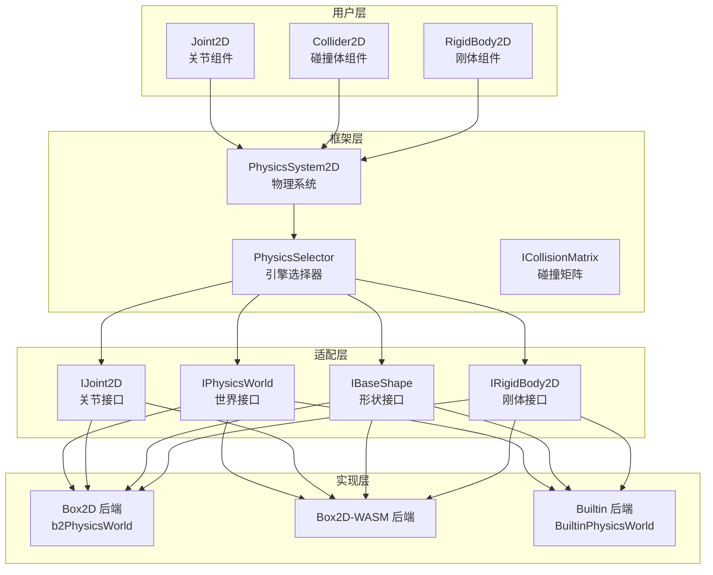
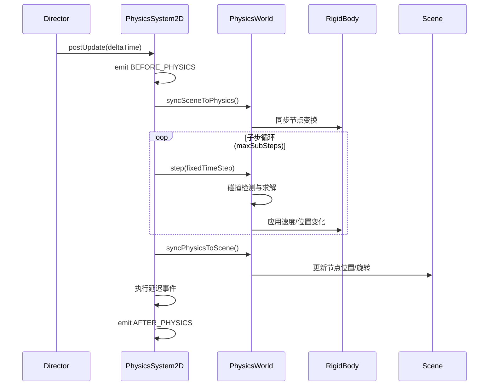

Cocos Creator 的 2D 物理系统为游戏开发者提供了完整的刚体动力学模拟能力，支持碰撞检测、关节约束和物理查询等核心功能。系统采用**分层架构设计**，通过抽象接口层隔离底层物理引擎实现，支持多种物理后端动态切换。

## 架构设计

2D 物理系统采用**策略模式**实现引擎无关性，核心架构分为四个层次：



**框架层**的 `PhysicsSystem2D` 作为单例系统组件，统一管理物理世界生命周期、时间步进和全局配置 [`PhysicsSystem2D`](cocos/physics-2d/framework/physics-system.ts#L37-L389)。`PhysicsSelector` 负责注册和切换物理引擎后端，系统在初始化前使用最后注册的后端 [`selector`](cocos/physics-2d/framework/physics-selector.ts#L117-L146)。

**适配层**定义了完整的接口契约：`IRigidBody2D` 封装刚体行为，`IBaseShape` 管理碰撞形状，`IJoint2D` 处理关节约束，`IPhysicsWorld` 提供世界级操作如射线检测和区域查询 [`interfaces`](cocos/physics-2d/spec/i-rigid-body.ts#L1-L406)。

**实现层**提供三种后端：
- **Box2D**：完整的 Box2D 引擎封装，支持所有物理特性 [`box2d`](cocos/physics-2d/box2d/instantiate.ts#L28-L52)
- **Box2D-WASM**：WebAssembly 版本，性能更优 [`box2d-wasm`](cocos/physics-2d/box2d-wasm/instantiate.ts#L1-L60)
- **Builtin**：内置简化实现，仅支持碰撞检测，无关节和刚体动力学 [`builtin`](cocos/physics-2d/builtin/instantiate.ts#L28-L46)

Sources: [physics-system.ts](cocos/physics-2d/framework/physics-system.ts#L37-L389), [physics-selector.ts](cocos/physics-2d/framework/physics-selector.ts#L117-L146), [instantiate.ts](cocos/physics-2d/box2d/instantiate.ts#L28-L52)

## 核心组件系统

### 刚体组件（RigidBody2D）

`RigidBody2D` 是 2D 物理系统的核心驱动组件，赋予节点物理属性并控制运动行为。刚体类型决定其物理响应方式：

| 类型 | 枚举值 | 质量 | 速度控制 | 典型用途 |
|------|--------|------|----------|----------|
| Static | 0 | 零质量 | 不可设置 | 地面、墙壁等固定物体 |
| Kinematic | 1 | 零质量 | 用户设置速度 | 移动平台、机关 |
| Dynamic | 2 | 正质量 | 由力/冲量决定 | 可交互物体、角色 |
| Animated | 3 | 零质量 | 动画驱动 | 骨骼动画角色 |

刚体关键属性包括：
- **group**：物理分组，配合碰撞矩阵控制碰撞关系 [`group`](cocos/physics-2d/framework/components/rigid-body-2d.ts#L42-L50)
- **linearDamping/angularDamping**：线性/角速度衰减系数，模拟空气阻力 [`damping`](cocos/physics-2d/framework/components/rigid-body-2d.ts#L122-L153)
- **gravityScale**：重力缩放因子，可实现反重力或零重力效果 [`gravityScale`](cocos/physics-2d/framework/components/rigid-body-2d.ts#L112-L120)
- **bullet**：高速物体防穿透标志，启用会增加计算开销 [`bullet`](cocos/physics-2d/framework/components/rigid-body-2d.ts#L62-L72)

刚体与节点 Transform 通过 `b2RigidBody2D` 同步，支持双向数据流：场景变换同步到物理世界，或物理模拟结果应用到渲染节点 [`sync`](cocos/physics-2d/box2d/rigid-body.ts#L85-L100)。Animated 类型刚体通过 `_animatedPos` 和 `_animatedAngle` 追踪动画目标状态，在 `animate()` 中计算速度驱动物理模拟 [`animate`](cocos/physics-2d/box2d/rigid-body.ts#L113-L148)。

Sources: [rigid-body-2d.ts](cocos/physics-2d/framework/components/rigid-body-2d.ts#L42-L153), [rigid-body.ts](cocos/physics-2d/box2d/rigid-body.ts#L85-L148)

### 碰撞体组件（Collider2D）

碰撞体定义刚体的碰撞形状和物理材质属性。系统提供三种基础碰撞体：

| 碰撞体类型 | 类名 | 形状描述 | 性能特征 |
|------------|------|----------|----------|
| BoxCollider2D | BoxCollider2D | 矩形包围盒 | 最快，支持旋转 |
| CircleCollider2D | CircleCollider2D | 圆形 | 最快，旋转不变 |
| PolygonCollider2D | PolygonCollider2D | 凸多边形 | 较高成本，精确匹配 |

碰撞体继承自 `Eventify(Component)`，支持碰撞事件回调：
- **onBeginContact**：开始接触时触发
- **onEndContact**：结束接触时触发
- **onPreSolve**：求解前回调，可过滤碰撞
- **onPostSolve**：求解后回调，获取冲量信息

关键材质属性：
- **density**：密度，影响刚体质量计算 [`density`](cocos/physics-2d/framework/components/colliders/collider-2d.ts#L67-L73)
- **friction**：摩擦系数，范围 [0,1]，决定表面粗糙度 [`friction`](cocos/physics-2d/framework/components/colliders/collider-2d.ts#L80-L86)
- **restitution**：弹性系数，范围 [0,1]，决定碰撞反弹程度 [`restitution`](cocos/physics-2d/framework/components/colliders/collider-2d.ts#L93-L99)
- **sensor**：传感器模式，仅检测碰撞不产生物理响应 [`sensor`](cocos/physics-2d/framework/components/colliders/collider-2d.ts#L75-L81)

碰撞体通过 `IBaseShape` 接口与底层引擎交互。`b2Shape2D` 管理 Box2D 的 `b2.Shape` 和 `b2.Fixture` 对象，在 `_init()` 中创建夹具并设置过滤规则 [`shape-init`](cocos/physics-2d/box2d/shapes/shape-2d.ts#L115-L166)。形状位置相对于刚体原点偏移，通过 `offset` 属性调整。

碰撞分组通过 `CollisionMatrix` 控制，矩阵定义哪些分组间可发生碰撞。系统从设置中读取碰撞矩阵和自定义分组，动态更新 `PhysicsGroup2D` 枚举 [`collisionMatrix`](cocos/physics-2d/framework/physics-system.ts#L236-L252)。

Sources: [collider-2d.ts](cocos/physics-2d/framework/components/colliders/collider-2d.ts#L67-L99), [shape-2d.ts](cocos/physics-2d/box2d/shapes/shape-2d.ts#L115-L166), [physics-system.ts](cocos/physics-2d/framework/physics-system.ts#L236-L252)

### 关节组件（Joint2D）

关节用于约束两个刚体的相对运动，实现铰链、滑块、弹簧等机械结构。系统支持 8 种关节类型：

| 关节类型 | 类名 | 约束描述 | 典型应用 |
|----------|------|----------|----------|
| DistanceJoint2D | DistanceJoint2D | 固定两点距离 | 绳索、链条 |
| HingeJoint2D | HingeJoint2D | 绕轴旋转，支持角度限制和马达 | 门、摆锤 |
| SliderJoint2D | SliderJoint2D | 沿直线滑动 | 活塞、导轨 |
| SpringJoint2D | SpringJoint2D | 弹性连接 | 减震器、弹弓 |
| FixedJoint2D | FixedJoint2D | 完全固定两刚体 | 焊接、临时组合 |
| WheelJoint2D | WheelJoint2D | 车轮约束，单方向运动 | 车辆悬挂 |
| MouseJoint2D | MouseJoint2D | 鼠标拖拽交互 | UI 拖拽、拾取 |
| RelativeJoint2D | RelativeJoint2D | 相对位置/角度约束 | 复杂机构 |

关节基类 `Joint2D` 管理公共属性：
- **connectedBody**：连接的另一个刚体，为空则连接到世界原点 [`connectedBody`](cocos/physics-2d/framework/components/joints/joint-2d.ts#L1-L150)
- **collideConnected**：连接的两个刚体是否互相碰撞 [`collideConnected`](cocos/physics-2d/framework/components/joints/joint-2d.ts#L1-L150)
- **anchor**/**connectedAnchor**：本地和连接刚体上的锚点位置

关节通过 `b2Joint` 基类封装 Box2D 关节对象，在 `_createJointDef()` 中由子类实现具体的关节定义创建 [`joint-base`](cocos/physics-2d/box2d/joints/joint-2d.ts#L67-L99)。关节初始化需要两个刚体都已创建，因此使用延迟初始化机制，通过 `PhysicsSystem2D._callAfterStep()` 在物理步进后执行 [`_init`](cocos/physics-2d/box2d/joints/joint-2d.ts#L54-L83)。

以 `HingeJoint2D` 为例，支持：
- **enableLimit**：启用角度限制 [`enableLimit`](cocos/physics-2d/framework/components/joints/hinge-joint-2d.ts#L42-L50)
- **lowerAngle/upperAngle**：角度范围限制 [`angleLimit`](cocos/physics-2d/framework/components/joints/hinge-joint-2d.ts#L57-L80)
- **enableMotor**：启用马达驱动 [`enableMotor`](cocos/physics-2d/framework/components/joints/hinge-joint-2d.ts#L87-L95)
- **motorSpeed/maxMotorTorque**：目标速度和最大扭矩 [`motor`](cocos/physics-2d/framework/components/joints/hinge-joint-2d.ts#L102-L124)

Sources: [joint-2d.ts](cocos/physics-2d/box2d/joints/joint-2d.ts#L67-L99), [hinge-joint-2d.ts](cocos/physics-2d/framework/components/joints/hinge-joint-2d.ts#L42-L124), [distance-joint-2d.ts](cocos/physics-2d/framework/components/joints/distance-joint-2d.ts#L35-L75)

## 物理世界与模拟循环

### 物理世界管理

`PhysicsSystem2D` 作为系统入口，通过单例模式管理全局物理状态。构造函数从设置系统读取配置：

```typescript
// 重力、时间步长、碰撞矩阵等配置
const gravity = settings.querySettings(SettingsCategory.PHYSICS, 'gravity');
const collisionMatrix = settings.querySettings(SettingsCategory.PHYSICS, 'collisionMatrix');
```

物理世界封装对象 `IPhysicsWorld` 提供统一接口：
- **setGravity()**：设置世界重力向量 [`setGravity`](cocos/physics-2d/box2d/physics-world.ts#L118-L120)
- **step()**：执行物理模拟步进 [`step`](cocos/physics-2d/box2d/physics-world.ts#L127-L134)
- **raycast()**：射线检测，返回路径上的碰撞体 [`raycast`](cocos/physics-2d/box2d/physics-world.ts#L136-L180)
- **testPoint()**/**testAABB()**：点或区域检测 [`testPoint`](cocos/physics-2d/box2d/physics-world.ts#L182-L220)
- **syncSceneToPhysics()**/**syncPhysicsToScene()**：场景与物理世界同步 [`sync`](cocos/physics-2d/box2d/physics-world.ts#L222-L280)

Box2D 实现中，`b2PhysicsWorld` 管理刚体列表、碰撞监听器和查询回调对象。碰撞监听器 `PhysicsContactListener` 拦截 Box2D 接触事件，转换为引擎级回调 [`contact-listener`](cocos/physics-2d/box2d/platform/physics-contact-listener.ts#L1-L100)。

### 模拟循环机制

物理系统在每帧 `postUpdate()` 中自动执行模拟，流程如下：



关键参数：
- **fixedTimeStep**：固定时间步长，默认 1/60 秒，保证物理模拟稳定性 [`fixedTimeStep`](cocos/physics-2d/framework/physics-system.ts#L215-L218)
- **maxSubSteps**：每帧最大子步数，防止帧率过低时物理失真 [`maxSubSteps`](cocos/physics-2d/framework/physics-system.ts#L213-L216)
- **velocityIterations/positionIterations**：速度/位置求解器迭代次数，默认 10 次，影响精度 [`iterations`](cocos/physics-2d/framework/physics-system.ts#L137-L143)

系统使用**时间累积器**处理帧率波动：`_accumulator` 累加帧时间，当超过 `fixedTimeStep` 时执行子步，剩余时间累积到下一帧 [`accumulator`](cocos/physics-2d/framework/physics-system.ts#L274-L283)。

延迟事件机制 `_callAfterStep()` 确保在物理步进中安全创建/销毁对象，避免迭代器失效 [`_callAfterStep`](cocos/physics-2d/framework/physics-system.ts#L300-L310)。

Sources: [physics-system.ts](cocos/physics-2d/framework/physics-system.ts#L266-L310), [physics-world.ts](cocos/physics-2d/box2d/physics-world.ts#L118-L280)

## 碰撞检测与查询

### 碰撞矩阵与分组

碰撞过滤通过 32 位碰撞矩阵实现，每位代表一个物理分组。`PhysicsGroup2D` 预定义分组枚举，默认仅 `DEFAULT = 1`：

```typescript
export enum PhysicsGroup2D {
    DEFAULT = 1,
}
```

碰撞矩阵 `ICollisionMatrix` 是 32 个数字的数组，`collisionMatrix[groupA]` 的位掩码定义与 groupA 可碰撞的分组。例如：
- `collisionMatrix[1] = 3`：分组 1 可与分组 1 和 2 碰撞
- `collisionMatrix[2] = 1`：分组 2 仅可与分组 1 碰撞

碰撞体在创建夹具时应用过滤规则：
```typescript
tempFilter.categoryBits = comp.group === PhysicsGroup.DEFAULT ? comp.body.group : comp.group;
tempFilter.maskBits = PhysicsSystem2D.instance.collisionMatrix[tempFilter.categoryBits];
fixture.SetFilterData(filter);
```

Sources: [shape-2d.ts](cocos/physics-2d/box2d/shapes/shape-2d.ts#L32-L42), [physics-types.ts](cocos/physics-2d/framework/physics-types.ts#L85-L88)

### 射线检测

`PhysicsSystem2D.raycast()` 执行世界级射线检测，支持四种检测模式：

| 模式 | 枚举值 | 行为描述 | 返回值 |
|------|--------|----------|--------|
| Closest | 0 | 检测最近碰撞点 | 单个结果 |
| Any | 1 | 检测到任意碰撞即停止 | 单个结果 |
| AllClosest | 2 | 检测所有碰撞体的最近点 | 多个结果 |
| All | 3 | 检测所有碰撞点 | 所有交点 |

射线检测结果 `RaycastResult2D` 包含：
- **collider**：命中的碰撞体
- **fixtureIndex**：夹具索引（多形状碰撞体）
- **point**：碰撞点世界坐标
- **normal**：碰撞点法线
- **fraction**：射线进度 (0-1)

Box2D 实现使用 `PhysicsRayCastCallback` 回调对象，在 `ReportFixture()` 中根据检测类型决定是否继续遍历 [`raycast-callback`](cocos/physics-2d/box2d/platform/physics-ray-cast-callback.ts#L1-L80)。

Sources: [physics-types.ts](cocos/physics-2d/framework/physics-types.ts#L95-L130), [physics-world.ts](cocos/physics-2d/box2d/physics-world.ts#L136-L180)

### 区域检测

系统提供两种区域检测方法：
- **testPoint(p)**：检测包含给定点的所有碰撞体
- **testAABB(rect)**：检测与给定矩形相交的所有碰撞体

Builtin 后端通过遍历所有形状并调用几何相交测试实现：
```typescript
shouldCollide(c1, c2): boolean {
    return (c1 !== c2) && (c1.node !== c2.node) 
        && (collisionMatrix[c1.group] & c2.group);
}
```

Box2D 后端使用 `QueryAABB()` 和 `TestPoint()` API，通过回调收集结果 [`testAABB`](cocos/physics-2d/box2d/physics-world.ts#L222-L280)。

Sources: [builtin-world.ts](cocos/physics-2d/builtin/builtin-world.ts#L48-L62), [physics-world.ts](cocos/physics-2d/box2d/physics-world.ts#L222-L280)

## 调试与可视化

### 调试绘制

系统支持多种调试绘制标志，通过 `EPhysics2DDrawFlags` 枚举控制：

| 标志 | 值 | 绘制内容 |
|------|-----|----------|
| Shape | 0x0001 | 碰撞形状轮廓 |
| Joint | 0x0002 | 关节连接 |
| Aabb | 0x0004 | 轴对齐包围盒 |
| Pair | 0x0008 | 宽相碰撞对 |
| CenterOfMass | 0x0010 | 质心标记 |
| Particle | 0x0020 | 粒子（如启用） |
| All | 0x003f | 全部绘制 |

设置 `debugDrawFlags` 后，系统在每帧物理模拟后调用 `physicsWorld.drawDebug()`。Box2D 实现通过 `PhysicsDebugDraw` 将 Box2D 的 `b2.Draw` 接口适配到 Cocos 的 `Graphics` 组件 [`debug-draw`](cocos/physics-2d/box2d/platform/physics-debug-draw.ts#L1-L150)。

Builtin 后端手动绘制形状：
```typescript
if (shape instanceof BuiltinBoxShape || shape instanceof BuiltinPolygonShape) {
    const ps = shape.worldPoints;
    debugDrawer.moveTo(ps[0].x, ps[0].y);
    for (let j = 1; j < ps.length; j++) {
        debugDrawer.lineTo(ps[j].x, ps[j].y);
    }
    debugDrawer.stroke();
}
```

Sources: [physics-types.ts](cocos/physics-2d/framework/physics-types.ts#L139-L155), [builtin-world.ts](cocos/physics-2d/builtin/builtin-world.ts#L127-L170)

## 最佳实践与性能优化

### 物理后端选择

| 后端 | 适用场景 | 优势 | 限制 |
|------|----------|------|------|
| Box2D | 完整物理需求 | 功能完整，社区成熟 | JavaScript 性能瓶颈 |
| Box2D-WASM | 高性能需求 | 接近原生性能 | 需要 WASM 支持 |
| Builtin | 简单碰撞检测 | 零依赖，体积小 | 无关节/刚体动力学 |

在 `exports/physics-2d-framework.ts` 中通过导入不同后端模块切换：
```typescript
// 使用 Box2D
import 'cocos/physics-2d/box2d/instantiate';

// 使用 Builtin
import 'cocos/physics-2d/builtin/instantiate';
```

### 性能优化策略

1. **合理设置迭代次数**：`velocityIterations` 和 `positionIterations` 默认 10 次，简单场景可降低至 6-8 次提升性能 [`iterations`](cocos/physics-2d/framework/physics-system.ts#L137-L143)

2. **启用睡眠**：`allowSleep = true` 允许静止刚体进入睡眠状态，减少计算量 [`allowSleep`](cocos/physics-2d/framework/physics-system.ts#L211-L218)

3. **使用传感器检测**：仅需检测不需物理响应时，设置 `sensor = true` 避免求解器计算 [`sensor`](cocos/physics-2d/framework/components/colliders/collider-2d.ts#L75-L81)

4. **简化碰撞形状**：优先使用 Circle 和 Box，Polygon 顶点数控制在 8 个以内

5. **批量操作**：在物理步进外批量创建/销毁对象，利用 `_callAfterStep()` 延迟机制

6. **碰撞矩阵优化**：精确配置碰撞分组，减少不必要的碰撞检测对

### 常见问题处理

**穿透问题**：
- 启用 `bullet = true` 防止高速物体穿透
- 降低 `fixedTimeStep` 提高模拟频率
- 使用连续碰撞检测（CCD）

**抖动问题**：
- 增加 `positionIterations` 提高位置求解精度
- 检查碰撞体是否重叠初始化
- 调整 `linearDamping` 增加阻尼

**性能瓶颈**：
- 使用 Profiler 查看物理耗时
- 减少动态刚体数量
- 合并静态碰撞体

Sources: [physics-system.ts](cocos/physics-2d/framework/physics-system.ts#L137-L218), [rigid-body-2d.ts](cocos/physics-2d/framework/components/rigid-body-2d.ts#L62-L72)

## 扩展阅读

- 深入理解物理系统配置：[引擎架构设计](4-yin-qing-jia-gou-she-ji)
- 3D 物理系统对比：[3D 物理系统](12-3d-wu-li-xi-tong)
- 碰撞体与渲染同步：[2D 渲染与精灵](7-2d-xuan-ran-yu-jing-ling)